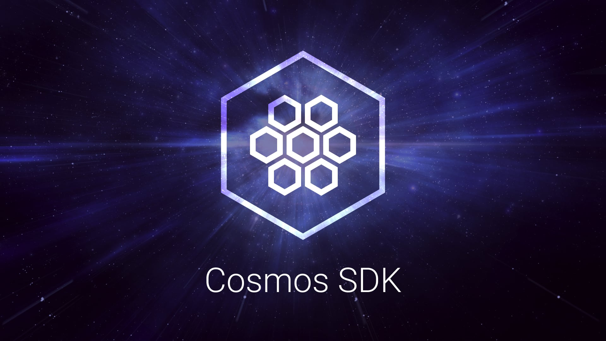

  <h1> Cosmos SDK </h1>

  
  
  

  
  
    
    

The Cosmos SDK is a framework for building blockchain applications. [CometBFT (BFT Consensus)](https://github.com/cometbft/cometbft) and the Cosmos SDK are written in the Go programming language. Cosmos SDK is used to build [Gaia](https://github.com/cosmos/gaia), the implementation of the Cosmos Hub.

**WARNING**: The Cosmos SDK has mostly stabilized, but we are still making some breaking changes.

**Note**: We advise to always use the latest maintained [Go](https://go.dev/dl) version for building Cosmos SDK applications.

## Quick Start

To learn how the Cosmos SDK works from a high-level perspective, see the Cosmos SDK [High-Level Intro](https://docs.cosmos.network/main/intro/overview).

If you want to get started quickly and learn how to build on top of Cosmos SDK, visit [Cosmos SDK Tutorials](https://tutorials.cosmos.network). You can also fork the tutorial's repository to get started building your own Cosmos SDK application.

For more information, see the [Cosmos SDK Documentation](https://docs.cosmos.network).

## Modules

The Cosmos SDK maintains a set of modules that can be included in your blockchain application.  For more information
on modules, see our [introduction doc](./x/README.md).

## Tools and Frameworks

The Cosmos ecosystem is vast.
[Awesome Cosmos](https://github.com/cosmos/awesome-cosmos) is a community-curated list of notable frameworks, modules and tools.

### Cosmos Hub Mainnet

The Cosmos Hub application, `gaia`, has its own [cosmos/gaia repository](https://github.com/cosmos/gaia). Go there to join the Cosmos Hub mainnet and more.

### Inter-Blockchain Communication (IBC)

The IBC module for the Cosmos SDK has its own [cosmos/ibc-go repository](https://github.com/cosmos/ibc-go). Go there to build and integrate with the IBC module.

## Disambiguation

This Cosmos SDK project is not related to the [React-Cosmos](https://github.com/react-cosmos/react-cosmos) project (yet). Many thanks to Evan Coury and Ovidiu (@skidding) for this Github organization name. As per our agreement, this disambiguation notice will stay here.
