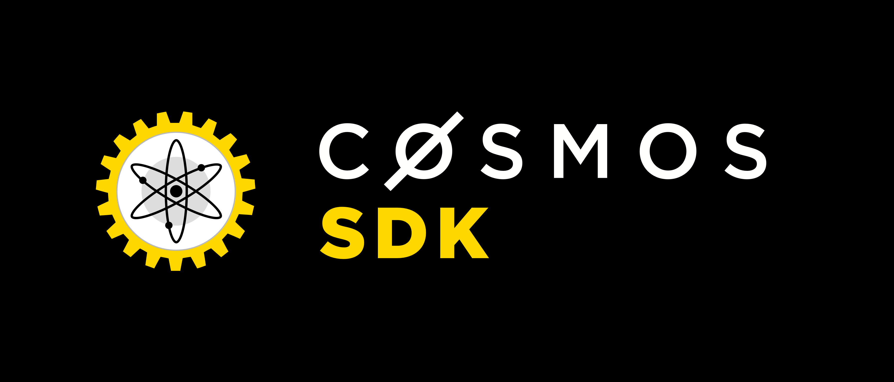

# Cosmos SDK



[](https://github.com/cosmos/cosmos-sdk/releases/latest)
[](https://godoc.org/github.com/cosmos/cosmos-sdk)
[](https://cosmos.rocket.chat/)
[](https://github.com/cosmos/cosmos-sdk/blob/master/LICENSE)

Branch    | Tests | Coverage | Report Card
----------|-------|----------|-------------
develop   | [](https://circleci.com/gh/cosmos/cosmos-sdk/tree/develop) | [](https://codecov.io/gh/cosmos/cosmos-sdk) | [](https://goreportcard.com/report/github.com/cosmos/cosmos-sdk/tree/develop)
master    | [](https://circleci.com/gh/cosmos/cosmos-sdk/tree/master) | [](https://codecov.io/gh/cosmos/cosmos-sdk) | [](https://goreportcard.com/report/github.com/cosmos/cosmos-sdk/tree/master)

The Cosmos SDK is the core framework for constructing
the atom tokens which will power [The Cosmos Network](https://cosmos.network/). It is an [ABCI application](https://github.com/tendermint/abci) designed to be used with the [Tendermint consensus engine](https://tendermint.com/) to form a Proof-of-Stake cryptocurrency. It also provides a general purpose framework
for extending the feature-set of the cryptocurrency by implementing plugins.

This SDK affords you all the tools you need to rapidly develop
robust blockchains and blockchain applications which are interoperable with The
Cosmos Hub. It is a blockchain development 'starter-pack' of common blockchain
modules while not enforcing their use thus giving maximum flexibility for
application customization. For example, do you require fees, how do you
want to log messages, do you enable IBC, do you even have a cryptocurrency?

Within this repository, the `basecoin` app serves as a reference implementation for how we build ABCI applications in Go, and is the framework in which we implement the [Cosmos Hub](https://cosmos.network). **It's easy to use, and doesn't require any forking** - just implement your plugin, import the libraries, and away
you go with a full-stack blockchain and command line tool for transacting.

## Prerequisites

* [golang](https://golang.org/doc/install)

## Installation

```
go get -u github.com/cosmos/cosmos-sdk/cmd/basecoin
```

See the [install guide](/docs/guide/install.md) for more details.

## Guides

* Getting started with the [Basecoin basics](/docs/guide/basecoin-basics.md)
* Learn to [use the plugin system](/docs/guide/basecoin-plugins.md)
* More features of the [Basecoin tool](/docs/guide/basecoin-tool.md)
* Learn how to use [Inter-Blockchain Communication (IBC)](/docs/guide/ibc.md)
* See [more examples](https://github.com/cosmos/cosmos-academy)

To deploy a testnet, see our [repository of deployment tools](https://github.com/tendermint/tools).
