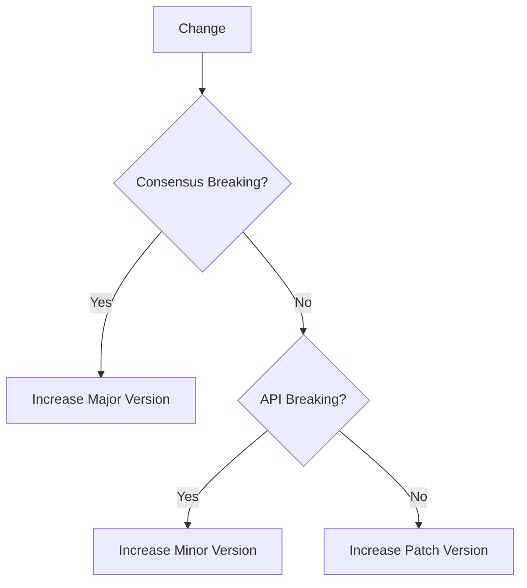

# Releases

The Cosmos-SDK follows both [0ver](https://0ver.org/) and [Semver](https://semver.org/). While this is confusing let's break it down: 0ver is used for the main Cosmos-SDK dependency (`github.com/cosmos/cosmos-sdk`) and Semver is used for all other dependencies.

## Semver Dependencies

Although we adhere to semantic versioning (semver), we have introduced a few modifications to accommodate the unique characteristics of blockchains. One significant divergence is that the major version (Y.x.x) is incremented solely when a consensus-breaking change occurs. On the other hand, the minor version (x.Y.x) is increased when there is a non-consensus-breaking alteration that also results in an incompatible API change. Patch versions will be bumped for all other changes that don't break the API nor Consensus. 

## 0ver Dependencies

In terms of the Cosmos-SDK dependency, we adhere to a simpler versioning approach known as 0ver. This flow differs from the previous Semver flow. Under this system, when a consensus-breaking change or an API-breaking change occurs, the Cosmos-SDK team increments the minor version (x.Y.x). Conversely, when a non-consensus-breaking change and a non-API-breaking change take place, the team bumps the patch version (x.x.Y).

