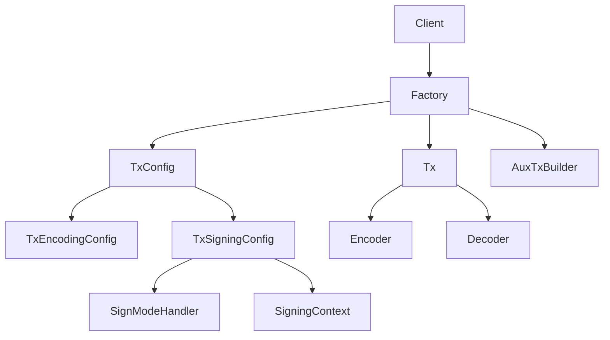
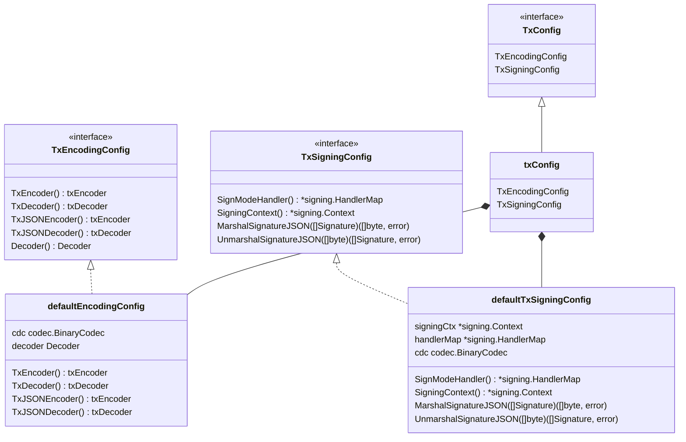
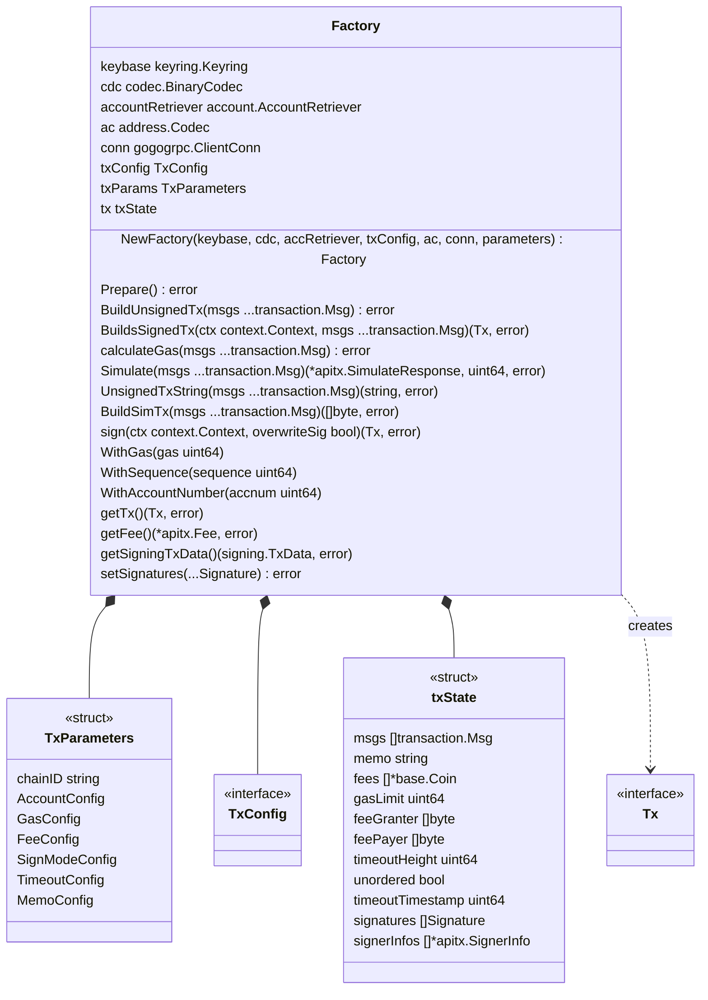
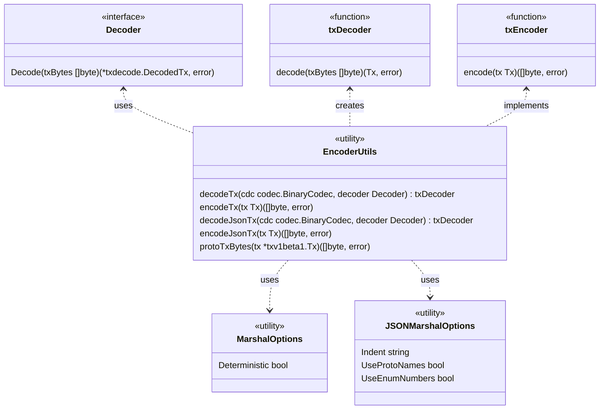
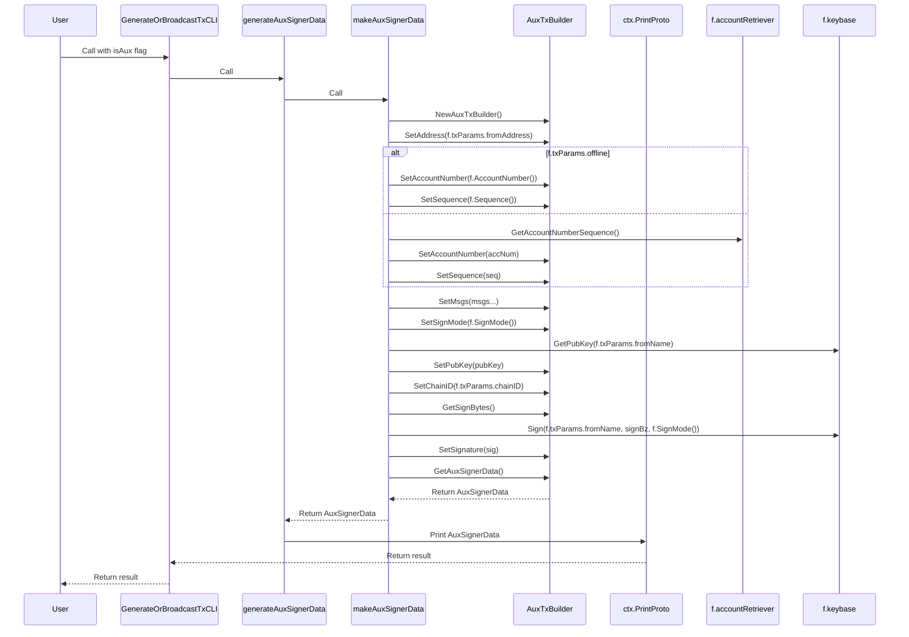
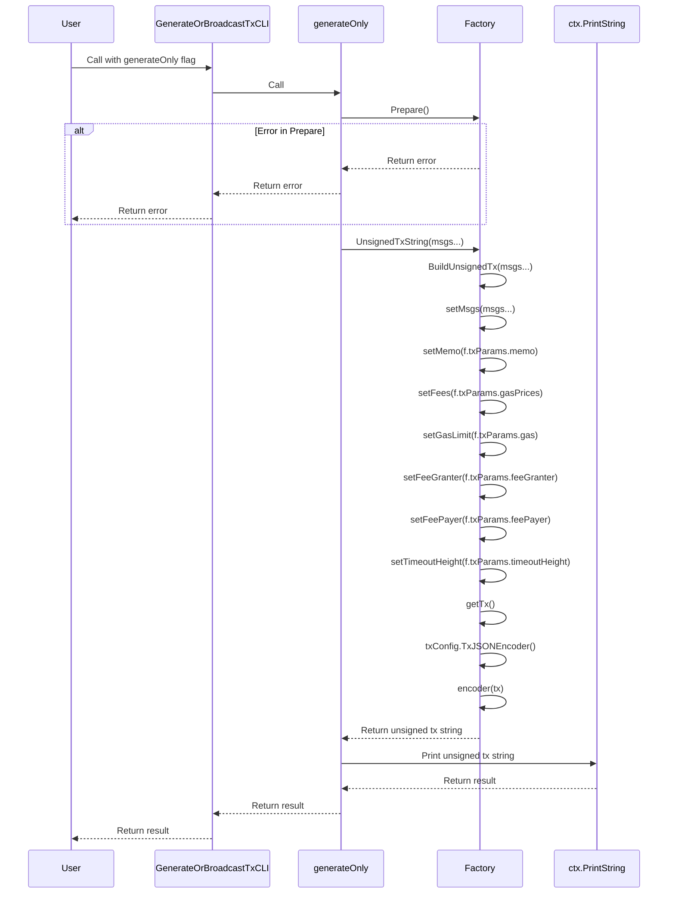
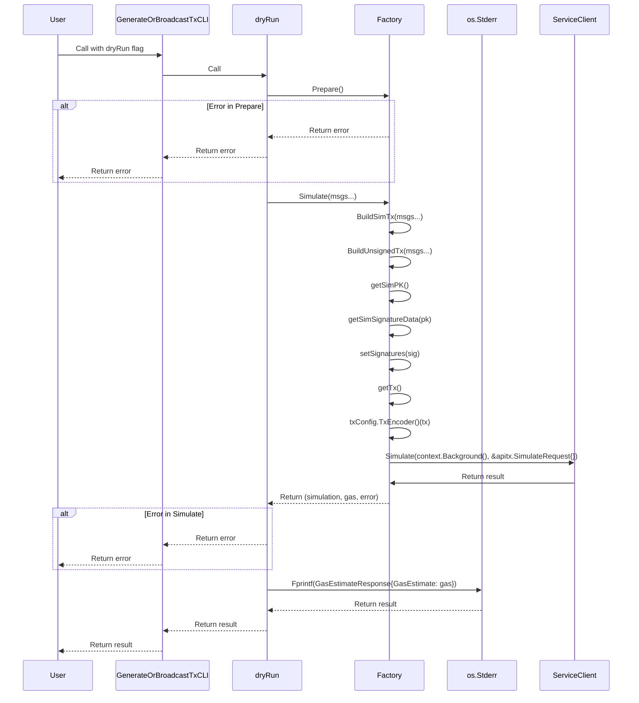
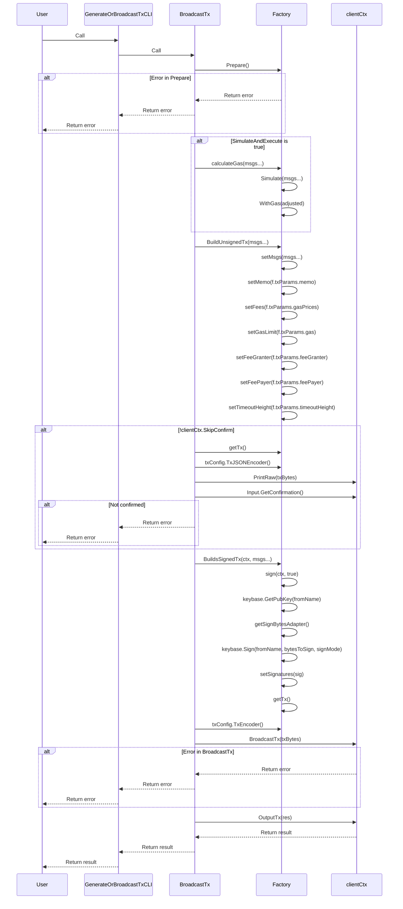

The tx package provides a robust set of tools for building, signing, and managing transactions in a Cosmos SDK-based blockchain application.

## Overview

This package includes several key components:

1. Transaction Factory
2. Transaction Config
3. Transaction Encoder/Decoder
4. Signature Handling

## Architecture



## Key Components

### TxConfig

`TxConfig` provides configuration for transaction handling, including:

- Encoding and decoding
- Sign mode handling
- Signature JSON marshaling/unmarshaling



### Factory

The `Factory` is the main entry point for creating and managing transactions. It handles:

- Account preparation
- Gas calculation
- Unsigned transaction building
- Transaction signing
- Transaction simulation
- Transaction broadcasting



### Encoder/Decoder

The package includes functions for encoding and decoding transactions in both binary and JSON formats.



### Sequence Diagrams

#### Generate Aux Signer Data


#### Generate Only


#### DryRun


#### Generate and Broadcast Tx


## Usage

To use the `tx` package, typically you would:

1. Create a `Factory`
2. Simulate the transaction (optional)
3. Build a signed transaction
4. Encode the transaction
5. Broadcast the transaction

Here's a simplified example:

```go
// Create a Factory
factory, err := NewFactory(keybase, cdc, accountRetriever, txConfig, addressCodec, conn, txParameters)
if err != nil {
    return err
}

// Simulate the transaction (optional)
simRes, gas, err := factory.Simulate(msgs...)
if err != nil {
    return err
}
factory.WithGas(gas)

// Build a signed transaction
signedTx, err := factory.BuildsSignedTx(context.Background(), msgs...)
if err != nil {
    return err
}

// Encode the transaction
txBytes, err := factory.txConfig.TxEncoder()(signedTx)
if err != nil {
    return err
}

// Broadcast the transaction
// (This step depends on your specific client implementation)
```