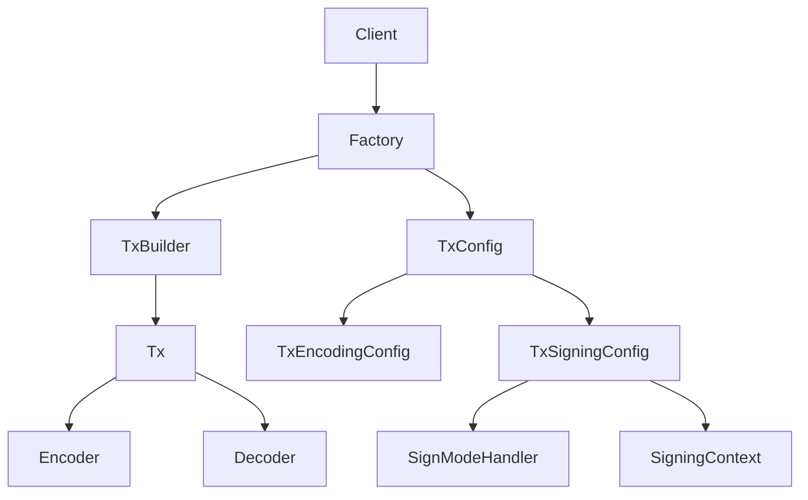
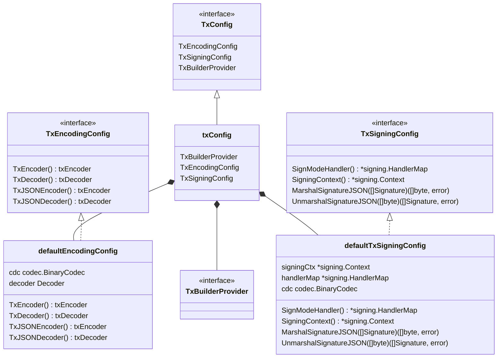
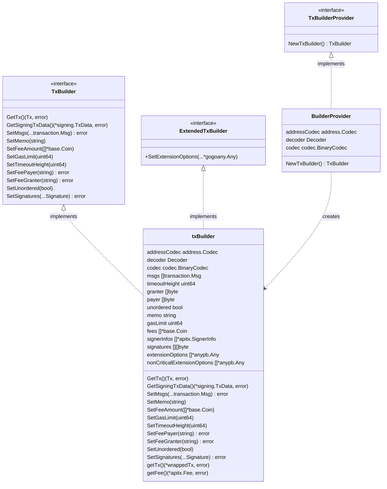
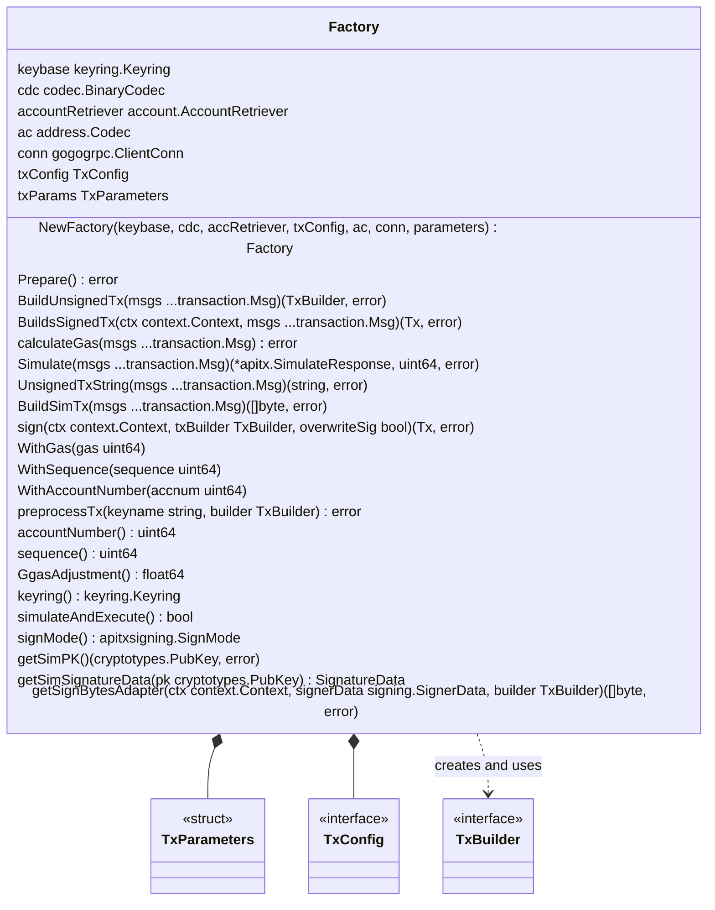
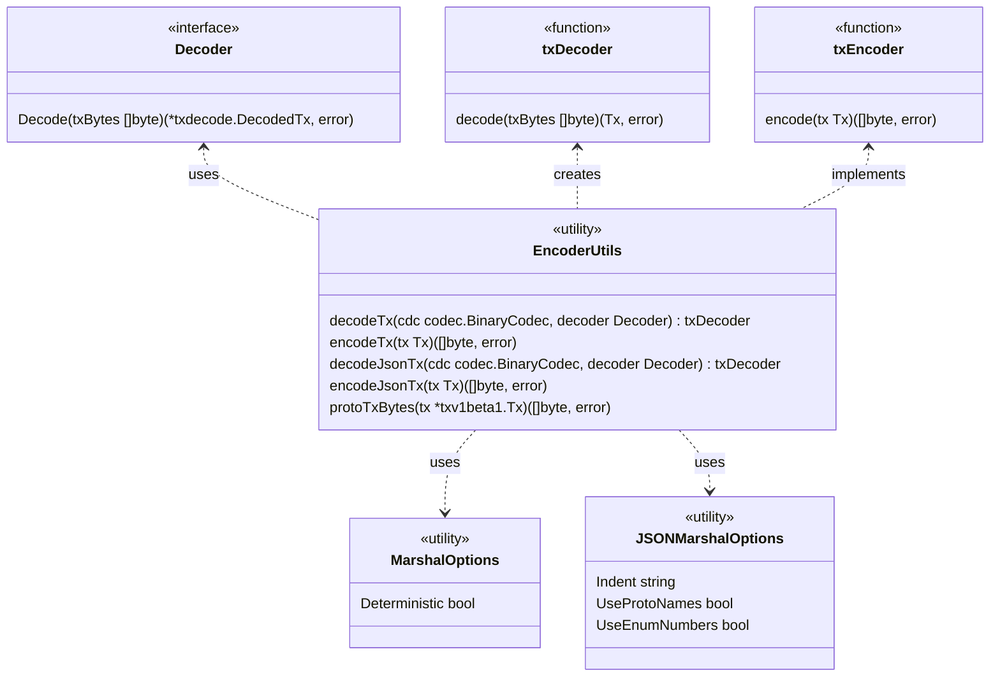
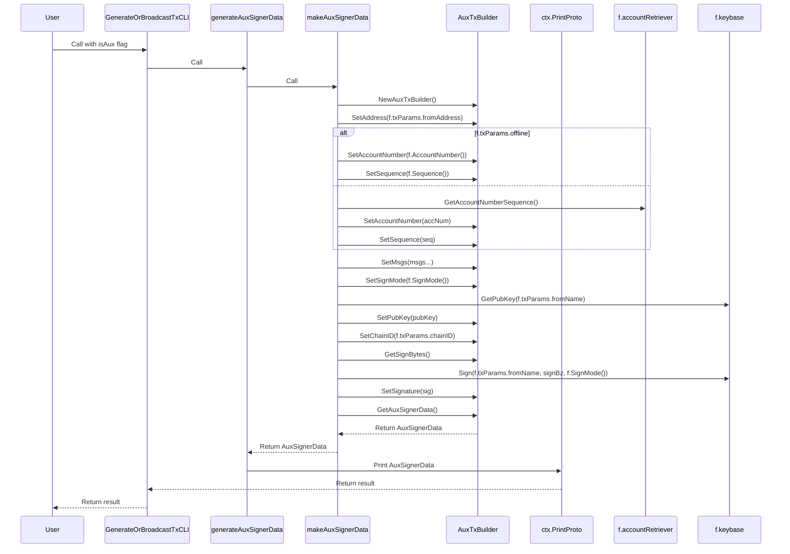
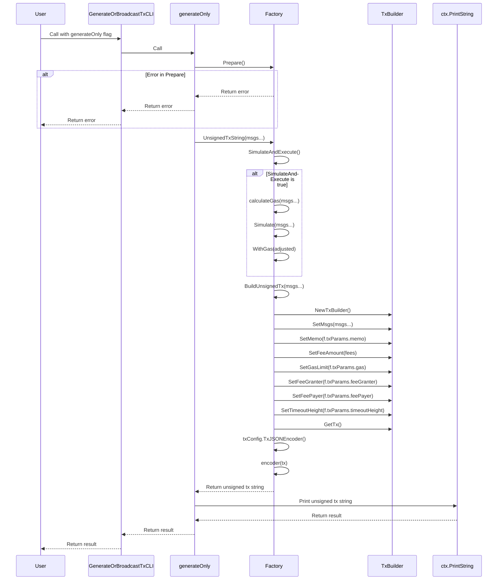
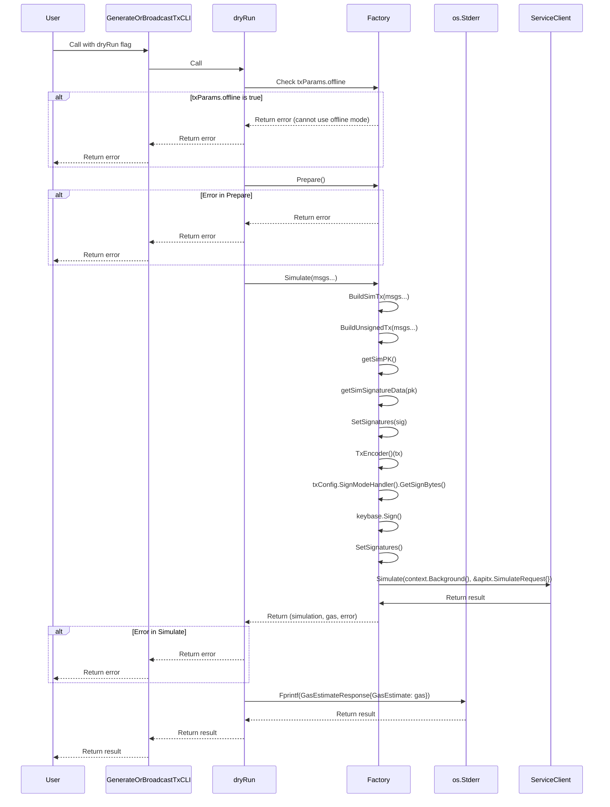
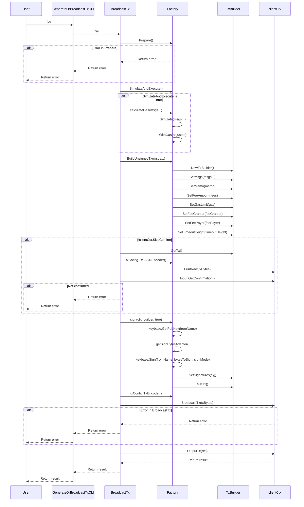

The tx package provides a robust set of tools for building, signing, and managing transactions in a Cosmos SDK-based blockchain application.

## Overview

This package includes several key components:

1. Transaction Factory
2. Transaction Builder
3. Transaction Config
4. Transaction Encoder/Decoder
5. Signature Handling

## Architecture



## Key Components

### TxConfig

`TxConfig` provides configuration for transaction handling, including:

- Encoding and decoding
- Sign mode handling
- Signature JSON marshaling/unmarshaling



### TxBuilder

`TxBuilder` is responsible for constructing the transaction.



### Factory

The `Factory` is the main entry point for creating and managing transactions. It handles:

- Account preparation
- Gas calculation
- Transaction simulation
- Unsigned transaction building



### Encoder/Decoder

The package includes functions for encoding and decoding transactions in both binary and JSON formats.



### Sequence Diagrams

#### Generate Aux Signer Data

#### Generate Only


#### DryRun


#### Generate and Broadcast Tx


## Usage

To use the `tx` package, typically you would:

1. Create a `Factory`
2. Prepare the account
3. Build an unsigned transaction
4. Simulate the transaction (optional)
5. Sign the transaction
6. Broadcast the transaction

Here's a simplified example:

```go
factory, _ := NewFactory(...)
factory.Prepare()
txBuilder, _ := factory.BuildUnsignedTx(msgs...)
factory.Sign(ctx, txBuilder, true)
txBytes, _ := factory.txConfig.TxEncoder()(txBuilder.GetTx())
// Broadcast txBytes
```