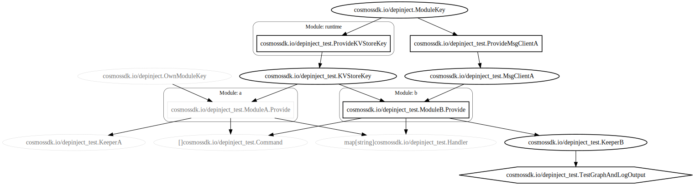
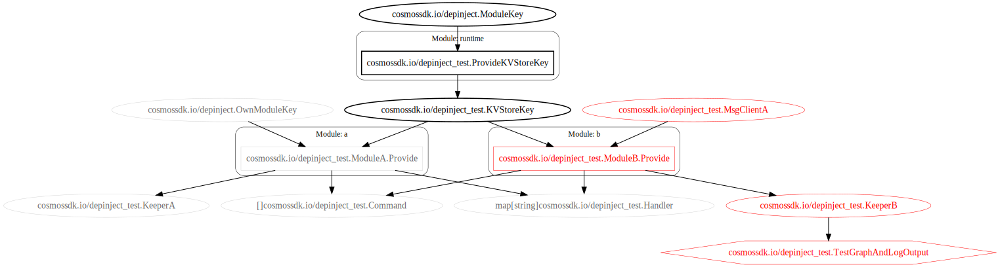

# Cosmos SDK Dependency Injection `depinject` Module

## Overview

`depinject` is a dependency injection framework for the Cosmos SDK. This module together with `core/appconfig` are meant
to simplify the definition of a blockchain by replacing most of app.go's boilerplate code with a configuration file (YAML or JSON).

## Usage

### `depinject` example 

```go
package main

import (
	"fmt"

	"cosmossdk.io/depinject"
)

type AnotherInt int

func main() {
	var (
	  x int
	  y AnotherInt
	)

	fmt.Printf("Before (%v, %v)\n", x, y)
	depinject.Inject(
		depinject.Provide(
			func() int { return 1 },
			func() AnotherInt { return AnotherInt(2) },
		),
		&x,
		&y,
	)
	fmt.Printf("After (%v, %v)\n", x, y)
}
```

### Full example in real app

```go
//go:embed app.yaml
var appConfigYaml []byte

var appConfig = appconfig.LoadYAML(appConfigYaml)

func NewSimApp(
	logger log.Logger,
	db dbm.DB,
	traceStore io.Writer,
	loadLatest bool,
	skipUpgradeHeights map[int64]bool,
	homePath string,
	invCheckPeriod uint,
	encodingConfig simappparams.EncodingConfig,
	appOpts servertypes.AppOptions,
	baseAppOptions ...func(*baseapp.BaseApp),
) *SimApp {
	app := &SimApp{
		invCheckPeriod: invCheckPeriod,
	}

	var (
		appBuilder *runtime.AppBuilder
		msgServiceRouter *baseapp.MsgServiceRouter
	)

	err := depinject.Inject(AppConfig,
		&appBuilder,
		&app.ParamsKeeper,
		&app.CapabilityKeeper,
		&app.appCodec,
		&app.legacyAmino,
		&app.interfaceRegistry,
		&app.AccountKeeper,
		&app.BankKeeper,
		&app.FeeGrantKeeper,
		&app.StakingKeeper,
		&msgServiceRouter,
	)
	if err != nil {
		panic(err)
	}
...
```

## Debugging

Issues with resolving dependencies in the container can be done with logs
and [Graphviz](https://graphviz.org) renderings of the container tree. By default, whenever there is an error, logs will
be printed to stderr and a rendering of the dependency graph in Graphviz DOT format will be saved to
`debug_container.dot`.

Here is an example Graphviz rendering of a successful build of a dependency graph:


Rectangles represent functions, ovals represent types, rounded rectangles represent modules and the single hexagon
represents the function which called `Build`. Black-colored shapes mark functions and types that were called/resolved
without an error. Gray-colored nodes mark functions and types that could have been called/resolved in the container but
were left unused.

Here is an example Graphviz rendering of a dependency graph build which failed:


Graphviz DOT files can be converted into SVG's for viewing in a web browser using the `dot` command-line tool, ex:
```
> dot -Tsvg debug_container.dot > debug_container.svg
```

Many other tools including some IDEs support working with DOT files.