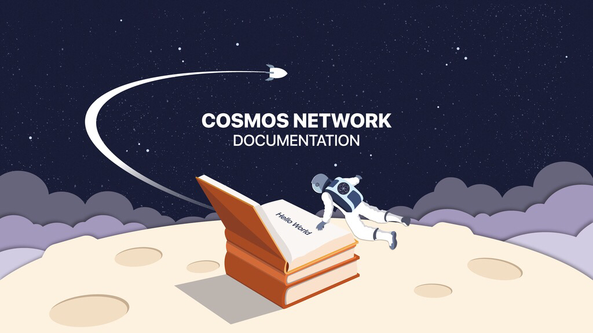

# Welcome to the Cosmos Docs!

Cosmos is a decentralized network of independent parallel blockchains, each powered by classical BFT consensus algorithms like Tendermint.

The first blockchain in the Cosmos Network is the Cosmos Hub, whose native token is the Atom. Cosmos is a permission-less network, meaning that anybody can build a blockchain on it.

Cosmos can interoperate with multiple other applications and cryptocurrencies. By creating a new zone, you can plug any blockchain system into the Cosmos hub and pass tokens back and forth between those zones, without the need for an intermediary.

## Quick Start

- [Getting started with the SDK](./sdk/core/intro.md)
- [SDK Examples](../examples)
- [Join the testnet](./getting-started/join-testnet.md#run-a-full-node)

## Edit the Documentation

See [this file](./DOCS_README.md) for details of the build process and
considerations when making changes.

## Version

This documentation is built from the following commit:
