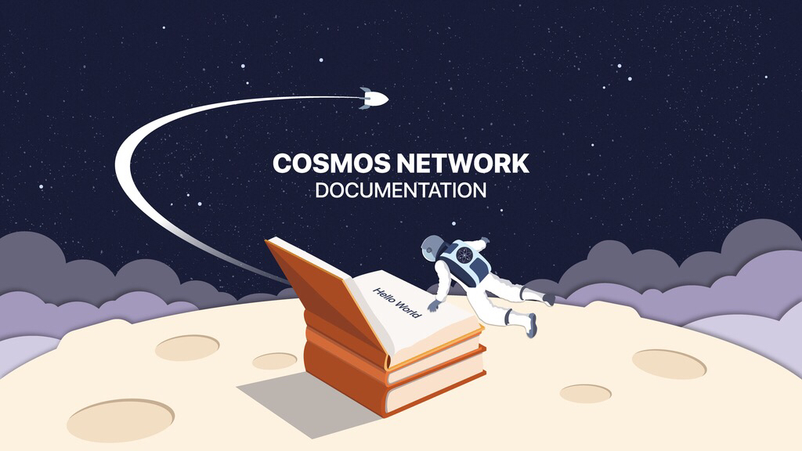

# Welcome to the SDK Docs!

This is the place to learn more about the Cosmos SDK! 

## Learn the SDK

### SDK Intro

If you are a newcomer and would like to learn more about the Cosmos SDK, this **[intro](./sdk.md)** is a good starting place.

### SDK tutorial

If you like to learn by doing, you can follow the **[SDK application tutorial](https://github.com/cosmos/sdk-application-tutorial)**. It showcases how to build an SDK-based blockchain from scratch, and teaches you about the basic principles the SDK in the process. 

## Use the SDK

The following sections contain the information you need if you want to build a fully-fonctional SDK-based blockchain:

>*NOTE*: We are currently working on improving the docs. Some info might be missing. 

- [Gaia](./gaia/README.md): Contains all documentation related to the gaia application (current name for the Cosmos-Hub). 
- [Reference](./reference/README.md): Explains the high-level concepts of the SDK (e.g. storage, gas, abstractions, ...)
- [Clients](./clients/README.md): Documentation about SDK clients like the SDK Command-Line interface and the SDK Light-client.
- [Modules](./modules/README.md): Contains specification of SDK modules.
- [Specifications](./spec/README.md): All specifications non-related to SDK modules (e.g. interchain standards, bech32, ...)

## Join the public testnet for the Cosmos Hub

To install the latest version of the `gaia` application and join the public testnet, **click [here](./gaia/README.md#join-the-cosmos-hub-public-testnet)**

## Edit the Documentation

See [this file](./DOCS_README.md) for details of the build process and
considerations when making changes.

