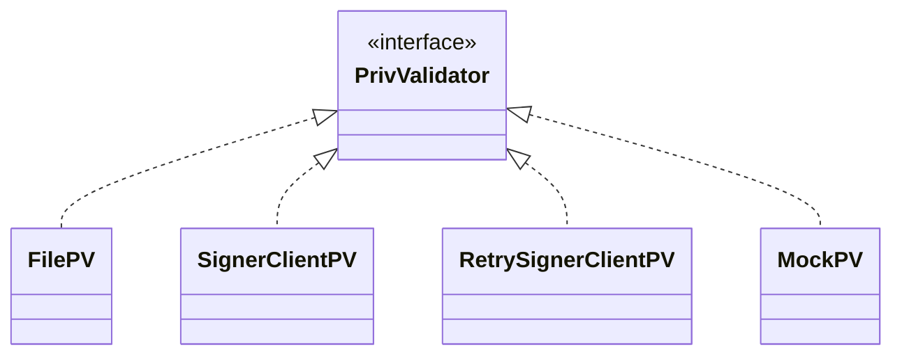
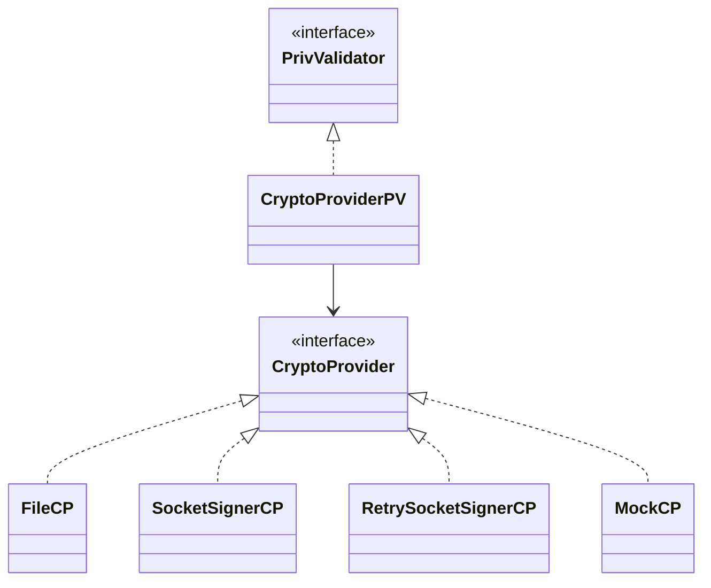

# ADR 071: Cryptography v2- Multi-curve support

## Change log

* May 7th 2024: Initial Draft (Zondax AG: @raynaudoe @juliantoledano @jleni @educlerici-zondax @lucaslopezf)
* June 13th 2024: Add CometBFT implementation proposal (Zondax AG: @raynaudoe @juliantoledano @jleni @educlerici-zondax @lucaslopezf)

## Status

DRAFT

## Abstract

This ADR proposes the refactoring of the existing `Keyring` and `cosmos-sdk/crypto` code to support multiple cryptographic curves for signing and verification processes. With this update, we aim to facilitate the integration of new cryptographic curves through clean and simple interfaces. Additionally, support for Hardware Security Modules (HSM) is introduced as a complementary enhancement in this redesign.

This ADR also introduces the capability to support remote signers. This feature will enable the nodes to interact with cryptographic signers that are not locally present on the system where the main app is running. This is particularly useful for scenarios where keys are managed in secure, remote environments or when leveraging cloud-based cryptographic services.

Additionally, the appendix will describe the implementation of this ADR within the [cometBFT](https://github.com/cometbft/cometbft) codebase, specifically focusing on the interactions with the [PrivateValidator](https://github.com/cometbft/cometbft/blob/68e5e1b4e3bd342a653a73091a1af7cc5e88b86b/types/priv_validator.go#L15) interface. See the [Appendix](#appendix) for more details on CometBFT integration.

## Introduction


The introduction of multi-curve support in the cosmos-sdk cryptographic module offers significant advantages. By not being restricted to a single cryptographic curve, developers can choose the most appropriate curve based on security, performance, and compatibility requirements. This flexibility enhances the application's ability to adapt to evolving security standards and optimizes performance for specific use cases, helping to future-proofing the sdk's cryptographic capabilities.


Special focus has been placed on the following key aspects:

* modularity
* extensibility
* security
* maintainability
* developer experience

The enhancements in this proposal not only render the ["Keyring ADR"](https://github.com/cosmos/cosmos-sdk/issues/14940) obsolete, but also encompass its key aspects, replacing it with a more flexible and comprehensive approach. Furthermore, the gRPC service proposed in the mentioned ADR can be easily implemented as a specialized `CryptoProvider`. 

We'll introduce the concept of `CryptoProvider` in the following sections.


### Glossary

1. **Interface**: In the context of this document, "interface" refers to Go's interface.

2. **Module**: In this document, "module" refers to a Go module.

3. **Package**: In the context of Go, a "package" refers to a unit of code organization.

## Context

In order to fully understand the need for changes and the proposed improvements, it's crucial to consider the current state of affairs:

* The Cosmos SDK currently lacks a comprehensive ADR for the cryptographic package.

* If a blockchain project requires a cryptographic curve that is not supported by the current SDK, the most likely scenario is that they will need to fork the SDK repository and make modifications. These modifications could potentially make the fork incompatible with future updates from the upstream SDK, complicating maintenance and integration.

* Type leakage of specific crypto data types expose backward compatibility and extensibility challenges.

* The demand for a more flexible and extensible approach to cryptography and address management is high.

* Architectural changes are necessary to resolve many of the currently open issues related to new curves support.

* There is a current trend towards modularity in the Interchain stack (e.g., runtime modules).

* Security implications are a critical consideration during the redesign work.

## Objectives

The key objectives for this proposal are:

Modular Design Philosophy

* Establish a flexible and extensible foundation using interfaces to enable the seamless integration of various cryptographic curves.

* Restructure, Refactor, and Decouple: Update the codebase to ensure modularity and future adaptability.

Documentation & Community Engagement

* Enhance documentation to ensure clarity, establish a good practices protocol and promote community engagement, providing a platform for feedback and collaborative growth.

Backward Compatibility & Migration

* Prioritize compatibility with previous version to avoid disruptions for existing users.

* Design and propose a suitable migration path, ensuring transitions are as seamless as possible.


Developer-Centric Approach

* Prioritize clear, intuitive interfaces and best-practice design principles.


Quality Assurance

* Enhanced Test Coverage: Improve testing methodologies to ensure the robustness and reliability of the module.

* Conduct an Audit: After implementation, perform a comprehensive audit to identify potential vulnerabilities and ensure the module's security and stability.

## Technical Goals

Multi-curve support:

* Support for a wide range of cryptographic curves to be integrated seamlessly into the sdk in a modular way.

Wide Hardware Device & Cloud-based HSM Interface Support:

* Design a foundational interface for various hardware devices (Ledger, YubiKey, Thales, etc.) and cloud-based HSMs (Amazon, Azure) to support both current and future implementations.

Testing:

* Design an environment for testing, ensuring developers can validate integrations without compromising system integrity.

New Keyring:

* Design a new Keyring interface with modular backends injection system to support hardware devices and cloud-based HSMs. This feature is optional and tied to complexity; if it proves too complex, it will be deferred to a future release as an enhancement.


## Proposed architecture

### Introduction

In this section, we will first introduce the concept of a `CryptoProvider`, which serves as the main API. Following this, we will present the detailed components that make up the `CryptoProvider`. Lastly, we will introduce the storage and persistence layer, providing code snippets for each component to illustrate their implementation.


#### Crypto Provider

This **interface** acts as a centralized controller, encapsulating the APIs for the **signing**, **verifying** and **hashing** functionalities. It acts as the main API with which the apps will interact with

By abstracting the underlying cryptographic functionalities, `CryptoProvider` enables a modular and extensible architecture, aka 'pluggable cryptography'. It allows users to easily switch between different cryptographic implementations without impacting the rest of the system.

The `CryptoProvider` interface includes getters for essential cryptographic functionalities and its metadata:


```go
// CryptoProvider aggregates the functionalities of signing, verifying, and hashing, and provides metadata.
type CryptoProvider interface {
    // GetSigner returns an instance of Signer.
    GetSigner() Signer

    // GetVerifier returns an instance of Verifier.
    GetVerifier() Verifier

    // GetHasher returns an instance of Hasher.
    GetHasher() Hasher

    // Metadata returns metadata for the crypto provider.
    Metadata() ProviderMetadata
}
```

##### Components

The components defined here are designed to act as *wrappers* around the underlying proper functions. This architecture ensures that the actual cryptographic operations such as signing, hashing, and verifying are delegated to the specialized functions, that are implementation dependant. These wrapper components facilitate a clean and modular approach by abstracting the complexity of direct cryptographic function calls.

In all of the interface's methods, we add an *options* input parameter of type `map[string]any`, designed to provide a flexible and dynamic way to pass various options and configurations to the `Sign`, `Verify`, and `Hash` functions. This approach allows developers to customize these processes by including any necessary parameters that might be required by specific algorithms or operational contexts. However, this requires that a type assertion for each option be performed inside the function's implementation.

###### Signer

Interface responsible for signing a message and returning the generated signature. 
The `SignerOpts` map allows for flexible and dynamic configuration of the signing process.
This can include algorithm-specific parameters, security levels, or other contextual information
that might be necessary for the signing operation.

```go
// Signer represents a general interface for signing messages.
type Signer interface {
    // Sign takes a signDoc as input and returns the digital signature.
    Sign(signDoc []byte, options SignerOpts) (Signature, error)
}

type SignerOpts = map[string]any
```

###### Signature

```go
// Signature represents a general interface for a digital signature.
type Signature interface {
    // Bytes returns the byte representation of the signature.
    Bytes() []byte

    // Equals checks if two signatures are identical.
    Equals(other Signature) bool
}
```

###### Verifier

Verifies if given a message belongs to a public key by validating against its respective signature.

```go
// Verifier represents a general interface for verifying signatures.
type Verifier interface {
    // Verify checks the digital signature against the message and a public key to determine its validity.
    Verify(signature Signature, signDoc []byte, pubKey PubKey, options VerifierOpts) (bool, error)
}

type VerifierOpts = map[string]any
```

###### Hasher

This interface allows to have a specific hashing algorithm.

```go
// Hasher represents a general interface for hashing data.
type Hasher interface {
    // Hash takes an input byte array and returns the hashed output as a byte array.
    Hash(input []byte, options HasherOpts) (output []byte, err error)
}

type HasherOpts = map[string]any
```

###### Metadata

The metadata allows uniquely identifying a `CryptoProvider` and also stores its configurations.

```go
// ProviderMetadata holds metadata about the crypto provider.
type ProviderMetadata struct {
    Name    string
    Type    string
    Version *semver.Version // Using semver type for versioning
    Config  map[string]any
}
```

###### Public Key

*Note:* Here we decoupled the `Address` type from its corresponding `PubKey`. The corresponding codec step is proposed to be abstracted out from the CryptoProvider layer.

```go
type PubKey interface {
	Bytes() []byte
	Equals(other PubKey) bool
	Type() string
}
```

###### Private Key

*Note*: For example, in hardware wallets, the `PrivKey` interface acts only as a *reference* to the real data. This is a design consideration and may be subject to change during implementation.

Future enhancements could include additional security functions such as **zeroing** memory after private key usage to further enhance security measures.


```go
type PrivKey interface {
	Bytes() []byte
	PubKey() PubKey
	Equals(other PrivKey) bool
	Type() string
}
```

##### Storage and persistence

The storage and persistence layer is tasked with storing a `CryptoProvider`s. Specifically, this layer must:

* Securely store the crypto provider's associated private key (only if stored locally, otherwise a reference to the private key will be stored instead).
* Store the `ProviderMetadata` struct which contains the data that distinguishes that provider.

The purpose of this layer is to ensure that upon retrieval of the persisted data, we can access the provider's type, version, and specific configuration (which varies based on the provider type). This information will subsequently be utilized to initialize the appropriate factory, as detailed in the following section on the factory pattern.

The storage proposal involves using a modified version of the [Record](https://github.com/cosmos/cosmos-sdk/blob/main/proto/cosmos/crypto/keyring/v1/record.proto) struct, which is already defined in **Keyring/v1**. Additionally, we propose utilizing the existing keyring backends (keychain, filesystem, memory, etc.) to store these `Record`s in the same manner as the current **Keyring/v1**.

*Note: This approach will facilitate a smoother migration path from the current Keyring/v1 to the proposed architecture.*

Below is the proposed protobuf message to be included in the modified `Record.proto` file

###### Protobuf message structure

```protobuf

// cryptoprovider.proto

syntax = "proto3";

package crypto;

import "google/protobuf/any.proto";

// CryptoProvider holds all necessary information to instantiate and configure a CryptoProvider.
message CryptoProvider {
    string name = 1; // (unique) name of the crypto provider.
    google.protobuf.Any pub_key = 2;
    string type = 3;       // Type of the crypto provider
    string version = 4;    // Version (semver format)
    map<string, bytes> config = 5;  // Configuration data with byte array values
    google.protobuf.Any privKey = 6; // Optional if key is stored locally
}
```
<b>name</b>:
Specifies the unique name of the crypto provider. This name is used to identify and reference the specific crypto provider instance.

<b>pub_key (google.protobuf.Any)</b>:
Holds the public key associated with the crypto provider.

<b>type</b>:
Specifies the type of the crypto provider. This field is used to identify and differentiate between various crypto provider implementations. Examples: `ledger`, `AWSCloudHSM`, `local-secp256k1`

<b>version</b>:
Indicates the version of the crypto provider using semantic versioning.

<b>configuration (map<string, bytes>)</b>:
Contains serialized configuration data as key-value pairs, where the key is a string and the value is a byte array.

<b>privKey (google.protobuf.Any)</b>:
An optional field that can store a private key if it is managed locally.


The [record.proto](https://github.com/cosmos/cosmos-sdk/blob/main/proto/cosmos/crypto/keyring/v1/record.proto) file will be modified to include the `CryptoProvider` message as an optional field as follows.

```protobuf

// record.proto

message Record {
  string name = 1;
  google.protobuf.Any pub_key = 2;

  oneof item {
    Local local = 3;
    Ledger ledger = 4;
    Multi multi = 5;
    Offline offline = 6;
    CryptoProvider crypto_provider = 7; // <- New
  }

  message Local {
    google.protobuf.Any priv_key = 1;
  }

  message Ledger {
    hd.v1.BIP44Params path = 1;
  }

  message Multi {}

  message Offline {}
}
```

##### Creating and loading a `CryptoProvider`

For creating providers, we propose a *factory pattern* and a *registry* for these builders.

Below, we present the proposed interfaces and code snippets to illustrate the proposed architecture.

```go
// CryptoProviderFactory is a factory interface for creating CryptoProviders.
// Must be implemented by each crypto provider.
type CryptoProviderFactory interface {
    CreateFromRecord(*Record) (CryptoProvider, error)
    CreateFromConfig(ProviderMetadata) (CryptoProvider, error)
}
```

**Note**: The mechanisms for storing and loading `records` will utilize the existing infrastructure from **Keyring/v1**.

**Code snippet**: provider **factory** and builder **registry**

```go
// crypto/v2/providerFactory.go

var providerFactories map[string]CryptoProviderFactory

// RegisterCryptoProviderFactory is a function that registers a CryptoProviderFactory for a CryptoProvider.
func RegisterCryptoProviderFactory(provider CryptoProvider, factory CryptoProviderFactory) string {
    metadata := provider.Metadata()
    id := generateProviderID(metadata)
    providerFactories[id] = factory
    return id
}

// CreateCryptoProviderFromRecordOrConfig creates a CryptoProvider based on the provided Record or ProviderMetadata.
// It enforces that exactly one of Record or ProviderMetadata must be provided.
func CreateCryptoProviderFromRecordOrConfig(id string, record *Record, config *ProviderMetadata) (CryptoProvider, error) {
    factory, exists := providerFactories[id]
    if !exists {
        return nil, fmt.Errorf("no factory registered for id %s", id)
    }

    // Validate input parameters
    if record == nil && config == nil {
        return nil, fmt.Errorf("both record and config cannot be nil")
    }
    if record != nil && config != nil {
        return nil, fmt.Errorf("both record and config cannot be provided simultaneously")
    }

    // Determine which factory method to call based on the input
    if record != nil {
        return factory.CreateFromRecord(record)
    }
    if config != nil {
        return factory.CreateFromConfig(*config)
    }

    // This line should never be reached due to the checks above
    return nil, fmt.Errorf("unexpected error in CreateCryptoProviderFromRecordOrConfig")
}

// generateProviderID is a function that generates a unique identifier for a CryptoProvider based on its metadata.
// This can be changed in the future to a more suitable function if needed.
func generateProviderID(metadata ProviderMetadata) string {
    return fmt.Sprintf("%s-%s", metadata.Type, metadata.Version)
}
```

**Example**: Ledger HW implementation 

Below is an example implementation of how a Ledger hardware wallet `CryptoProvider` might implement the registration of its factory and how instantiation would work.

```go
// crypto/v2/providers/ledger/factory.go

type LedgerCryptoProviderFactory struct {
    DevicePath string
    // Any other necessary fields goes here 
}

func (f *LedgerCryptoProviderFactory) CreateFromRecord(record *Record) (CryptoProvider, error) {
    // Extract necessary data from the record to initialize a LedgerCryptoProvider
    if record == nil {
        return nil, fmt.Errorf("record is nil")
    }

    // Assuming the record contains necessary fields like devicePath
    devicePath, ok := record.CryptoProvider.Config["devicePath"].(string)
    if !ok {
        return nil, fmt.Errorf("device path not found in record")
    }

    // Initialize the LedgerCryptoProvider with the device path
    return &LedgerCryptoProvider{DevicePath: devicePath}, nil
}

// crypto/v2/examples/registerProvider.go


import (
    "crypto/v2/providers"
    "log"
)

func main() {
    // Create an instance of the factory
    ledgerFactory := &crypto.LedgerCryptoProviderFactory{}

    // Register the factory
    id := crypto.RegisterCryptoProviderFactory("LedgerCryptoProvider", ledgerFactory)

    // Example of using a Record
    record, err := keyring.GetRecord("ledgerDevice-0")
    if err != nil {
        log.Fatalf("Error fetching record from keyring: %s", err)
    }
    ledgerProvider, err := crypto.CreateCryptoProviderFromRecordOrConfig(id, record, nil)
    if err != nil {
        log.Fatalf("Error creating crypto provider from record: %s", err)
    }
    log.Printf("Provider from record created successfully: %+v", ledgerProvider.Metadata())

    // ledgerProvider CryptoProvider ready to use 
}

```


##### Keyring

The new `Keyring` interface will serve as a central hub for managing and fetching `CryptoProviders`. To ensure a smoother migration path, the new Keyring will be backward compatible with the previous version. Since this will be the main API from which applications will obtain their `CryptoProvider` instances, the proposal is to extend the Keyring interface to include the methods:


```go
type KeyringV2 interface {
  // methods from Keyring/v1
  
  // ListCryptoProviders returns a list of all the stored CryptoProvider metadata.
  ListCryptoProviders() ([]ProviderMetadata, error)
  
  // GetCryptoProvider retrieves a specific CryptoProvider by its id.
  GetCryptoProvider(id string) (CryptoProvider, error)
}
```

*Note*: Methods to obtain a provider from a public key or other means that make it easier to load the desired provider can be added.

##### Especial use case: remote signers

It's important to note that the `CryptoProvider` interface is versatile enough to be implemented as a remote signer. This capability allows for the integration of remote cryptographic operations, which can be particularly useful in distributed or cloud-based environments where local cryptographic resources are limited or need to be managed centrally.

Here are a few of the services that can be leveraged:

* AWS CloudHSM
* Azure Key Vault
* HashiCorp Vault
* Google Cloud KMS

## Alternatives

It is important to note that all the code presented in this document is not in its final form and could be subject to changes at the time of implementation. The examples and implementations discussed should be interpreted as alternatives, providing a conceptual framework rather than definitive solutions. This flexibility allows for adjustments based on further insights, technical evaluations, or changing requirements as development progresses.

## Decision

We will:

* Refactor the module structure as described above.
* Define types and interfaces as the code attached.
* Refactor existing code into new structure and interfaces.
* Implement Unit Tests to ensure no backward compatibility issues.
* All code will be uploaded to the already existing [cosmos/crypto](https://github.com/cosmos/crypto) repo. Once a first stable release is ready, the projects that decide to adopt this package will be ready to clean up their internal crypto-related code to avoid code duplication and cluttering.

## Consequences

### Impact on the SDK codebase

We can divide the impact of this ADR into two main categories: state machine code and client related code.

#### Client

The major impact will be on the client side, where the current `Keyring` interface will be replaced by the new `KeyringV2` interface. At first, the impact will be low since `CryptoProvider` is an optional field in the `Record` message, so there's no mandatory requirement for migrating to this new concept right away. This allows a progressive transition where the risks of breaking changes or regressions are minimized.


#### State Machine

The impact on the state machine code will be minimal, the modules affected (at the time of writing this ADR)
are the `x/accounts` module, specifically the `Authenticate` function and the `x/auth/ante` module. This function will need to be adapted to use a `CryptoProvider` service to make use of the `Verifier` instance.

Worth mentioning that there's also the alternative of using `Verifier` instances in a standalone fashion (see note below).

The specific way to adapt these modules will be deeply analyzed and decided at implementation time of this ADR.


*Note*: All cryptographic tools (hashers, verifiers, signers, etc.) will continue to be available as standalone packages that can be imported and utilized directly without the need for a `CryptoProvider` instance. However, the `CryptoProvider` is the recommended method for using these tools as it offers a more secure way to handle sensitive data, enhanced modularity, and the ability to store configurations and metadata within the `CryptoProvider` definition.


### Backwards Compatibility

The proposed migration path is similar to what the cosmos-sdk has done in the past. To ensure a smooth transition, the following steps will be taken:

* Develop all new code in [cosmos/crypto](https://github.com/cosmos/crypto) repo. Create unit tests, documentation and examples.
* Deprecate the old crypto package. The old crypto package will still be usable, but it will be marked as deprecated and users can opt to use the new package.
* Migrate the codebase to use the new cosmos/crypto package and remove the old crypto one.

_A more detailed migration path is provided in the corresponding document._

### Positive

* Single place of truth
* Easier to use interfaces
* Easier to extend
* Unit test for each crypto package
* Greater maintainability
* Incentivize addition of implementations instead of forks
* Decoupling behavior from implementation
* Sanitization of code

### Negative

* It will involve an effort to adapt existing code.
* It will require attention to detail and audition.

### Neutral

* It will involve extensive testing.

## Test Cases

* The code will be unit tested to ensure a high code coverage
* There should be integration tests around Keyring and CryptoProviders.

## Further Discussions

> While an ADR is in the DRAFT or PROPOSED stage, this section should contain a
> summary of issues to be solved in future iterations (usually referencing comments
> from a pull-request discussion).
>
> Later, this section can optionally list ideas or improvements the author or
> reviewers found during the analysis of this ADR.


## References

* TPM 2.0 support: https://github.com/google/go-tpm
* https://solanacookbook.com/references/keypairs-and-wallets.html#how-to-generate-a-new-keypair
* https://www.nist.gov/news-events/news/2022/07/nist-announces-first-four-quantum-resistant-cryptographic-algorithms
* https://blog.cloudflare.com/nist-post-quantum-surprise/
* https://pkg.go.dev/crypto#Hash
* https://cheatsheetseries.owasp.org/cheatsheets/Password_Storage_Cheat_Sheet.html

## Appendix


### Implementation on CometBFT Codebase

The implementation of this ADR in CometBFT will require a medium-level refactor of the codebase. Below we describe the proposed strategy to perform this implementation, which is:

* Add a new `PrivValidator` implementation that uses the `CryptoProvider` interface underneath.

* **[Optional]** Adding [Keyring](https://github.com/cosmos/cosmos-sdk/blob/main/crypto/keyring/keyring.go) and [Record](https://github.com/cosmos/cosmos-sdk/blob/main/proto/cosmos/crypto/keyring/v1/record.proto) for storing and loading providers.

* New directories reorganization.

* **[Optional]** Use `Keyring` to load and instantiate validators when booting up a node.


#### Create a single implementation for `PrivValidator` 


The current CometBFT codebase includes the following implementations of `PrivValidator`:

* `FilePV`: Handles file-based private validators.
* `SignerClient`: Manages remote signing.
* `RetrySignerClient`: Provides retry mechanisms for remote signing.
* `MockPV`: Used exclusively for testing purposes.

We propose introducing a new implementation, `CryptoProviderPV`, which will unify and replace all the above implementations. This single implementation will act as an abstraction layer for the `PrivValidator` implementations mentioned above.

**Current:**




**Proposed:**



For these new implementations, the current code for `File`, `SocketClient`, and `RetrySocketClient` will have to implement the `CryptoProvider` interface instead of the `PrivValidator` one.

##### Code snippet for `CryptoProviderPV`

As mentioned above, instead of having several implementations of `PrivValidator`, the proposal is to have only one that, by dependency injection, loads the corresponding `CryptoProvider` that offers the same functionality as the previous implementations of `PrivValidator`.

Below is an example of how `CryptoProviderPV` would look like. Note that in this particular case, since the PrivateKey is managed inside the corresponding implementation, we're not passing that value to the signer. This is to avoid having to significantly change the code for `FilePV`. This is also valid for all implementations that manage their private keys in their own logic.

```go
// CryptoProviderPV is the implementation of PrivValidator using CryptoProvider's methods
type CryptoProviderPV struct {
    provider CryptoProvider
    pubKey   PubKey
}

// NewCryptoProviderPV creates a new instance of CryptoProviderPV
func NewCryptoProviderPV(provider CryptoProvider, pk PubKey) (*CryptoProviderPV, error) {
    return &CryptoProviderPV{provider: provider, pubKey: pubKey}, nil
}

// GetPubKey returns the public key of the validator
func (pv *CryptoProviderPV) GetPubKey() (PubKey, error) {
    return pv.pubKey, nil
}

// SignVote signs a canonical representation of the vote. If signExtension is true, it also signs the vote extension.
func (pv *CryptoProviderPV) SignVote(chainID string, vote *Vote, signExtension bool) error {
    signer := pv.provider.GetSigner()

    // code for getting voteBytes goes here
    // voteBytes := ...

    // The underlying signer needs these parameters so we pass them through SignerOpts
    options := SignerOpts{
        "chainID": chainID,
        "vote":    vote,
    }
 
    sig, _ := signer.Sign(voteBytes, options)
    vote.Signature = sig
    return nil
}

// SignProposal signs a canonical representation of the proposal
func (pv *CryptoProviderPV) SignProposal(chainID string, proposal *Proposal) error {
    signer := pv.provider.GetSigner()

    // code for getting proposalBytes goes here
    // proposalBytes := ...

    // The underlying signer needs these parameters so we pass them through SignerOpts
    options := SignerOpts{
        "chainID":  chainID,
        "proposal": proposal,
    }
 
    sig, _ := signer.Sign(proposalBytes, options)
    proposal.Signature = sig
    return nil
}

// SignBytes signs an arbitrary array of bytes
func (pv *CryptoProviderPV) SignBytes(bytes []byte) ([]byte, error) {
    signer := pv.provider.GetSigner()
    return signer.Sign(bytes, SignerOpts{})
}

```

*Note:* Each provider (File, Socket, SignerClient, RetrySignerClient) will need to be modified to satisfy the `CryptoProvider` interface.


#### Loading and storing implementations

Alternatives:

* Low impact / minimal dependencies: The corresponding CryptoProvider [Protobuf message](#protobuf-message-structure) can be directly stored on disk in a dedicated directory in an encoding format of choice (text, JSON).

* Greater impact / better security: Use cosmos-sdk's [Keyring](https://github.com/cosmos/cosmos-sdk/blob/439f2f9d5b5884bc9df4b58d702555330549a898/crypto/keyring/keyring). to manage CryptoProviders along with its private keys. This specifically applies to the `FilePV` implementation, which could store its private keys in Keyring instead of a file in the filesystem. This approach will require decoupling the Keyring package from the cosmos-sdk to avoid having CometBFT import artifacts from that repository.


Implementations of crypto providers (previously `Privval` implementations) should be in their own directory:

```
cometbft/
├── privval/
│   ├── providers/
│   │   ├── file_provider.go
│   │   ├── signer_provider.go
│   │   ├── retry_signer_provider.go
│   │   ├── mock_provider.go
├── types/
│   ├── priv_validator.go
```

#### Other considerations

##### Node startup

Node's configuration file should include the name of the `CryptoProvider` to be loaded at startup. Also, the startup logic will need to be changed from creating a validator to loading a `CryptoProvider`


### Tentative Primitive Building Blocks

This is a **tentative** list of primitives that we might want to support.
**This is not a final list or comprehensive, and it is subject to change.**
Moreover, it is important to emphasize the purpose of this work allows extensibility so any other primitive can be added in the future.

* digital signatures
    *  RSA (PSS)
    *  ECDSA (secp256r1, secp256k1, etc.)
    *  EdDSA (ed25519, ed448)
    *  SR25519
    *  Schnorr
    *  Lattice-based (Dilithium)
    *  BLS (BLS12-381, 377?)

* Hashing
    * sha2 / sha3
    * RIPEMD-160
    * blake2b,2s,3
    * Keccak-256 / shake256
    * bcrypt / scrypt / argon2, Argon2d/i/id
    * Pedersen
