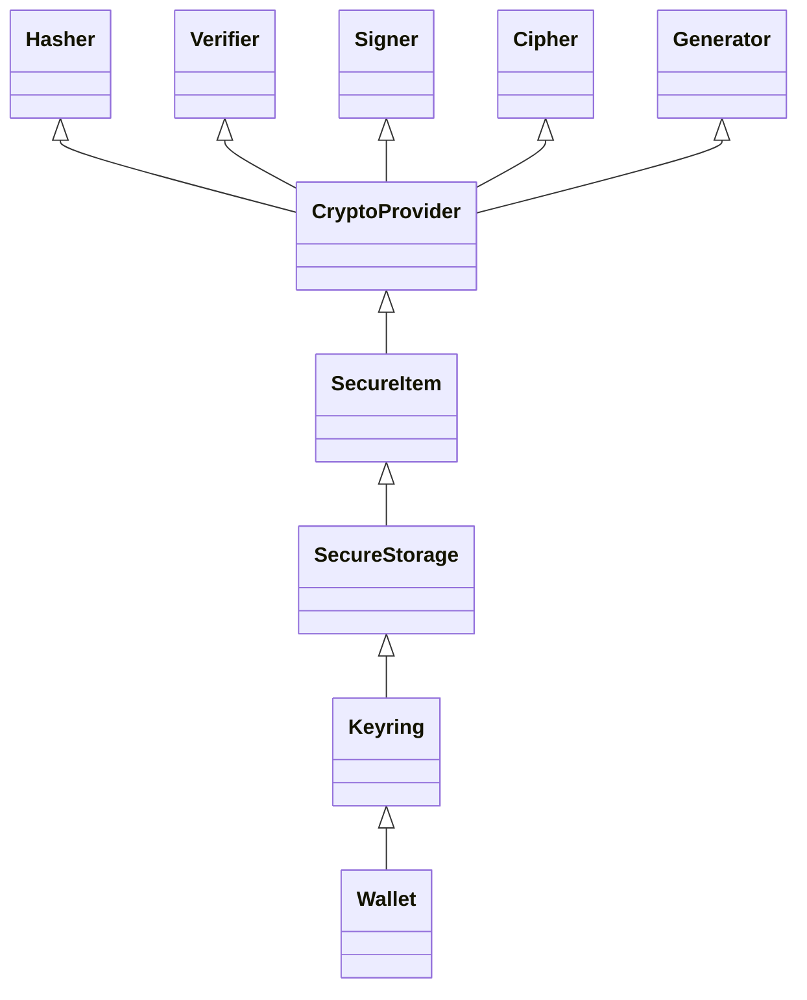
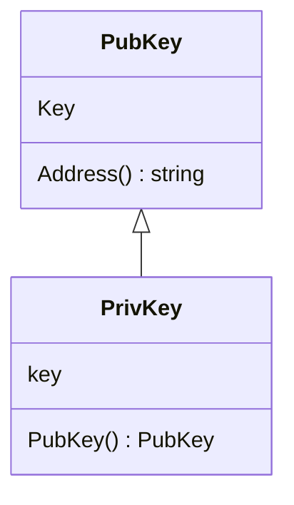
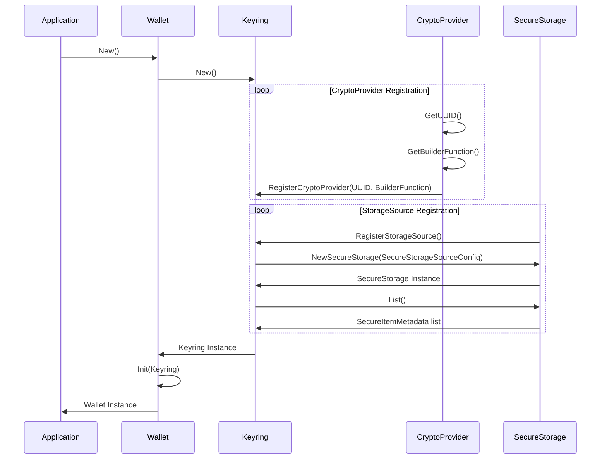
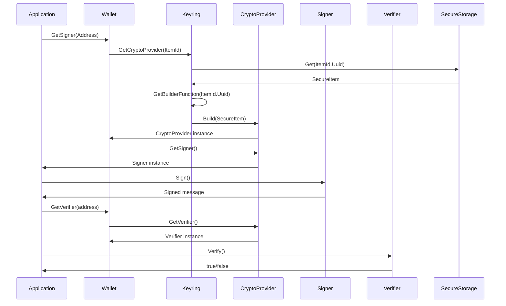

# ADR 071: Cryptography v2

## Change log

* Feb 8th 2024: Fixes and improvements (Zondax AG: @raynaudoe @juliantoledano @jleni @educlerici-zondax)
* Nov 1st 2023: Initial Draft (Zondax AG: @raynaudoe @bizk @juliantoledano @jleni @educlerici-zondax)

## Status

DRAFT

## Abstract

This ADR proposes the creation of a new crypto module (**cryptoV2** from now on) to enhance the modularity, re-usability, and maintainability
of all the crypto tools and algorithms available in the sdk while prioritizing developer experience and incorporating best security practices.
The proposal defines a clear division of scope for each component, cleaner interfaces, easier extension,
better test coverage and a single place of truth, allowing the developer to focus on what's important
while ensuring the secure handling of sensitive data throughout the module. Lastly but not least allowing the ecosystem to
grow and implement new cryptographic methods and tools as easy as possible.

## Introduction

This ADR outlines the redesign of the crypto package. The design establishes a clear decoupling via interfaces, extension points, and a much more modular design to allow developers to concentrate on application level aspects while ensuring the adequate handling of sensitive data.

Special focus has been placed on the following key aspects:

* modularity
* extensibility
* security
* maintainability
* developer experience

The enhancements in this proposal not only render the ["Keyring ADR"](https://github.com/cosmos/cosmos-sdk/issues/14940) obsolete, but also encompass its key aspects, replacing it with a more flexible and comprehensive approach. Furthermore, the gRPC service proposed in the Keyring ADR can be easily implemented as a specialized implementation of the "CryptoProvider" interface defined later in this ADR. This allows for the integration of HashiCorp-like [go-plugins](https://github.com/hashicorp/go-plugin) over gRPC, providing a robust and extensible solution for keyring functionality.

Furthermore, the grpc service proposed in the Keyring ADR can be easily followed by creating an implementation of the "CryptoProvider" interface defined in this ADR. This allows, for example, the integration of HashiCorp plugins over gRPC, providing more flexible implementations.

### Glossary

1. **Interface**: In the context of this document, "interface" refers to Go's interface concept.

2. **Module**: In this document, "module" refers to a Go module.

3. **Package**: In the context of Go, a "package" refers to a unit of code organization.

## Context

In order to fully understand the need for changes and the proposed improvements, it's crucial to consider the current state of affairs:

* The Cosmos SDK currently lacks a comprehensive ADR for the cryptographic package.
* Type leakage of specific crypto data types expose backward compatibility and extensibility challenges.
* The demand for a more flexible and extensible approach to cryptography and address management is high.
* Architectural changes are necessary to resolve many of the currently open issues.
* There is a current trend towards modularity in the Interchain stack (e.g. runtime modules)
* Security implications are a critical consideration during the redesign work.

## Objectives

The key objectives for the CryptoV2 module are:

Modular Design Philosophy

* Establish a flexible and extensible foundation using interfaces to enable the seamless integration of various cryptographic methods and tools.

* Restructure, Refactor, and Decouple: Update the cryptography codebase to ensure modularity and future adaptability.

Documentation & Community Engagement

* Cryptography v2 ADR: Draft a new Architecture Decision Record to guide and document the evolution of the module (this document).

* Enhance documentation to ensure clarity, establish a good practices protocol and promote community engagement, providing a platform for feedback and collaborative growth.

Backward Compatibility & Migration

* Prioritize compatibility with previous module version to avoid disruptions for existing users.

* Design and propose a suitable migration path, ensuring transitions are as seamless as possible.

* Evaluate and decide on the relevance of existing systems and tools, incorporating or deprecating them based on their alignment with the module's new vision.

Developer-Centric Approach

* Prioritize clear, intuitive interfaces and best-practice design principles.
* Improve Developer Experience: Provide tools, samples, and best practices to foster an efficient and user-friendly development environment.

Leverage Extensibility

* Utilize the module's modular design to support a wide range of cryptographic tools, key types, and methods, ensuring adaptability for future technological advancements.
* Integrate support for advanced cryptographic features, ensuring the module's position at the forefront of cryptographic technologies.

Quality Assurance

* Enhanced Test Coverage: Improve testing methodologies to ensure the robustness and reliability of the module.
* Conduct an Audit: After implementation, perform a comprehensive audit to identify potential vulnerabilities and ensure the module's security and stability.

## Technical Goals

As technical goals, the aim is to create a robust, flexible, and future-proof cryptographic module. This is achieved through the following key points:

Wide Hardware Device & Cloud-based HSM Interface Support:

* Design a foundational interface for various hardware devices (Ledger, YubiKey, Thales, etc.) and cloud-based HSMs (Amazon, Azure) to cater to both current and future implementations.

Plugin Architecture and Dependency Injection

* Establish the architectural foundation for an extensible plugin system and integrate a dependency injection framework, ensuring modularity, testability, and third-party integrations.

* Design an environment for plugin testing, ensuring developers can validate integrations without compromising system integrity.

Interface considerations

* Design should take into considerations support for Trusted Platform Module (TPM) 2.0 and similar devices to anticipate future enhancements.

* Design should take into account the Cryptographic Token Interface Standard (PKCS#11)

Increase cryptographic versatility

* Support for a broad spectrum of cryptographic techniques
* Extend support for more hash functions (e.g. pedersen, argon2, Argon2d/I/id, Blake3, etc.)
* Extend support for more signature schemes (e.g. secp256r1, ed25519, ed448, sr25519, etc.)
* More advanced methods ( Post-Quantum Cryptography (PQC) methods
* Threshold signatures and encryption

Community Engagement Infrastructure:

* Structure the design with tools and documentation interfaces in mind, enabling a seamless future rollout of resources for developer engagement.

## Proposed architecture

### Introduction

In the proposed architecture, each package is decoupled and isolated. Adding new implementations consist of implementing the required interfaces.



### Crypto Provider

*Crypto Providers* serve as a middleware responsible for managing the interaction with various instantiated cryptographic packages. It acts as a centralized controller, encapsulating the API of the crypto modules in a single location.
Through each Crypto provider, users can access functionality such as signing, verification, encryption, and hashing.

By abstracting the underlying cryptographic functionality, *Crypto providers* enable a modular and extensible architecture. It allows users to easily switch between different cryptographic implementations without impacting the rest of the system.

A `CryptoProvider` can be built from different sources, such as a `SecureItem`, a randomness source, a seed, a mnemonic, or a string.
Since the underlying representation of a `CryptoProvider` is a protobuf message, it can be easily serialized and stored in a safe manner.
The storing and retrieval is handled by a `SecureStorage` implementation which will be presented in the next section.

```go
type ProviderMetadata struct {
  key string
  value string
}

type ICryptoProviderMetadata interface {
  GetTypeUUID() TypeUUID
  GetName() string
  GetMetadata() []ProviderMetadata
}

type ICryptoProviderBuilder interface {
  ICryptoProviderMetadata
  
  FromSecureItem( item SecureItem ) (ICryptoProvider, error)  

  FromRandomness( source IRandomnessSource ) (ICryptoProvider, error)
  FromSeed( seed []byte ) (ICryptoProvider, error)
  FromMnemonic( mnemonic string ) (ICryptoProvider error)
  FromString( url string ) (ICryptoProvider error)
}

type ICryptoProvider interface {
  Proto.Message
  ICryptoProviderMetadata
  
  GetKeys() (PubKey, PrivKey, error)
  GetSigner() (ISigner, error)
  GetVerifier() (IVerifier, error)
  GetCipher() (ICipher, error)
  GetHasher() (IHasher, error)
}
```

#### Signing

Interface responsible for signing a message and returning the generated signature.

```go
type ISigner interface {
  Sign(Blob) (Signature, error)
}
```

#### Verifier

Verifies if given a message belongs to a public key by validating against its respective signature.

```go
type IVerifier interface {
  Verify(Blob, Signature) (bool, error)
}
```

#### Cipher

A cipher is an api for encryption and decryption of data. Given a message it should operate through a secret.

```go
type ICipher interface {
  Encrypt(message Blob) (encryptedMessage Blob, error)
  Decrypt(encryptedMessage Blob) (message Blob, error)
}
```

#### Hasher

This package contains the different hashing algorithms and conventions agreed on this matter.

```go
type IHasher interface {
  Hash(input Blob) Blob
  CanHashIncrementally() bool
}
```

### Secure Storage

A *Secure Storage* represents a secure vault where one or more *Secure Items* can be stored. As a parallelism, a `SecureStorage` instance can be compared to the current `Keyring Backend` interface,
but with the main difference that the stored items are abstracted as `SecureItem` instead of `Record`. This allows a fully decoupled relation between what is being stored (`SecureItem`) and where it is being stored (`SecureStorage`).
To access a *Secure Item*, users must interact with the *Secure Storage*, which handles the retrieval and management of keys.
Different implementations of *Secure Storage* will be available to cater to various storage requirements:

* FileSystem: This implementation stores the items in a designated folder within the file system.
* Memory: This implementation stores the items in memory, providing fast access but limited persistence (for testing purpose mainly).
* KMS: This implementation utilizes the Key Management System available on AWS, GCP, etc.
* others: 1password, OS-integrated secure storage (macOS, Linux, Windows)

```go
type ISecureStorage interface {
  List() []string

  Get(name string) (SecureItem, error)
  Set(item SecureItem) error
  Remove(name string) error
}
```

### Secure Item

A *Secure Item* is a structured data object designed for storing any type of data within a *Secure Storage* instance.
In the context of this ADR, the `Blob` field of a `SecureItem` represents the serialized form of a `CryptoProvider`.

_Note:_ The encoder/decoder of the `Blob` field will be dependent on the `CryptoProvider` implementation, a `SecureItem`
has no knowledge of the underlying data structure.

```go
type ISecureItemMetadata interface {
  Type()   TypeUUID     // Relates to the corresponding provider
  Name()   string
}

type ISecureItem interface {
  ISecureItemMetadata
  Bytes() []byte
}
```

##### Keyring

The `Keyring` interface serves as a central hub for managing `CryptoProviders` and `SecureStorage` implementations.
The main difference with the current `Keyring` interface is that it adds the ability to register several `SecureStorage` (this is, several "storing backends") implementations and the
_values_ are abstracted as `SecureItem` instead of `Record`.

```go
type IKeyring interface {
  RegisterCryptoProviderBuilder(typeUUID TypeUUID, builder CryptoProviderBuilder)
  RegisterAndLoadStorageProvider(typeUUID TypeUUID, provider StorageProvider)

  ListStorageProviders() ([]IStorageProvider, error)
  ListCryptoProviders() ([]ICryptoProvider, error)

  List() ([]SecureItemMetadata, error)
  
  GetCryptoProvider(ItemId) (CryptoProvider, error)
}
```

#### **Wallet**

The `Wallet` interface contains the blockchain specifics logics for converting PubKeys into addresses.
It also serves as a convenient API for:

* Signing and Verifying messages
* Generating addresses out of keys

_Note:_ Each Wallet implementation should provide the logic to map addresses and PubKeys.

```go
type Wallet interface {
	Init(Keyring)
	GetSigner(address string) Signer
	GetVerifier(address string) Verifier
	Generate() string
}
```

#### Additional components

##### **Blob**

This is a wrapper for the widely used `[]byte` type that is used when handling binary data.
Since handling sensitive information is a common task in crypto algorithms, the objective is to provide some extra security capabilities around such type as:

* Zeroing values after a read operation.
* Proper data handling.

#### **Pub/Priv Key**

PubKey and PrivKey are wrappers to store the corresponding keys bytes.
The corresponding implementations will have the proper security measures to handle the keys mentioned at the beginning of this document.



Base key interface (common to private and public keys)

```go
type BaseKey interface {
 String() string
 Bytes() Blob
}
```

##### PubKey

```go
type PubKey interface {
 BaseKey
}
```

##### PrivKey

```go
type PrivKey interface {
 BaseKey
 Pubkey() PubKey //Generate a public key out of a private key
}
```

**Flow overview**

***Initialization***



***Signing and verifying a message***



## Alternatives

The alternatives may vary in the way of distributing the packages, grouping them together as for example verify and signing in
one place. This will affect the granularity of the code, thus the reusability and modularity. We aim to balance between simplicity and
granularity.

## Decision

We will:

* Refactor the module structure as described above.
* Define types and interfaces as the code attached.
* Refactor existing code into new structure and interfaces.
* Implement Unit Tests to ensure no backward compatibility issues.

## Consequences

### Impact on the SDK codebase

We can divide the impact of this ADR into two main categories: state machine code and client related code.

#### Client

The major impact will be on the client side, where the current `Keyring` interface will be replaced by the new `Wallet` and `Keyring` interfaces.
This means that any piece of code that makes use of the `Record` struct will need to be adapted to use the new `CryptoProvider` instead.
This will aso affect a large number of unit tests that will need to be adapted/replaced with new ones.

#### State Machine

The impact on the state machine code will be minimal, the modules affected (at the time of writing this ADR)
are the `x/accounts` module, specifically the `Authenticate` function and the `x/auth/ante` module. These function will need to be adapted to use a `CryptoProvider` service to make use of the `Verifier` instance. As a result, the account abstraction feature will benefit from all the new features and security improvements mentioned in this ADR.

Worth mentioning that there's also the alternative of using `Verifier` instances in a standalone fashion (see note below).

The specific way to adapt these modules will be deeply analyzed and decided at implementation time of this ADR.


_Note:_ All the cryptographic tools (hasher, verifier, signer, etc) will still be available as standalone packages that can be
imported and utilized directly without the need for a `CryptoProvider` instance. But, the `CryptoProvider` will be the recommended way to use them
since it provides a more secure way to handle sensitive data, better modularity and the possibility to store configurations and metadata into the CryptoProvider
definition.


### Backwards Compatibility

The proposed migration path is similar to what the cosmos-sdk has done in the past. To ensure a smooth transition, the following steps will be taken:
- Create a new package `cryptoV2` and implement this ADR. Create unit tests, documentation and examples.
- Deprecate the old crypto package. The old crypto package will still be usable, but it will be marked as deprecated and users can opt to use the new package.
- Migrate the codebase to use the new `CryptoV2` package and remove the old crypto package.

_A more detailed migration path is provided in the corresponding document._

### Positive

* Single place of truth
* Easier to use interfaces
* Easier to extend
* Unit test for each crypto package
* Greater maintainability
* Incentivize addition of implementations instead of forks
* Decoupling behaviour from implementation
* Sanitization of code

### Negative

* It will involve an effort to adapt existing code.
* It will require attention to detail and audition.

### Neutral

* It will involve extensive testing.

## Test Cases

*The code will be unit tested to ensure a high code coverage
- There should be integration tests around Wallet, Keyring and CryptoProviders.
- There should be benchmark tests for hashing, keyring, encryption, decryption, signing and verifying functions.

## Further Discussions

> While an ADR is in the DRAFT or PROPOSED stage, this section should contain a
> summary of issues to be solved in future iterations (usually referencing comments
> from a pull-request discussion).
>
> Later, this section can optionally list ideas or improvements the author or
> reviewers found during the analysis of this ADR.


## References

* TPM 2.0 support: https://github.com/google/go-tpm
* Initial basic PKCS#11
  https://docs.oasis-open.org/pkcs11/pkcs11-base/v3.0/os/pkcs11-base-v3.0-os.pdf
  https://docs.aws.amazon.com/cloudhsm/latest/userguide/pkcs11-library.html
* https://docs.aws.amazon.com/cloudhsm/latest/userguide/pkcs11-key-types.html
* https://solanacookbook.com/references/keypairs-and-wallets.html#how-to-generate-a-new-keypair
* https://www.nist.gov/news-events/news/2022/07/nist-announces-first-four-quantum-resistant-cryptographic-algorithms
* https://blog.cloudflare.com/nist-post-quantum-surprise/
* https://pkg.go.dev/crypto#Hash
* https://cheatsheetseries.owasp.org/cheatsheets/Password_Storage_Cheat_Sheet.html

## Appendix

### Tentative Primitive Building Blocks

This is a tentative list of primitives that we might want to support.
This is not a final list or comprehensive, and it is subject to change.
Moreover, it is important to emphasize the purpose of this work allows extensibility so any other primitive can be added in the future.

* digital signatures
    *  RSA (PSS)
    *  ECDSA (secp256r1, secp256k1, etc.)
    *  EdDSA (ed25519, ed448)
    *  SR25519
    *  Schnorr
    *  Lattice-based (Dilithium)
    *  BLS (BLS12-381, 377?)

* encryption
    * AES (AES-GCM, AES-CCM)
    * RSA (OAEP)
    * salsa20
    * (x)chacha20 / (x)ChaCha20-Poly1305 (AEAD)
    * Dilithium
    * Ntru

* Hashing
    * sha2 / sha3
    * RIPEMD-160
    * blake2b,2s,3
    * Keccak-256 / shake256
    * bcrypt / scrypt / argon2, Argon2d/i/id
    * Pedersen