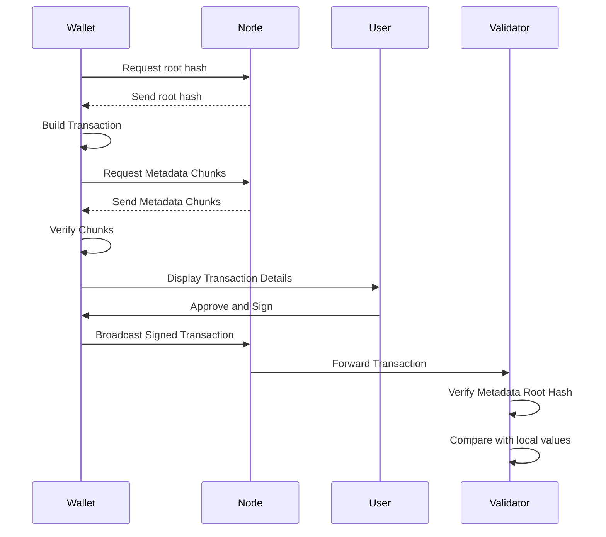

# ADR 075: Sign Mode Unified

## Changelog

* December 2nd 2024: Initial Draft (Zondax AG)

## Status

DRAFT Not Implemented

## Abstract

This ADR introduces `SIGN_MODE_UNIFIED`, a new signing mode for the Cosmos SDK. This mode aims to provide a simpler and more future-proof signing process, focusing on ease of maintenance and an improved user and developer experience. At the core of this new mode is a concept for storing message specifications in a verifiable and efficient manner: *runtime metadata*. This metadata contains the definitions of all data types for each message of each module, down to their underlying primitive types. Signers can then use this metadata to accurately decode and display the intended transaction fields to the user in a human-readable format, avoiding blind signing on any Cosmos-based chain.

This metadata does not need to be stored on the signer app since, by using a chunked and merkleized version of the metadata, chunks representing the data types involved in the messages can be delivered on-demand to the signer, and the root hash of the tree can be computed from those chunks and proofs from the remaining chunks, thus verifying the metadata integrity. On the signer app side, what the user ends up signing is the `metadata root hash + blob`, this means that the signed transaction can be verified by the validator by checking that the metadata root hash in the signed transaction matches the one locally stored in the node.

## Context

## Challenges with Current sign modes

1. **Complex codebase:**
   Maintaining both sign modes increases the maintenance overhead and the complexity of the codebase.

2. **Inconsistent signing processes across different Cosmos chains:**
   Not all Cosmos chains use the same sign mode, which creates inconsistencies in the ecosystem.

3. **Blind signing:**
   When wallets cannot decode a transaction or smart contract call, it leads to blind signing. Blind signing exposes users to potential security risks, as they may unknowingly sign malicious transactions.

4. **Cross-language Types Inconsistency:**
   Implementing renderers for each language in which a signer would be implemented can lead to inconsistencies in type interpretation.

5. **Upgradeability:**
   When new types are added to the system, wallets need to synchronize their renderers to match these new types. This process can lead to delays in supporting new types of transactions.


## Main components

Key components of `SIGN_MODE_UNIFIED` include:

* *Metadata struct*: A JSON file containing the definitions of all data types for each message of each module, down to primitive types.
* *Metadata Digest*: A compact representation of the complete metadata set used for transaction construction. When hashed (digest hash), this struct serves as the root of the merkle tree, enabling efficient verification of metadata integrity.
* *Merkleized Structure*: The metadata is organized into a merkle tree, allowing for efficient proofs and verification.

### Metadata file

The metadata file is a JSON file that contains all the types and messages definitions used in the SDK, is meant to be generated at build time and stored in the node, using the protobuf definition files as source. This file (in fact, chunks of its encoded version) are sent to the signer in order to be used to decode and show the transaction's fields without the need to store locally all definitions of types and messages. In the end, all signers should only be compliant with the primitive types and their string representations. This ensures consistency and reliability in type interpretation

Since all nodes should have a copy of this file built from the codebase, it is a requirement that this file be created using the existing protobuf definition files. Ideally, this should be done on every new SDK release through a CI workflow. This process will require building a tool to parse protobuf files into metadata definition types.

#### Formal definition

The structure of the metadata file follows this format:

$$
M = (v, R, P)
$$

$$
R = (r0, ..., rn)
$$

$$
P = (p0, ..., pn)
$$

where:

* M is the main metadata structure.
* v is a string representing the version of the metadata structure.
* R is a sequence of type definitions ri.
* P is a sequence of module metadata pi.

Each type definition ri has the following structure:

$$ri = (id, n, D)$$

where:

* id is an integer representing the unique identifier for this type.
* n is a string representing the name of the type.
* D is the type definition, which can be one of the following:
    * Primitive: for basic types like String, Int, etc.
    * Composite: for struct-like types with multiple fields.
    * Vec: for vector types.

Each module metadata pi has the following structure:

$$pi = (n, M)$$

$$M = (m0, ..., mn)$$

where:

* n is a string representing the name of the module.
* M is a sequence of message definitions mi.

Each message definition mi has the following structure:

$$ mi = (n, u, T) $$

where:

* n is a string representing the name of the message.
* u is a string representing the type URL of the message.
* T is the type definition of the message, following the same structure as the type definitions in R.

#### Example

Metadata file example for the `Bank.MsgSend` message:

```json
{
    "version": "1.0.0",
    "modules": [
      {
        "name": "Bank",
        "messages": [
          {
            "name": "MsgSend",
            "typeUrl": "/cosmos.bank.v1beta1.MsgSend",
            "type": {
              "Struct": {
                "fields": [
                  {
                    "name": "from_address",
                    "type": 1
                  },
                  {
                    "name": "to_address",
                    "type": 1
                  },
                  {
                    "name": "amount",
                    "type": {
                      "Vec": 2
                    }
                  }
                ]
              }
            }
          }
        ]
      }
    ],
    "types": [
      {
        "id": 1,
        "typeName": "String",
        "type": {
          "def": {
            "Primitive": "String"
          }
        }
      },
      {
        "id": 2,
        "typeName": "Coin",
        "type": {
          "def": {
            "Composite": {
              "fields": [
                {
                  "name": "denom",
                  "type": 1
                },
                {
                  "name": "amount",
                  "type": 1
                }
              ]
            }
          }
        }
      }
    ]
  }
```

### Metadata digest

The metadata digest is a compact representation of the complete metadata set. The hash of this digest serves as the metadata hash, which is included in the transaction's sign doc. Here's the proposed structure for the Hash type and the MetadataDigest in Go:

```go
type Hash [32]byte

type MetadataDigest struct {
    TreeRootHash     Hash   // The Merkle root hash of the metadata tree
    SpecVersion      uint32 // A version number for the metadata specification
    Props            map[string]string // A map of properties for the metadata
}
```

The field `Props` is a map of properties for the metadata, it is used to store additional information about the metadata that are chain-specific. For example, it can be used to store the token symbols and decimals.

### Metadata merkle tree

The metadata merkle tree is a crucial component of the `SIGN_MODE_UNIFIED` design. It allows for efficient verification of metadata integrity without requiring offline signers to store the full metadata. The tree is constructed as a complete binary merkle tree using `blake3` as the hashing function.

#### Construction Process

1. **Prepare the leaves**: The initial data (leaves of the merkle tree) are the type information sorted by their unique identifiers. For `Enumeration` types, variants are sorted using their `index`.

2. **Sort the leaves**: The leaves are sorted to ensure the tree root is deterministic.

3. **Build the tree**: The tree is built from the bottom up, combining pairs of hashes to form parent nodes until a single root hash is obtained. 

4. **Handle empty trees**: If there are no nodes left in the list (i.e., the initial data set was empty), an all-zeros hash `[32]byte{0}` is used to represent the empty tree.

The resulting `merkleTreeRoot` is the last node left in the list of nodes, representing the root of the entire merkle tree.

#### Purpose and Benefits

* **Efficient Verification**: The merkle tree structure allows for efficient verification of metadata integrity. Only the necessary chunks and their corresponding proofs need to be provided to offline wallets for transaction decoding.

* **Reduced Storage Requirements**: Offline signers don't need to store the full metadata. They can verify the integrity of the metadata using just the root hash and the relevant chunks.

* **Security**: The use of cryptographic hashes in the tree structure ensures the integrity of the metadata, making it tamper-evident.

### Encoding

`SIGN_MODE_UNIFIED` proposes using CBOR (Concise Binary Object Representation) for transaction encoding, offering several critical advantages:

* **Deterministic Encoding**: CBOR's canonical form ensures consistent merkleization of transaction data, which is essential for verification and proof generation.
* **Human-readable Diagnostic Notation**: While CBOR is binary, it provides a diagnostic notation format that maintains transparency and reduces blind signing risks.
* **Type Safety**: CBOR's strong typing system prevents type confusion and ensures consistent cross-language interpretation.
* **Efficiency**: Offers compact binary encoding while maintaining full data model compatibility with JSON.
* **Universal Support**: Widely supported across programming languages with mature libraries.

### Signing process

The signing process steps are the following:

 1. The transaction is built, including the root hash and transaction data.
 2. The signer receives the transaction and starts receiving the corresponding chunks of the CBOR encoded metadata file (types and proofs).
 3. The signer verifies the integrity of the received chunks by computing the root hash of the merkle tree from the chunks and comparing it against the tree root hash in the metadata digest.
 4. The signer decodes the transaction fields using the received chunks and displays them to the user.
 5. The user reviews the transaction and signs it.
 6. Once the transaction is broadcasted, the validator compares the metadata hash included in the signed transaction against the one locally stored in the node to verify that all the messages were signed with the consensual metadata structure.




## Decision

We will implement `SIGN_MODE_UNIFIED` as a new sign mode for the Cosmos SDK. This decision involves the following key actions:

* The implementation will include all the necessary code to build and support the new sign mode, including:
    * Implementation of the MetadataDigest structure and its associated hash calculation function.
    * Development of the Merkle tree construction and verification logic for the metadata.
    * Integration of the new sign mode into the existing transaction signing and verification pipeline.
* A tool will be created to build the metadata file from the existing protobuf files. This tool will:
    * Parse all relevant protobuf files in the Cosmos SDK.
    * Generate a structured JSON metadata file that includes all type and message definitions.
    * A CI job will be implemented to automatically run this metadata generation tool.

* The transaction signing process will be updated to include the MetadataDigest hash in the sign doc.
* The Ledger HW signing process will be accommodated to match this new sign mode.
* The transaction verification process will be modified to validate the metadata hash against the locally stored metadata on validator nodes.
* Comprehensive documentation for `SIGN_MODE_UNIFIED` will be created, including guides for wallet developers and chain developers on how to implement and use the new sign mode.
* A migration strategy will be implemented to allow for a (progressive) smooth transition from existing sign modes to `SIGN_MODE_UNIFIED`.
* Finally, all legacy sign modes (`SIGN_MODE_LEGACY_AMINO`, `SIGN_MODE_DIRECT`, `SIGN_MODE_TEXTUAL`) will be deprecated and removed from the SDK.

## Alternatives

### Encoding options

We've chosen CBOR (Concise Binary Object Representation) as our encoding format primarily because it provides deterministic encoding, allowing us to build a merkle tree with consistent root hashes across different signer implementations. 

An alternative approach that prioritizes human readability would be to use plain JSON along with a specification defining "canonical" JSON encoding rules. This would achieve deterministic encoding across different signer implementations while maintaining readability. However, this approach would require all wallet implementations of this sign mode to ensure their JSON encoder complies with the canonical encoding rules, otherwise transactions would be rejected by validators. A complete suite for testing canonical JSON would be needed.

Below is a table comparing the two options:

| Feature                     | CBOR                              | JSON + SPEC                                    |
| --------------------------- | --------------------------------- | --------------------------------------------- |
| **Data Size**               | Compact binary format             | Larger but optimized with canonical encoding  |
| **Parsing Speed**           | Faster due to binary encoding     | Slower due to text processing                 |
| **Storage Requirements**    | Lower                             | Higher but manageable with optimized structure|
| **Human Readability**       | Not human-readable                | Human-readable                                |
| **Ecosystem Support**       | Requires specific libraries/tools | Widely supported with standardization efforts |
| **Security**                | Less prone to injection attacks   | Prevents injection with strict canonical rules|
| **Interoperability**        | Standardized for consistent use   | High due to canonical JSON specification      |


## Consequences

### Backwards Compatibility

**Preservation of Existing Sign Modes:**
    * Existing sign modes remain supported to ensure that legacy wallets and clients continue to function without interruption.

### Positive

* **Enhanced User Experience:**
    * `SIGN_MODE_UNIFIED` provides a more intuitive and secure signing experience for users, especially on hardware wallets, by enabling the display of human-readable transaction details.
  
* **Improved Security:**
    * Reduces the risk of blind signing by allowing users to verify transaction contents before signing.
  
* **Consistency Across Platforms:**
    * Standardizes the signing process across different wallets and platforms, ensuring uniform behavior and reducing inconsistencies.
  
* **Reduced Maintenance Overhead:**
    * Consolidates multiple sign modes into a unified approach, decreasing the complexity and maintenance efforts on the codebase.
  
* **Versioned Metadata:**
    * The metadata will be versioned, allowing for better control and management of changes over time.

### Negative
    
* **Development Effort:**
    * Requires significant development effort to implement the new sign mode, including updates to multiple components such as transaction builders, signers, and validators and HW wallet apps.
  
* **Tooling and Documentation Updates:**
    * Requires updates to existing tools, documentation, and developer guides to accommodate the new sign mode, which may involve additional resources and time.

### Neutral

* **Minimal Performance Impact:**
    * The construction and verification of the merkle tree are optimized to have minimal impact on transaction processing performance.

* **New HW wallets apps:**
    * The new HW wallets apps will need to be updated to support the new sign mode.
  

## References

https://polkadot-fellows.github.io/RFCs/approved/0078-merkleized-metadata.html