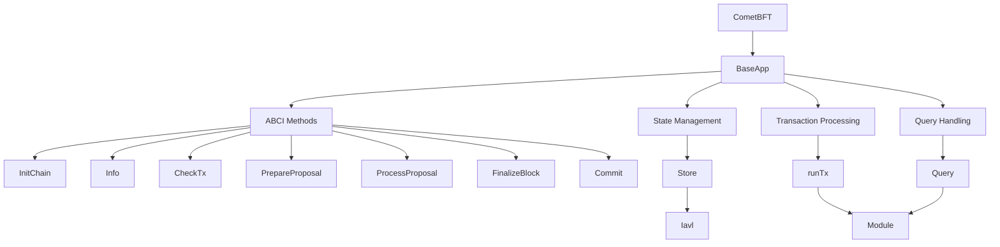
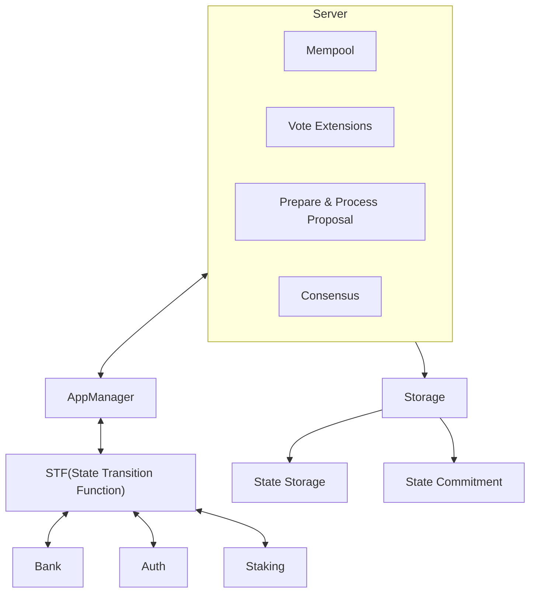

# ADR 75: V2 Upgrades

## Changelog

* 2023-11-07: Initial Draft

## Status

DRAFT

## Abstract

V2 is a reset in the Cosmos SDK architecture. It is a complete rewrite of the SDK, with a focus on modularity, extensibility, and performance. The V2 SDK breaks apart the core SDK into smaller modular components allowing users to pick and choose the components they need for their specific use case. This document outlines the changes and migration path for users of the V1 SDK.

## Context

The Cosmos SDK began in 2016, at this time the software was written with the direct use case of the Cosmos Hub.Since then we have seen the SDK evolve and grow, with new features and improvements being added over time. The SDK today is used by over 100 different projects, with more users joining the ecosystem every day. This has led to a number of challenges, including:

* The SDK is becoming increasingly complex, with many different components and dependencies.
* The SDK is becoming more difficult to maintain, with frequent breaking changes and compatibility issues.

V2 is a complete rewrite of the Cosmos SDK, with a focus on modularity, extensibility, and performance. The goal is to make the Cosmos SDK easier to use for the various use cases that we have seen emerging in the ecosystem. 

This is a high-level overview of Baseapp today. As we can see baseapp houses all the logic for the ABCI methods, state management, transaction processing, and query handling. This has led baseapp to be a very large monolith.

## Alternatives

The alternative to doing a rewrite is to spend more time cleaning up baseapp. This would not fix issues around forking the repository to make changes like we see today. Keeping the current codebase does not allow the project to progress and reduce the maintenance burden on the project.

## Decision

The Descision is to rewrite the core componenets (baseapp, server, store) of the SDK into smaller modules. 

These components will be broken into separate go.mods. The modules consist of the following:

* Cometbft
* Appmanager
* STF  (State Transition Function)
* Server/v2
* Store/v2
* Runtime/v2

> This section describes our response to these forces. It is stated in full
> sentences, with active voice. "We will ..."
> {decision body}

## Consequences

> This section describes the resulting context, after applying the decision. All
> consequences should be listed here, not just the "positive" ones. A particular
> decision may have positive, negative, and neutral consequences, but all of them
> affect the team and project in the future.

### Backwards Compatibility

> All ADRs that introduce backwards incompatibilities must include a section
> describing these incompatibilities and their severity. The ADR must explain
> how the author proposes to deal with these incompatibilities. ADR submissions
> without a sufficient backwards compatibility treatise may be rejected outright.

### Positive

> {positive consequences}

### Negative

> {negative consequences}

### Neutral

> {neutral consequences}

## Further Discussions

> While an ADR is in the DRAFT or PROPOSED stage, this section should contain a
> summary of issues to be solved in future iterations (usually referencing comments
> from a pull-request discussion).
> 
> Later, this section can optionally list ideas or improvements the author or
> reviewers found during the analysis of this ADR.

## Test Cases [optional]

Test cases for an implementation are mandatory for ADRs that are affecting consensus
changes. Other ADRs can choose to include links to test cases if applicable.

## References

* {reference link}
