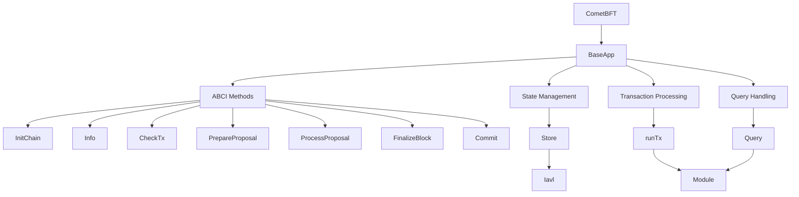
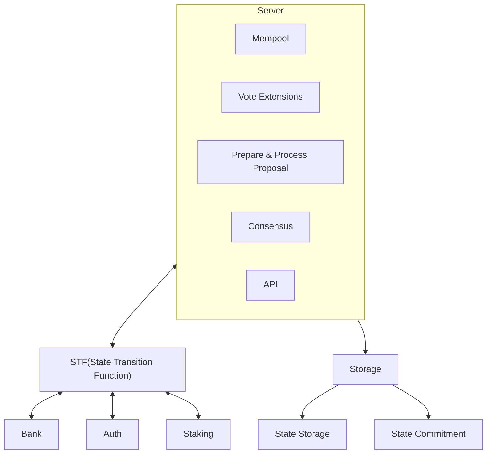
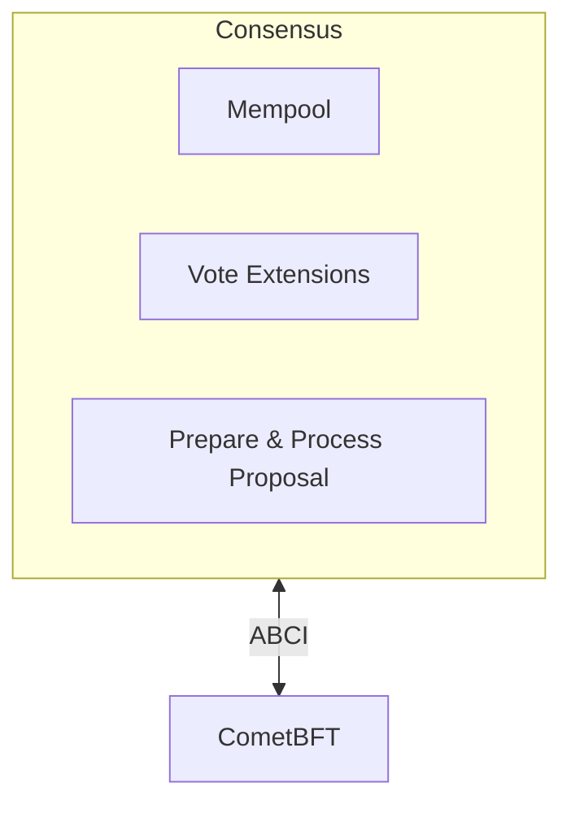
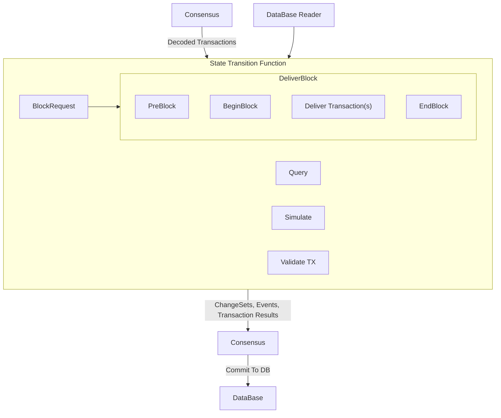

# ADR 75: V2 Upgrades

## Changelog

* 2023-11-07: Initial Draft

## Status

DRAFT

## Abstract

V2 is a reset in the Cosmos SDK architecture. It is a complete rewrite of the SDK, with a focus on modularity, extensibility, and performance. The V2 SDK breaks apart the core SDK into smaller modular components allowing users to pick and choose the components they need for their specific use case. This document outlines the changes and migration path for users of the V1 SDK.

## Context

The Cosmos SDK began in 2016, at this time the software was written with the direct use case of the Cosmos Hub.Since then we have seen the SDK evolve and grow, with new features and improvements being added over time. The SDK today is used by over 100 different projects, with more users joining the ecosystem every day. This has led to a number of challenges, including:

* The SDK is becoming increasingly complex, with many different components and dependencies.
* The SDK is becoming more difficult to maintain, with frequent breaking changes and compatibility issues.

V2 is a complete rewrite of the Cosmos SDK, with a focus on modularity, extensibility, and performance. The goal is to make the Cosmos SDK easier to use for the various use cases that we have seen emerging in the ecosystem. 



This is a high-level overview of Baseapp today. As we can see baseapp houses all the logic for the ABCI methods, state management, transaction processing, and query handling. This has led baseapp to be a very large monolith.

## Alternatives

The alternative to doing a rewrite is to spend more time cleaning up baseapp. This would not fix issues around forking the repository to make changes like we see today. Keeping the current codebase does not allow the project to progress and reduce the maintenance burden on the project.


## Decision

The Decision is to rewrite the core components (baseapp, server, store) of the SDK into smaller modules. 

These components will be broken into separate go.mods. The modules consist of the following:

* Consensus
* STF  (State Transition Function)
* Server/v2
* Store/v2
* Runtime/v2

The flow of all the components was designed to be as simple as possible, and the flow is as follows:



In the above diagram we do not mention runtime/v2 because it is the componend that is responsible for combining all the other components into a single application.

### Consensus

Consensus is the component that handles communication to the Consensus Engine (Networking & Consensus). The default implementation will be CometBFT, but other consensus engines can be used with v2. The goal of consensus is not to offer a consensus API to meet all needs, but a way to allow developers to swap out the server for a different consensus engine. An application developer should not assume that the cometbftserver will work with other consensus engines. 

Consensus is the component that controls the interaction with the consensus engine, concurrency and execution models. For context, there are three execution models we have identified: 

* **Immediate**:
    * Immediate execution differs from what Cosmos SDK utilizes today. In CometBFT, consensus at height N is executed at height N+1.
    * Immediate execution refers to coming to consensus at height N for the transactions in the same block.
* **Optimistic** 
    * Optimistic execution means different things to different applications. The way we imagine it working is that consensus may not be made on every block. Instead consensus is made after execution. This design favors a fast chain as it will not slow down for execution until the optimistic window  may be exceeded.
* **Delayed**
    * Delayed execution is the default execution model in CometBFT. Consensus is made after execution, but the execution may be delayed until the next block.

The consensus server is responsible for handling the execution model of the state machine. The state machine executes transactions when it is told, it is unaware of the execution model.

Since consensus servers can be swapped there are certain features features specific to consensus engines need to be implemented in the server. In the CometBFT server we have implemented the following features:

* Mempool 
* Prepare & Process Proposal
* Vote Extensions
* Snapshots

If another consensus server would like to utilize the above features they can be copied or implemented in the server. 



:::Note
ABCI, Vote Extensions, and Prepare & Process Proposal are primitives of cometbft, V2 is not tied to these features, teams do not have to adhere to them if they implement their own consensus engine.
:::

### State Transition Function

The state transition function is the component that handles the execution of transactions. It is responsible for calling the correct message handler for the transaction. The state transition function is stateless, it is handed a read only view of state and returns state changes, the changes returned can be handled by consensus in anyway needed. 

The state transition function interface is simple and meant to be as light weight as possible. This is the only interface that is required to be implemented by bespoke consensus engines.



State Transition function interface: 

```go
type StateTransitionFunction[T transaction.Tx] interface {
	// DeliverBlock executes a block of transactions.
	DeliverBlock(
		ctx context.Context,
		block *server.BlockRequest[T],
		state store.ReaderMap,
	) (blockResult *server.BlockResponse, newState store.WriterMap, err error)
	
	// ValidateTx validates a transaction.
	ValidateTx(
		ctx context.Context,
		state store.ReaderMap,
		gasLimit uint64,
		tx T,
	) server.TxResult
	
	// Simulate executes a transaction in simulation mode.
	Simulate(
		ctx context.Context,
		state store.ReaderMap,
		gasLimit uint64,
		tx T,
	) (server.TxResult, store.WriterMap)
	
	// Query executes a query on the application.
	Query(
		ctx context.Context,
		state store.ReaderMap,
		gasLimit uint64,
		req transaction.Msg,
	) (transaction.Msg, error)
}
```

## Consequences

The design of the node comes with a number of tradeoffs.

* Maintenance cost can be the same as existing Baseapp as handling many go.mods is a overhead.
* Modularity means different layers of abstractions, abstractions always have a cost. 

### Backwards Compatibility

The state machine was made to not affect modules that are not using the state transition function. If a user would like to migrate to v2 they will need to migrate to `appmodule.Environment` from `sdk.Context`.  `sdk.Context` is a struct which is a global in the state machine, this design limits the concurrency. 

V2 will have a breaking changes in regards to how CometBFT handles certain fields in ABCI. Previously, the Cosmos SDK panicked and recovered in the case of out of gas, providing an error to CometBFT which we do not return in the new design. 

V2 only works with `Store/v2`, `IAVL V1` can be used with `Store/v2`. This allows chains to continue with existing databases. There will be a migration happening to convert the database to the separation of Storage and Commitment. Once the migration is completed the state machine will query information from the rawDB unless otherwise specified. 

### Positive

* Ability to add new features to the SDK without forking the entire repository.
* Ability to create custom node configurations.
* Reduced maintenance cost burden. 
* State machine is more performant.
* Isolated components allow for easier testing.
* Allow the team to delete a lot of code in `github.com/cosmos/cosmos-sdk`.

### Negative

* Modularity and abstractions can be a burden.


## Further Discussions

* After reducing the feature set of Cosmos SDK, we can more easily look into rewriting the core into rust. This is dependent on crosslang. 

## References

* {reference link}
