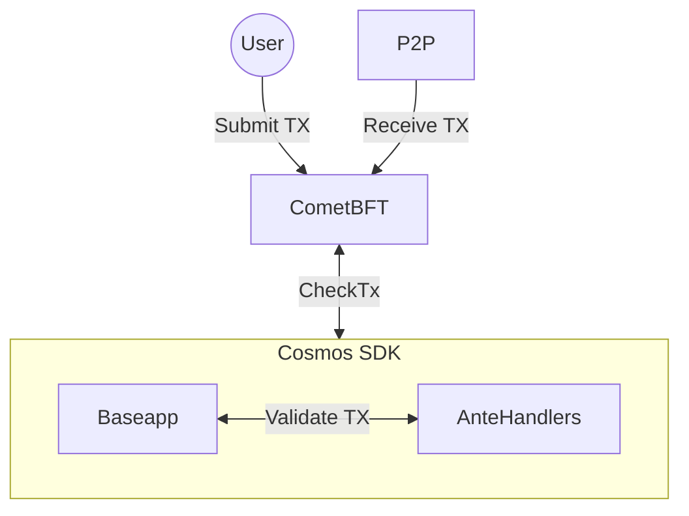

# CheckTx

CheckTx is called by the `BaseApp` when comet receives a transaction from a client, over the p2p network or RPC. The CheckTx method is responsible for validating the transaction and returning an error if the transaction is invalid. 



```go
// CheckTx implements the ABCI interface.
func (app *BaseApp) CheckTx(req abci.RequestCheckTx) abci.ResponseCheckTx {
	var mode execMode

	switch {
	case req.Type == abci.CHECK_TX_TYPE_CHECK:
		mode = execModeCheck

	case req.Type == abci.CHECK_TX_TYPE_RECHECK:
		mode = execModeReCheck

	default:
		return nil, fmt.Errorf("unknown RequestCheckTx type: %s", req.Type)
	}

	var decodedTx sdk.Tx = nil
	ctx := app.getContextForTx(mode, req.Tx)
	if app.checkTxHandler != nil {
		tx, err := app.checkTxHandler(ctx, req.Tx)
		if err != nil {
			return nil, fmt.Errorf("checkTxHandler error: %w", err)
		}
		decodedTx = tx
	}

	gInfo, result, anteEvents, err := app.runTx(mode, req.Tx, decodedTx)
	if err != nil {
		return responseCheckTxWithEvents(err, gInfo.GasWanted, gInfo.GasUsed, anteEvents, app.trace), nil
	}

	return &abci.CheckTxResponse{
		GasWanted: int64(gInfo.GasWanted),
		GasUsed:   int64(gInfo.GasUsed),
		Log:       result.Log,
		Data:      result.Data,
		Events:    sdk.MarkEventsToIndex(result.Events, app.indexEvents),
	}, nil
}
```

## CheckTx Handler

`CheckTxHandler` allows users to extend the logic of `CheckTx`. `CheckTxHandler` is called by pasding context and the transaction bytes received through ABCI. It is required that the handler returns deterministic results given the same transaction bytes. 

:::note
we return the raw decoded transaction here to avoid decoding it twice.
:::

```go
type CheckTxHandler func(ctx sdk.Context, tx []byte) (Tx, error)
```

Setting a custom `CheckTxHandler` is optional. It can be done from your app.go file:

```go
func NewSimApp(
	logger log.Logger,
	db corestore.KVStoreWithBatch,
	traceStore io.Writer,
	loadLatest bool,
	appOpts servertypes.AppOptions,
	baseAppOptions ...func(*baseapp.BaseApp),
) *SimApp {
  ...
  // Create ChecktxHandler
  checktxHandler := abci.NewCustomCheckTxHandler(...)
  app.SetCheckTxHandler(checktxHandler)
  ...
}
```
