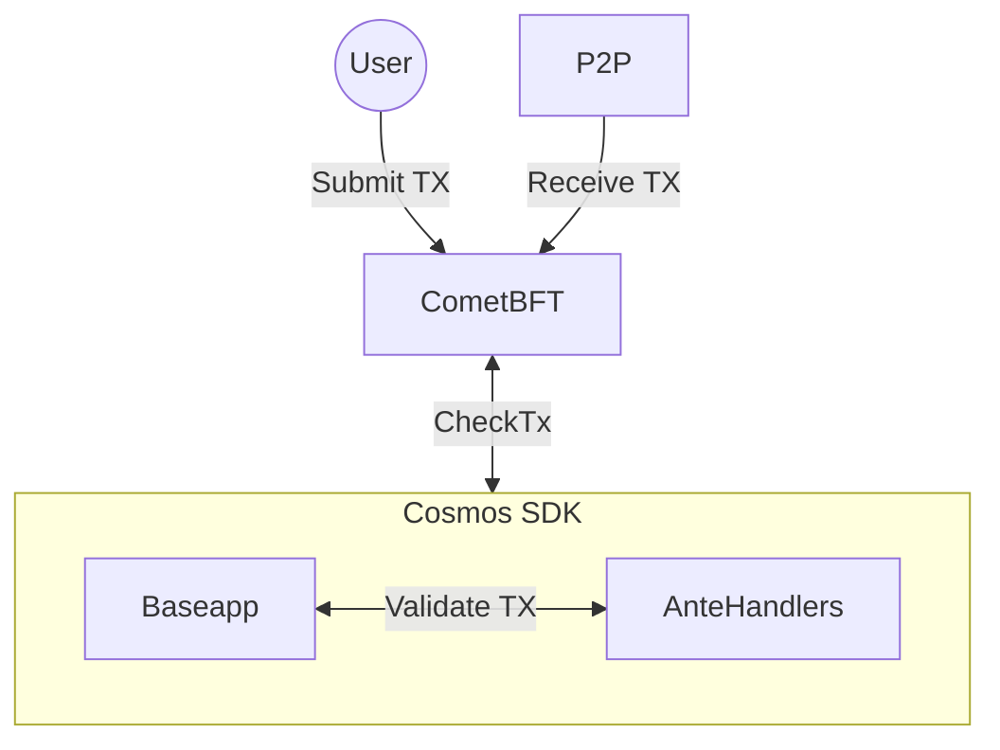

# CheckTx

CheckTx is called by the `BaseApp` when comet receives a transaction from a client, over the p2p network or RPC. The CheckTx method is responsible for validating the transaction and returning an error if the transaction is invalid. 



```go
// CheckTx implements the ABCI interface.
func (app *BaseApp) CheckTx(req abci.RequestCheckTx) abci.ResponseCheckTx {
	var mode execMode

	switch {
	case req.Type == abci.CHECK_TX_TYPE_CHECK:
		mode = execModeCheck

	case req.Type == abci.CHECK_TX_TYPE_RECHECK:
		mode = execModeReCheck

	default:
		return nil, fmt.Errorf("unknown RequestCheckTx type: %s", req.Type)
	}

	gInfo, result, anteEvents, err := app.runTx(mode, req.Tx, nil)
	if err != nil {
		return responseCheckTxWithEvents(err, gInfo.GasWanted, gInfo.GasUsed, anteEvents, app.trace), nil
	}

	return &abci.CheckTxResponse{
		GasWanted: int64(gInfo.GasWanted),
		GasUsed:   int64(gInfo.GasUsed),
		Log:       result.Log,
		Data:      result.Data,
		Events:    sdk.MarkEventsToIndex(result.Events, app.indexEvents),
	}, nil
}
```

## CheckTx Lane Handler

Comet provides the optionality for application developers to set a lane for a specific type of transaction. This allows the application to set a form of priority for transaction dissemination. 

The `LaneHandler` interface is defined as follows:

```go
type Lanes interface {
	GetLanes() (lanes map[string]uint32, defaultLane string)
	GetTxLane(context.Context, sdk.Tx) (string, error)
}
```

The `LaneHandler` is set on the `BaseApp` using the `SetLaneHandler` method.

```go
func NewSimApp(
	logger log.Logger,
	db corestore.KVStoreWithBatch,
	traceStore io.Writer,
	loadLatest bool,
	appOpts servertypes.AppOptions,
	baseAppOptions ...func(*baseapp.BaseApp),
) *SimApp {
  ...
  laneHandler := mempool.CustomLaneHandler(map[string]uint32{}, "default")
  app.SetLaneHandler(laneHandler)
  ...
}
```
