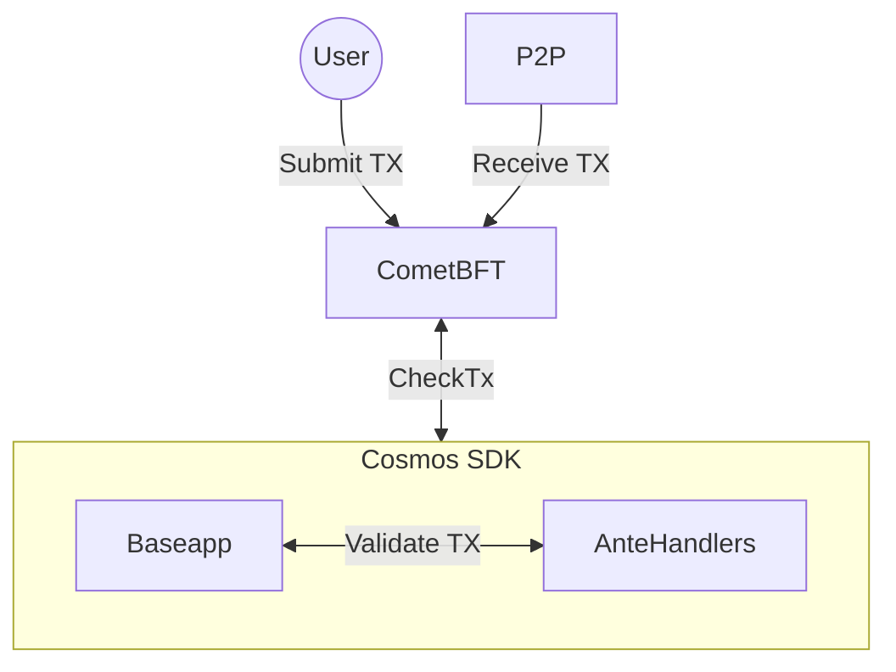

# CheckTx

CheckTx is called by the `BaseApp` when comet receives a transaction from a client, over the p2p network or RPC. The CheckTx method is responsible for validating the transaction and returning an error if the transaction is invalid. 



```go reference
https://github.com/cosmos/cosmos-sdk/blob/31c604762a434c7b676b6a89897ecbd7c4653a23/baseapp/abci.go#L350-L390
```

## CheckTx Handler

`CheckTxHandler` allows users to extend the logic of `CheckTx`. `CheckTxHandler` is called by pasding context and the transaction bytes received through ABCI. It is required that the handler returns deterministic results given the same transaction bytes. 

:::note
we return the raw decoded transaction here to avoid decoding it twice.
:::

```go
type CheckTxHandler func(ctx sdk.Context, tx []byte) (Tx, error)
```

Setting a custom `CheckTxHandler` is optional. It can be done from your app.go file:

```go
func NewSimApp(
	logger log.Logger,
	db corestore.KVStoreWithBatch,
	traceStore io.Writer,
	loadLatest bool,
	appOpts servertypes.AppOptions,
	baseAppOptions ...func(*baseapp.BaseApp),
) *SimApp {
  ...
  // Create ChecktxHandler
  checktxHandler := abci.NewCustomCheckTxHandler(...)
  app.SetCheckTxHandler(checktxHandler)
  ...
}
```
