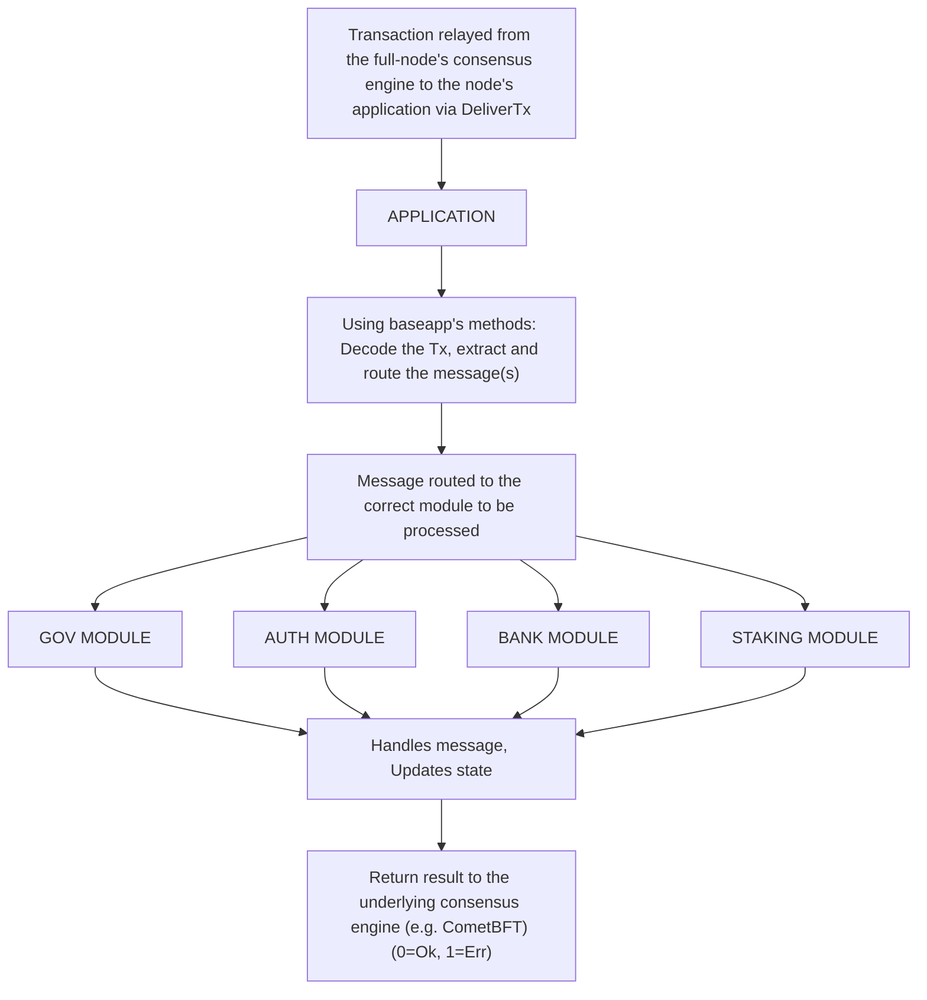

# Introduction to Cosmos SDK Modules

:::note Synopsis
Modules define most of the logic of Cosmos SDK applications. Developers compose modules together using the Cosmos SDK to build their custom application-specific blockchains. This document outlines the basic concepts behind SDK modules and how to approach module management.
:::

:::note Pre-requisite Readings

* [Anatomy of a Cosmos SDK application](../../learn/beginner/00-app-anatomy.md)
* [Lifecycle of a Cosmos SDK transaction](../../learn/beginner/01-tx-lifecycle.md)

:::

## Role of Modules in a Cosmos SDK Application

The Cosmos SDK can be thought of as the Next.js or Ruby-on-Rails of blockchain development. It comes with a core that provides the basic functionalities every blockchain application needs, like a [boilerplate implementation of the ABCI](../../learn/advanced/00-baseapp.md) to communicate with the underlying consensus engine, a [`multistore`](../../learn/advanced/04-store.md#multistore) to persist state, a [server](../../learn/advanced/03-node.md) to form a full-node and [interfaces](./09-module-interfaces.md) to handle queries.

On top of this core, the Cosmos SDK enables developers to build modules that implement the business logic of their application. In other words, SDK modules implement the bulk of the logic of applications, while the core does the wiring (via [runtime](../building-apps/00-runtime.md)) and enables modules to be composed together. The end goal is to build a robust ecosystem of open-source Cosmos SDK modules, making it increasingly easier to build complex blockchain applications.

Cosmos SDK modules can be seen as little state-machines within the state-machine. They generally define a subset of the state using one or more `KVStore`s in the [main multistore](../../learn/advanced/04-store.md), as well as a subset of [message types](./02-messages-and-queries.md#messages). These messages are routed by one of the main components of Cosmos SDK core, [`BaseApp`](../../learn/advanced/00-baseapp.md), to a module Protobuf [`Msg` service](./03-msg-services.md) that defines them.



As a result of this architecture, building a Cosmos SDK application usually revolves around writing modules to implement the specialized logic of the application and composing them with existing modules to complete the application. Developers will generally work on modules that implement logic needed for their specific use case that do not exist yet, and will use existing modules for more generic functionalities like staking, accounts, or token management.

### Modules as super-users

Modules have the ability to perform actions that are not available to regular users. This is because modules are given sudo permissions by the state machine. Modules can reject another modules desire to execute a function but this logic must be explicit. Examples of this can be seen when modules create functions to modify parameters:

```go reference
https://github.com/cosmos/cosmos-sdk/blob/61da5d1c29c16a1eb5bb5488719fde604ec07b10/x/bank/keeper/msg_server.go#L147-L149
```

## How to Approach Building Modules as a Developer

While there are no definitive guidelines for writing modules, here are some important design principles developers should keep in mind when building them:

* **Composability**: Cosmos SDK applications are almost always composed of multiple modules. This means developers need to carefully consider the integration of their module not only with the core of the Cosmos SDK, but also with other modules. The former is achieved by following standard design patterns outlined [here](#main-components-of-cosmos-sdk-modules), while the latter is achieved by properly exposing the store(s) of the module via the [`keeper`](./06-keeper.md).
* **Specialization**: A direct consequence of the **composability** feature is that modules should be **specialized**. Developers should carefully establish the scope of their module and not batch multiple functionalities into the same module. This separation of concerns enables modules to be re-used in other projects and improves the upgradability of the application. **Specialization** also plays an important role in the [object-capabilities model](https://docs.cosmos.network/main/learn/advanced/ocap#ocaps-in-practice) of the Cosmos SDK.
* **Capabilities**: Most modules need to read and/or write to the store(s) of other modules. However, in an open-source environment, it is possible for some modules to be malicious. That is why module developers need to carefully think not only about how their module interacts with other modules, but also about how to give access to the module's store(s). The Cosmos SDK takes a capabilities-oriented approach to inter-module security. This means that each store defined by a module is accessed by a `key`, which is held by the module's [`keeper`](./06-keeper.md). This `keeper` defines how to access the store(s) and under what conditions. Access to the module's store(s) is done by passing a reference to the module's `keeper`.

## Core APIs for Modules

The SDK provides a set of APIs that a module can implement, and a set of services that a module can use.
Those APIs are defined in the `cosmossdk.io/core/appmodule` package, and are used to defined the module capabilities, which is used by `runtime` during the wiring of the application. 

Learn more about the core APIs for modules [here](../../learn/advanced/02-core.md).

## Main Components of Cosmos SDK Modules

Modules are by convention defined in the `./x/` subfolder (e.g. the `bank` module will be defined in the `./x/bank` folder). They generally share the same core components:

* A [`keeper`](./06-keeper.md), used to access the module's store(s) and update the state.
* A [`Msg` service](./02-messages-and-queries.md#messages), used to process messages when they are routed to the module by [`BaseApp`](../../learn/advanced/00-baseapp.md#message-routing) and trigger state-transitions.
* A [query service](./04-query-services.md), used to process user queries when they are routed to the module by [`BaseApp`](../../learn/advanced/00-baseapp.md#query-routing).
* Interfaces, for end users to query the subset of the state defined by the module and create `message`s of the custom types defined in the module.

In addition to these components, modules implement the `AppModule` interface in order to be managed by the [`module manager`](./01-module-manager.md).

Please refer to the [structure document](./11-structure.md) to learn about the recommended structure of a module's directory.
