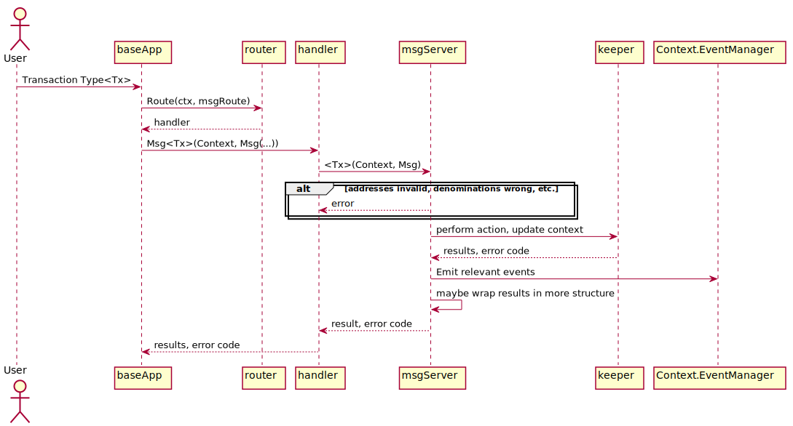

<!--
order: 4
-->

# `Msg` Services

A Protobuf `Msg` service processes [messages](./messages-and-queries.md#messages). Protobuf `Msg` services are specific to the module in which they are defined, and only process messages defined within the said module. They are called from `BaseApp` during [`DeliverTx`](../core/baseapp.md#delivertx). {synopsis}

## Pre-requisite Readings

- [Module Manager](./module-manager.md) {prereq}
- [Messages and Queries](./messages-and-queries.md) {prereq}

## Implementation of a module `Msg` service

Each module should define a Protobuf `Msg` service, which will be responsible for processing requests (implementing `sdk.Msg`) and returning responses.

As further described in [ADR 031](../architecture/adr-031-msg-service.md), this approach has the advantage of clearly specifying return types and generating server and client code.

Protobuf generates a `MsgServer` interface based on a definition of `Msg` service. It is the role of the module developer to implement this interface, by implementing the state transition logic that should happen upon receival of each `sdk.Msg`. As an example, here is the generated `MsgServer` interface for `x/bank`, which exposes two `sdk.Msg`s:

+++ https://github.com/cosmos/cosmos-sdk/blob/v0.40.0-rc3/x/bank/types/tx.pb.go#L285-L291

When possible, the existing module's [`Keeper`](keeper.md) should implement `MsgServer`, otherwise a `msgServer` struct that embeds the `Keeper` can be created, typically in `./keeper/msg_server.go`:

+++ https://github.com/cosmos/cosmos-sdk/blob/v0.40.0-rc1/x/bank/keeper/msg_server.go#L14-L16

`msgServer` methods can retrieve the `sdk.Context` from the `context.Context` parameter method using the `sdk.UnwrapSDKContext`:

+++ https://github.com/cosmos/cosmos-sdk/blob/v0.40.0-rc1/x/bank/keeper/msg_server.go#L27-L28

`sdk.Msg` processing usually follows these 3 steps:

### Validation 

Before a `msgServer` method is executed, the message's [`ValidateBasic()`](../basics/tx-lifecycle.md#ValidateBasic) method has already been called. Since `msg.ValidateBasic()`  performs only the most basic checks, this stage must perform all other validation (both *stateful* and *stateless*) to make sure the `message` is valid. Checks performed in the `msgServer` method can be more expensive and the signer is charged gas for these operations.
For example, a `msgServer` method for a `transfer` message might check that the sending account has enough funds to actually perform the transfer. 

It is recommended to implement all validation checks in a separate function that passes state values as arguments. This implementation simplifies testing. As expected, expensive validation functions charge additional gas. Example:

```go
ValidateMsgA(msg MsgA, now Time, gm GasMeter) error {
	if now.Before(msg.Expire) {
		return sdkerrrors.ErrInvalidRequest.Wrap("msg expired")
	}
	gm.ConsumeGas(1000, "signature verification")
	return signatureVerificaton(msg.Prover, msg.Data)
}
```

### State Transition

After the validation is successful, the `msgServer` method uses the [`keeper`](./keeper.md) functions to access the state and perform a state transition.

### Events 

Before returning, `msgServer` methods generally emit one or more [events](../core/events.md) by using the `EventManager` held in the `ctx`. Use the new `EmitTypedEvent` function that uses protobuf-based event types:

```
ctx.EventManager().EmitTypedEvent(
	&group.EventABC{Key1: Value1,  Key2, Value2})
```

or the older `EmitEvent` function: 

```go
ctx.EventManager().EmitEvent(
	sdk.NewEvent(
		eventType,  // e.g. sdk.EventTypeMessage for a message, types.CustomEventType for a custom event defined in the module
		sdk.NewAttribute(key1, value1),
		sdk.NewAttribute(key2, value2),
	),
)
```

These events are relayed back to the underlying consensus engine and can be used by service providers to implement services around the application. Click [here](../core/events.md) to learn more about events.

The invoked `msgServer` method returns a `proto.Message` response and an `error`. These return values are then wrapped into an `*sdk.Result` or an `error` using `sdk.WrapServiceResult(ctx sdk.Context, res proto.Message, err error)`:

+++ https://github.com/cosmos/cosmos-sdk/blob/v0.40.0-rc2/baseapp/msg_service_router.go#L104-L104

This method takes care of marshaling the `res` parameter to protobuf and attaching any events on the `ctx.EventManager()` to the `sdk.Result`.

+++ https://github.com/cosmos/cosmos-sdk/blob/d55c1a26657a0af937fa2273b38dcfa1bb3cff9f/proto/cosmos/base/abci/v1beta1/abci.proto#L81-L95

This diagram shows a typical structure of a Protobuf `Msg` service, and how the message propagates through the module.



## Amino `LegacyMsg`s

### `handler` type

The `handler` type defined in the Cosmos SDK will be deprecated in favor of [`Msg` Services](#implementation-of-a-module-msg-service).

Here is the typical structure of a `handler` function:

+++ https://github.com/cosmos/cosmos-sdk/blob/v0.40.0-rc2/types/handler.go#L4-L4

Let us break it down:

- The [`LegacyMsg`](./messages-and-queries.md#messages) is the actual object being processed.
- The [`Context`](../core/context.md) contains all the necessary information needed to process the `msg`, as well as a branch of the latest state. If the `msg` is successfully processed, the branched version of the state contained in the `ctx` will be written to the main state (branch).
- The `*Result` returned to `BaseApp` contains (among other things) information on the execution of the `handler` and [events](../core/events.md).

Module `handler`s are typically implemented in a `./handler.go` file inside the module's folder. The [module manager](./module-manager.md) is used to add the module's `handler`s to the
[application's `router`](../core/baseapp.md#message-routing) via the `Route()` method. Typically,
the manager's `Route()` method simply constructs a Route that calls a `NewHandler()` method defined in `handler.go`.

+++ https://github.com/cosmos/cosmos-sdk/blob/228728cce2af8d494c8b4e996d011492139b04ab/x/gov/module.go#L143-L146

### Implementation

`NewHandler` function dispatches a `LegacyMsg` to appropriate handler function, usually by using a switch statement:

+++ https://github.com/cosmos/cosmos-sdk/blob/d55c1a26657a0af937fa2273b38dcfa1bb3cff9f/x/bank/handler.go#L13-L29

First, `NewHandler` function sets a new `EventManager` to the context to isolate events per `msg`.
Then, a simple switch calls the appropriate `handler` based on the `LegacyMsg` type.

In this regard, `handler`s functions need to be implemented for each module `LegacyMsg`. This will also involve manual handler registration of `LegacyMsg` types.
`handler`s functions should return a `*Result` and an `error`.

## Telemetry

New [telemetry metrics](../core/telemetry.md) can be created from `msgServer` methods when handling messages.

This is an example from the `x/auth/vesting` module:

+++ https://github.com/cosmos/cosmos-sdk/blob/v0.40.0-rc1/x/auth/vesting/msg_server.go#L73-L85

## Next {hide}

Learn about [query services](./query-services.md) {hide}
