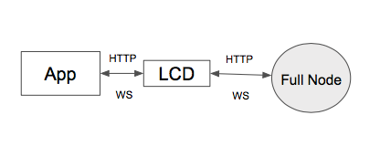

# Lite Client Overview

**See the Cosmos SDK lite Client RPC documentation [here](https://cosmos.network/rpc/)**

## Introduction

A lite client allows clients, such as mobile phones, to receive proofs of the state of the
blockchain from any full node. lite clients do not have to trust any full node, since they are able
to verify any proof they receive and hence full nodes cannot lie about the state of the network.

A lite client can provide the same security as a full node with the minimal requirements on
bandwidth, computing and storage resource. As well, it can also provide modular functionality
according to users' configuration. These fantastic features allow developers to build fully secure,
efficient and usable mobile apps, websites or any other applications without deploying or
maintaining any full blockchain nodes.

### What is a lite Client

The Cosmos SDK Light Client (Gaia-lite) is split into two separate components. The first component is generic for any Tendermint
based application. It handles the security and connectivity aspects of following the header chain
and verify proofs from full nodes against locally trusted validator set. Furthermore it exposes
exactly the same API as any Tendermint Core node. The second component is specific for the Cosmos
Hub (`gaiad`). It works as a query endpoint and exposes the application specific functionality, which
can be arbitrary. All queries against the application state have to go through the query endpoint.
The advantage of the query endpoint is that it can verify the proofs that the application returns.

### High-Level Architecture

An application developer that wants to build a third party client application for the Cosmos Hub (or any
other zone) should build it against its canonical API. That API is a combination of multiple parts.
All zones have to expose ICS0 (TendermintAPI). Beyond that any zone is free to choose any
combination of module APIs, depending on which modules the state machine uses. The Cosmos Hub will
initially support [ICS0](https://cosmos.network/rpc/#/ICS0) (TendermintAPI), [ICS1](https://cosmos.network/rpc/#/ICS1) (KeyAPI), [ICS20](https://cosmos.network/rpc/#/ICS20) (TokenAPI), [ICS21](https://cosmos.network/rpc/#/ICS21) (StakingAPI),
[ICS22](https://cosmos.network/rpc/#/ICS22) (GovernanceAPI) and [ICS23](https://cosmos.network/rpc/#/ICS23) (SlashingAPI).

All applications are expected to only run against Gaia-lite. Gaia-lite is the only piece of software
that offers stability guarantees around the zone API.

### Comparison

A full node of ABCI is different from its lite client in the following ways:

|| Full Node | Gaia-lite | Description|
|-| ------------- | ----- | -------------- |
| Execute and verify transactions|Yes|No|A full node will execute and verify all transactions while Gaia-lite won't|
| Verify and save blocks|Yes|No|A full node will verify and save all blocks while Gaia-lite won't|
| Participate consensus| Yes|No|Only when the full node is a validator, it will participate consensus. Lite nodes never participate in consensus|
| Bandwidth cost|Huge|Little|A full node will receive all blocks, if the bandwidth is limited, it will fall behind the main network. What's more, if it happens to be a validator, it will slow down the consensus process. Light clients requires little bandwidth. Only when serving local request, it will cost bandwidth|
| Computing resource|Huge|Little|A full node will execute all transactions and verify all blocks|
| Storage resource|Huge|Little|A full node will save all blocks and ABCI states. Gaia-lite just saves validator sets and some checkpoints|
| Power consumption|Huge|Little|A full nodes have to be deployed on machines which have high performance and will be running all the time. So power consumption will be huge. Gaia-lite can be deployed on the same machine as user applications, or independently. There is not a requirement to run the lite-client at all times. Due to the lower power requirements of Gaia-lite, you are able to run it on mobile devices.|
| Provide APIs|All cosmos APIs|Modular APIs|A full node supports all cosmos APIs. Gaia-lite provides modular APIs according to users' configuration|
| Security level| High|High|A full node will verify all transactions and blocks by itself. A light client can't do this, but it can query any data from full nodes and verify the data independently. So both full nodes and light clients don't need to trust any third nodes, they can achieve high security|

According to the above table, Gaia-lite can meet all users' functionality and security requirements, but
only requires little resource on bandwidth, computing, storage and power.

## Achieving Security

### Trusted Validator Set

The base design philosophy of Gaia-lite follows two rules:

1. **Doesn't trust any blockchain nodes, including validator nodes and other full nodes**
2. **Only trusts the whole validator set**

The original trusted validator set should be prepositioned into its trust store, usually this
validator set comes from the genesis file. During runtime, if Gaia-lite detects a different validator set,
it will verify it and save the new validated validator set to the trust store.

### Trust Propagation

From the above section, we come to know how to get a trusted validator set and how lcd keeps track of
validator set evolution. The validator set is the foundation of trust, and the trust can propagate to
other blockchain data, such as blocks and transactions. The propagate architecture is shown as
follows:

In general, with a trusted validator set, a light client can verify each block commit which contains all pre-commit
data and block header data. Then the block hash, data hash and appHash are trusted. Based on this
and merkle proof, all transactions data and ABCI states can be verified too.
