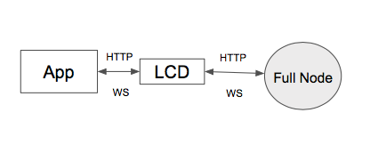
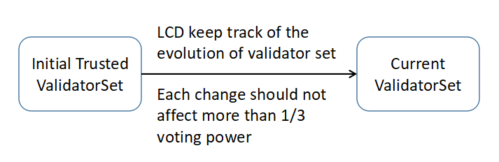

# 轻客户端概览

**点击[这里](https://cosmos.network/rpc/)查看 Cosmos SDK 轻客户端 RPC 文档**

## 简介

轻客户端允许客户端（例如移动电话）从任何全节点接收区块链状态的证明。 轻客户端不必信任任何全节点，因为他们能够验证他们收到的任何证明，因此全节点不能对网络状态撒谎。

轻客户端可以用最低的带宽、计算和存储资源提供与全节点相同的安全性。 同时，它还可以根据用户的配置提供模块化功能。 这些出色的功能允许开发人员构建完全安全、高效且可用的移动应用、网站或任何其他应用程序，而无需部署或维护任何完整的区块链节点。

### 什么是轻节点

Cosmos SDK 轻节点（Gaia-lite）分为两个独立的组件。 第一个组件对于任何基于 Tendermint 的应用程序都是通用的，它处理区块头相关的安全性和连接性，并验证来自全节点的证明与本地可信验证人集合的对比。 此外，它暴露与任何 Tendermint 核心节点完全相同的 API。 第二个组件专用于 Cosmos Hub（`gaiad`），它作为查询端点工作，并公开特定于应用程序的功能，这些功能可以是任意的。 针对应用程序状态的所有查询都必须通过查询端点。 查询端点的优点是它可以验证应用程序返回的证据。

### 高层体系结构

想要为 Cosmos Hub（或任何其他 zone）构建第三方客户端应用程序的应用程序开发人员，应根据其规范 API 构建。 该 API 是多个部分的组合。 所有 zone 都必须暴露 ICS0（TendermintAPI）。 除此之外，任何 zone 都可以自由选择模块 API 的任意组合，具体取决于状态机使用的模块。 Cosmos Hub 最初将支持[ICS0](https://cosmos.network/rpc/#/ICS0) (TendermintAPI)、 [ICS1](https://cosmos.network/rpc/#/ICS1) (KeyAPI)、 [ICS20](https://cosmos.network/rpc/#/ICS20) (TokenAPI)、 [ICS21](https://cosmos.network/rpc/#/ICS21) (StakingAPI)、 [ICS22](https://cosmos.network/rpc/#/ICS22) (GovernanceAPI) 和 [ICS23](https://cosmos.network/rpc/#/ICS23) (SlashingAPI)。

预计所有应用程序仅依赖于 Gaia-lite 运行。 Gaia-lite 是唯一一款围绕 zone API 提供稳定性保证的软件。

### 对比

ABCI 的全节点与其轻客户端的区别在于以下方面：

|                | Full Node        | 轻客户端      | Description                                                                                                                                                                                                                                                      |
| -------------- | ---------------- | ------------- | ---------------------------------------------------------------------------------------------------------------------------------------------------------------------------------------------------------------------------------------------------------------- |
| 执行并验证交易 | Yes              | No            | 全节点将执行并验证所有交易，而 Gaia-lite 则不会                                                                                                                                                                                                                  |
| 验证和存储区块 | Yes              | No            | 全节点将验证并保存所有块，而 Gaia-lite 则不会                                                                                                                                                                                                                    |
| 参与共识       | Yes              | No            | 只有当全节点是验证人时，它才会参与共识。 Lite 节点永远不会参与共识。                                                                                                                                                                                             |
| 带宽开销       | 巨大             | 很小          | 全节点将接收所有块。 如果带宽有限，它将落后于主网络。 更重要的是，如果碰巧是验证人，它将减缓共识过程。 轻客户端需要很少的带宽， 只有在提供本地请求时，才会占用带宽。                                                                                             |
| 计算资源       | 巨大             | 很小          | 全节点将执行所有交易并验证所有块，这需要大量的计算资源                                                                                                                                                                                                           |
| 存储资源       | 巨大             | 很小          | 全节点将保存所有块和 ABCI 状态，而 Gaia-lite 只保存验证人集合和一些检查点。                                                                                                                                                                                      |
| 电力资源       | 巨大             | 很小          | 全节点必须在具有高性能并能一直运行的机器上部署，因此功耗将是巨大的。 Gaia-lite 可以部署在与用户应用程序相同的机器上，也可以部署在独立但性能较差的机器上。 此外，Lite 客户端可以在必要时随时关闭。所以 Gaia-lite 只消耗很少的功率，即使移动设备也能满足功率需求。 |
| 提供的 APIs    | 所有 cosmos APIs | 部分模块 APIs | 全节点支持所有 cosmos API。 Gaia-lite 根据用户的配置提供模块化 API。                                                                                                                                                                                             |
| 安全等级       | 高               | 高            | 全节点将自行验证所有交易和块。 轻型客户端无法执行此操作，但它可以查询来自其他全节点的任何数据并独立验证数据。 因此，全节点和轻型客户端都不需要信任任何第三方节点，它们都可以实现高安全性。                                                                       |

根据上表，Gaia-lite 可以满足所有用户的功能和安全需求，但只需要很少的带宽、计算、存储和电力资源。

## 安全实现

### 可信验证人集合

Gaia-lite 的基本设计理念遵循两个规则：

1. **不信任任何区块链节点，包括验证人节点和其他全节点**
2. **只信任整个验证人集合**

原始的可信验证人集应该预先放置到其信任库中，通常这个验证人集来自 genesis 文件。 在运行时期间，如果 Gaia-lite 检测到不同的验证人集，它将验证它并将可信的验证人集保存到信任库中。

### 信任传播

从上面的小节中，我们了解了如何获得可信验证器集以及 LCD 如何跟踪验证人集演化。 验证人集是信任的基础，信任可以传播到其他区块链数据，例如块和交易。 传播架构如下所示：

通常，通过可信验证人集，轻客户端可以验证包含所有预提交数据和块头数据的每个提交块。 此时块哈希、数据哈希和应用哈希是可信的。 基于此和默克尔证明，所有交易数据和 ABCI 状态也可以被验证。
