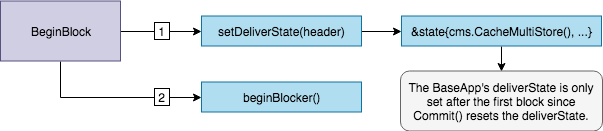

<!--
order: 1
synopsis: This document describes `BaseApp`, the abstraction that implements the core functionalities of an SDK application.
-->

# Baseapp

## Pre-requisite Readings {hide}

- [Anatomy of an SDK application](../basics/app-anatomy.md) {prereq}
- [Lifecycle of an SDK transaction](../basics/tx-lifecycle.md) {prereq}

## Introduction

`BaseApp` is a base type that implements the core of an SDK application, namely:

- The [Application Blockchain Interface](#abci), for the state-machine to communicate with the
underlying consensus engine (e.g. Tendermint).
- A [Router](#routing), to route messages and queries to the appropriate module.
- Different [states](#states), as the state-machine can have different volatile
states updated based on the ABCI message received.

The goal of `BaseApp` is to provide the fundamental layer of an SDK application
that developers can easily extend to build their own custom application. Usually,
developers will create a custom type for their application, like so:

```go
type App struct {
  // reference to a BaseApp
  *bam.BaseApp

  // list of application store keys

  // list of application keepers

  // module manager
}
```

Extending the application with `BaseApp` gives the former access to all of `BaseApp`'s methods.
This allows developers to compose their custom application with the modules they want, while not
having to concern themselves with the hard work of implementing the ABCI, the routing and state
management logic.

## Type Definition

The `BaseApp` type holds many important parameters for any Cosmos SDK based application. 

+++ https://github.com/cosmos/cosmos-sdk/blob/7d7821b9af132b0f6131640195326aa02b6751db/baseapp/baseapp.go#L54-L108

Let us go through the most important components.

> __Note__: Not all parameters are described, only the most important ones. Refer to the
type definition for the full list.

First, the important parameters that are initialized during the bootstrapping of the application:

- [`CommitMultiStore`](./store.md#commitmultistore): This is the main store of the application,
which holds the canonical state that is committed at the [end of each block](#commit). This store
is **not** cached, meaning it is not used to update the application's volatile (un-committed) states.
The `CommitMultiStore` is a multi-store, meaning a store of stores. Each module of the application
uses one or multiple `KVStores` in the multi-store to persist their subset of the state.
- Database: The `db` is used by the `CommitMultiStore` to handle data persistence.
- [Router](#message-routing): The `router` facilitates the routing of `messages` to the appropriate
module for it to be processed. Here a `message` refers to the transaction components that need to be
processed by the application in order to update the state, and not to ABCI messages which implement
the interface between the application and the underlying consensus engine.
- [Query Router](#query-routing): The `query router` facilitates the routing of queries to the
appropriate module for it to be processed. These `queries` are not ABCI messages themselves, but they
are relayed to the application from the underlying consensus engine via the ABCI message [`Query`](#query).
- [`TxDecoder`](https://godoc.org/github.com/cosmos/cosmos-sdk/types#TxDecoder): It is used to decode
raw transaction bytes relayed by the underlying Tendermint engine.
- `BaseKey`: This key is used to access the main store in the `CommitMultiStore`. The main store is
used to persist data related to the core of the application, like consensus parameters.
- [`AnteHandler`](#antehandler): This handler is used to handle signature verification, fee payment,
and other pre-message execution checks when a transaction is received. It's executed during
[`CheckTx/RecheckTx`](#checktx) and [`DeliverTx`](#delivertx).
- [`InitChainer`](../basics/app-anatomy.md#initchainer),
[`BeginBlocker` and `EndBlocker`](../basics/app-anatomy.md#beginblocker-and-endblocker): These are
the functions executed when the application receives the `InitChain`, `BeginBlock` and `EndBlock`
ABCI messages from the underlying Tendermint engine.

Then, parameters used to define [volatile states](#volatile-states) (i.e. cached states):

- `checkState`: This state is updated during [`CheckTx`](#checktx), and reset on [`Commit`](#commit).
- `deliverState`: This state is updated during [`DeliverTx`](#delivertx), and set to `nil` on
[`Commit`](#commit) and gets re-initialized on BeginBlock.

Finally, a few more important parameterd:

- `voteInfos`: This parameter carries the list of validators whose precommit is missing, either
because they did not vote or because the proposer did not include their vote. This information is
carried by the [Context](#context) and can be used by the application for various things like
punishing absent validators.
- `minGasPrices`: This parameter defines the minimum gas prices accepted by the node. This is a
**local** parameter, meaning each full-node can set a different `minGasPrices`. It is used in the
`AnteHandler` during [`CheckTx`](#checktx), mainly as a spam protection mechanism. The transaction
enters the [mempool](https://tendermint.com/docs/tendermint-core/mempool.html#transaction-ordering)
only if the gas prices of the transaction are greater than one of the minimum gas price in
`minGasPrices` (e.g. if `minGasPrices == 1uatom,1photon`, the `gas-price` of the transaction must be
greater than `1uatom` OR `1photon`).
- `appVersion`: Version of the application. It is set in the
[application's constructor function](../basics/app-anatomy.md#constructor-function).

## Constructor

```go
func NewBaseApp(
  name string, logger log.Logger, db dbm.DB, txDecoder sdk.TxDecoder, options ...func(*BaseApp),
) *BaseApp {

  // ...
}
```

The `BaseApp` constructor function is pretty straightforward. The only thing worth noting is the
possibility to provide additional [`options`](https://github.com/cosmos/cosmos-sdk/blob/7d7821b9af132b0f6131640195326aa02b6751db/baseapp/options.go)
to the `BaseApp`, which will execute them in order. The `options` are generally `setter` functions
for important parameters, like `SetPruning()` to set pruning options or `SetMinGasPrices()` to set
the node's `min-gas-prices`.

Naturally, developers can add additional `options` based on their application's needs.

## State Updates 

The `BaseApp` maintains two primary volatile states and a root or main state. The main state
is the canonical state of the application and the volatile states, `checkState` and `deliverState`,
are used to handle state transitions in-between the main state made during [`Commit`](#commit).

Internally, there is only a single `CommitMultiStore` which we refer to as the main or root state.
From this root state, we derive two volatile state through a mechanism called cache-wrapping. The
types can be illustrated as follows:


### InitChain State Updates

During `InitChain`, the two volatile states, `checkState` and `deliverState` are set by cache-wrapping
the root `CommitMultiStore`. Any subsequent reads and writes happen on cached versions of the `CommitMultiStore`.


### CheckTx State Updates

During `CheckTx`, the `checkState`, which is based off of the last committed state from the root
store, is used for any reads and writes. Here we only execute the `AnteHandler` and verify a router
exists for every message in the transaction. Note, when we execute the `AnteHandler`, we cache-wrap
the already cache-wrapped `checkState`. This has the side effect that if the `AnteHandler` fails,
the state transitions won't be reflected in the `checkState` -- i.e. `checkState` is only updated on
success.


### BeginBlock State Updates

During `BeginBlock`, the `deliverState` is set for use in subsequent `DeliverTx` ABCI messages. The
`deliverState` is based off of the last committed state from the root store and is cache-wrapped.
Note, the `deliverState` is set to `nil` on [`Commit`](#commit).



### DeliverTx State Updates

The state flow for `DeliverTx` is nearly identical to `CheckTx` except state transitions occur on
the `deliverState` and messages in a transaction are executed. Similarly to `CheckTx`, state transitions
occur on a doubly cache-wrapped state -- `deliverState`. Successful message execution results in
writes being committed to `deliverState`. Note, if message execution fails, state transitions from
the AnteHandler are persisted.


### Commit State Updates

During `Commit` all the state transitions that occurred in the `deliverState` are finally written to
the root `CommitMultiStore` which in turn is committed to disk and results in a new application
root hash. These state transitions are now considered final. Finally, the `checkState` is set to the
newly committed state and `deliverState` is set to `nil` to be reset on `BeginBlock`.


## Routing

When messages and queries are received by the application, they must be routed to the appropriate module in order to be processed. Routing is done via `baseapp`, which holds a `router` for messages, and a `query router` for queries.

### Message Routing

[`Message`s](#../building-modules/messages-and-queries.md#messages) need to be routed after they are extracted from transactions, which are sent from the underlying Tendermint engine via the [`CheckTx`](#checktx) and [`DeliverTx`](#delivertx) ABCI messages. To do so, `baseapp` holds a `router` which maps `paths` (`string`) to the appropriate module [`handler`](../building-modules/handler.md) using the `.Route(ctx sdk.Context, path string)` function. Usually, the `path` is the name of the module.

The [default router included in baseapp](https://github.com/cosmos/cosmos-sdk/blob/master/baseapp/router.go) is stateless.  However, some applications may want to make use of more stateful routing mechanisms such as allowing governance to disable certain routes or point them to new modules for upgrade purposes.  For this reason, the `sdk.Context` is also passed into the `Route` function of the [Router interface](https://github.com/cosmos/cosmos-sdk/blob/master/types/router.go#L12).  For a stateless router that doesn't want to make use of this, can just ignore the ctx.

The application's `router` is initilalized with all the routes using the application's [module manager](../building-modules/module-manager.md#manager), which itself is initialized with all the application's modules in the application's [constructor](../basics/app-anatomy.md#app-constructor). 

### Query Routing

Similar to `message`s, [`queries`](../building-modules/messages-and-queries.md#queries) need to be routed to the appropriate module's [querier](../building-modules/querier.md). To do so, `baseapp` holds a `query router`, which maps module names to module `querier`s. The `queryRouter` is called during the initial stages of `query` processing, which is done via the [`Query` ABCI message](#query). 

Just like the `router`, the `query router` is initilalized with all the query routes using the application's [module manager](../building-modules/module-manager.md), which itself is initialized with all the application's modules in the application's [constructor](../basics/app-anatomy.md#app-constructor).

## Main ABCI Messages

The [Application-Blockchain Interface](https://tendermint.com/docs/spec/abci/) (ABCI) is a generic interface that connects a state-machine with a consensus engine to form a functional full-node. It can be wrapped in any language, and needs to be implemented by each application-specific blockchain built on top of an ABCI-compatible consensus engine like Tendermint. 

The consensus engine handles two main tasks:

- The networking logic, which mainly consists in gossiping block parts, transactions and consensus votes.
- The consensus logic, which results in the deterministic ordering of transactions in the form of blocks. 

It is **not** the role of the consensus engine to define the state or the validity of transactions. Generally, transactions are handled by the consensus engine in the form of `[]bytes`, and relayed to the application via the ABCI to be decoded and processed. At keys moments in the networking and consensus processes (e.g. beginning of a block, commit of a block, reception of an unconfirmed transaction, ...), the consensus engine emits ABCI messages for the state-machine to act on. 

Developers building on top of the Cosmos SDK need not implement the ABCI themselves, as `baseapp` comes with a built-in implementation of the interface. Let us go through the main ABCI messages that `baseapp` implements: [`CheckTx`](#checktx) and [`DeliverTx`](#delivertx)

### CheckTx

`CheckTx` is sent by the underlying consensus engine when a new unconfirmed (i.e. not yet included in a valid block)
transaction is received by a full-node. The role of `CheckTx` is to guard the full-node's mempool
(where unconfirmed transactions are stored until they are included in a block) from spam transactions.
Unconfirmed transactions are relayed to peers only if they pass `CheckTx`.

`CheckTx()` can perform both _stateful_ and _stateless_ checks, but developers should strive to
make them lightweight. In the Cosmos SDK, after [decoding transactions](./encoding.md), `CheckTx()` is implemented
to do the following checks:

1. Extract the `message`s from the transaction.
2. Perform _stateless_ checks by calling `ValidateBasic()` on each of the `messages`. This is done
   first, as _stateless_ checks are less computationally expensive than _stateful_ checks. If
   `ValidateBasic()` fail, `CheckTx` returns before running _stateful_ checks, which saves resources.
3. Perform non-module related _stateful_ checks on the [account](../basics/accounts.md). This step is mainly about checking
   that the `message` signatures are valid, that enough fees are provided and that the sending account
   has enough funds to pay for said fees. Note that no precise [`gas`](../basics/gas-fees.md) counting occurs here,
   as `message`s are not processed. Usually, the [`AnteHandler`](../basics/gas-fees.md#antehandler) will check that the `gas` provided
   with the transaction is superior to a minimum reference gas amount based on the raw transaction size,
   in order to avoid spam with transactions that provide 0 gas.
4. Ensure that a [`Route`](#message-routing) exists for each `message`, but do **not** actually
   process `message`s. `Message`s only need to be processed when the canonical state need to be updated,
   which happens during `DeliverTx`.

Steps 2. and 3. are performed by the [`AnteHandler`](../basics/gas-fees.md#antehandler) in the [`RunTx()`](#runtx-antehandler-and-runmsgs)
function, which `CheckTx()` calls with the `runTxModeCheck` mode. During each step of `CheckTx()`, a
special [volatile state](#volatile-states) called `checkState` is updated. This state is used to keep
track of the temporary changes triggered by the `CheckTx()` calls of each transaction without modifying
the [main canonical state](#main-state) . For example, when a transaction goes through `CheckTx()`, the
transaction's fees are deducted from the sender's account in `checkState`. If a second transaction is
received from the same account before the first is processed, and the account has consumed all its
funds in `checkState` during the first transaction, the second transaction will fail `CheckTx`() and
be rejected. In any case, the sender's account will not actually pay the fees until the transaction
is actually included in a block, because `checkState` never gets committed to the main state. The
`checkState` is reset to the latest state of the main state each time a blocks gets [committed](#commit).

`CheckTx` returns a response to the underlying consensus engine of type [`abci.ResponseCheckTx`](https://tendermint.com/docs/spec/abci/abci.html#messages).
The response contains:

- `Code (uint32)`: Response Code. `0` if successful. 
- `Data ([]byte)`: Result bytes, if any.
- `Log (string):` The output of the application's logger. May be non-deterministic.
- `Info (string):` Additional information. May be non-deterministic.
- `GasWanted (int64)`: Amount of gas requested for transaction. It is provided by users when they generate the transaction. 
- `GasUsed (int64)`: Amount of gas consumed by transaction. During `CheckTx`, this value is computed by multiplying the standard cost of a transaction byte by the size of the raw transaction. Next is an example:
  +++ https://github.com/cosmos/cosmos-sdk/blob/7d7821b9af132b0f6131640195326aa02b6751db/x/auth/ante/basic.go#L104
- `Events ([]cmn.KVPair)`: Key-Value tags for filtering and indexing transactions (eg. by account). See [`event`s](./events.md) for more.
- `Codespace (string)`: Namespace for the Code.

#### RecheckTx

After `Commit`, `CheckTx` is run again on all transactions that remain in the node's local mempool
after filtering those included in the block. To prevent the mempool from rechecking all transactions
every time a block is committed, the configuration option `mempool.recheck=false` can be set. As of
Tendermint v0.32.1, an additional `Type` parameter is made available to the `CheckTx` function that
indicates whether an incoming transaction is new (`CheckTxType_New`), or a recheck (`CheckTxType_Recheck`).
This allows certain checks like signature verification can be skipped during `CheckTxType_Recheck`.

### DeliverTx

When the underlying consensus engine receives a block proposal, each transaction in the block needs to be processed by the application. To that end, the underlying consensus engine sends a `DeliverTx` message to the application for each transaction in a sequential order.

Before the first transaction of a given block is processed, a [volatile state](#volatile-states) called `deliverState` is intialized during [`BeginBlock`](#beginblock). This state is updated each time a transaction is processed via `DeliverTx`, and committed to the [main state](#main-state) when the block is [committed](#commit), after what is is set to `nil`. 

`DeliverTx` performs the **exact same steps as `CheckTx`**, with a little caveat at step 3 and the addition of a fifth step:

1. The `AnteHandler` does **not** check that the transaction's `gas-prices` is sufficient. That is because the `min-gas-prices` value `gas-prices` is checked against is local to the node, and therefore what is enough for one full-node might not be for another. This means that the proposer can potentially include transactions for free, although they are not incentivised to do so, as they earn a bonus on the total fee of the block they propose.
2. For each `message` in the transaction, route to the appropriate module's [`handler`](../building-modules/handler.md). Additional _stateful_ checks are performed, and the cache-wrapped multistore held in `deliverState`'s `context` is updated by the module's `keeper`. If the `handler` returns successfully, the cache-wrapped multistore held in `context` is written to `deliverState` `CacheMultiStore`.

During step 5., each read/write to the store increases the value of `GasConsumed`. You can find the default cost of each operation:

+++ https://github.com/cosmos/cosmos-sdk/blob/7d7821b9af132b0f6131640195326aa02b6751db/store/types/gas.go#L142-L150

At any point, if `GasConsumed > GasWanted`, the function returns with `Code != 0` and `DeliverTx` fails. 

`DeliverTx` returns a response to the underlying consensus engine of type [`abci.ResponseDeliverTx`](https://tendermint.com/docs/spec/abci/abci.html#delivertx). The response contains:

- `Code (uint32)`: Response Code. `0` if successful. 
- `Data ([]byte)`: Result bytes, if any.
- `Log (string):` The output of the application's logger. May be non-deterministic.
- `Info (string):` Additional information. May be non-deterministic.
- `GasWanted (int64)`: Amount of gas requested for transaction. It is provided by users when they generate the transaction. 
- `GasUsed (int64)`: Amount of gas consumed by transaction. During `DeliverTx`, this value is computed by multiplying the standard cost of a transaction byte by the size of the raw transaction, and by adding gas each time a read/write to the store occurs. 
- `Events ([]cmn.KVPair)`: Key-Value tags for filtering and indexing transactions (eg. by account). See [`event`s](./events.md) for more.
- `Codespace (string)`: Namespace for the Code.

## RunTx, AnteHandler and RunMsgs

### RunTx

`RunTx` is called from `CheckTx`/`DeliverTx` to handle the transaction, with `runTxModeCheck` or `runTxModeDeliver` as parameter to differentiate between the two modes of execution. Note that when `RunTx` receives a transaction, it has already been decoded. 

The first thing `RunTx` does upon being called is to retrieve the `context`'s `CacheMultiStore` by calling the `getContextForTx()` function with the appropriate mode (either `runTxModeCheck` or `runTxModeDeliver`). This `CacheMultiStore` is a cached version of the main store instantiated during `BeginBlock` for `DeliverTx` and during the `Commit` of the previous block for `CheckTx`.  After that, two `defer func()` are called for [`gas`](../basics/gas-fees.md) management. They are executed when `runTx` returns and make sure `gas` is actually consumed, and will throw errors, if any.

After that, `RunTx()` calls `ValidateBasic()` on each `message`in the `Tx`, which runs preliminary _stateless_ validity checks. If any `message` fails to pass `ValidateBasic()`, `RunTx()` returns with an error.

Then, the [`anteHandler`](#antehandler) of the application is run (if it exists). In preparation of this step, both the `checkState`/`deliverState`'s `context` and `context`'s `CacheMultiStore` are cached-wrapped using the `cacheTxContext()` function. 

+++ https://github.com/cosmos/cosmos-sdk/blob/7d7821b9af132b0f6131640195326aa02b6751db/baseapp/baseapp.go#L587

This allows `RunTx` not to commit the changes made to the state during the execution of `anteHandler` if it ends up failing. It also prevents the module implementing the `anteHandler` from writing to state, which is an important part of the [object-capabilities](./ocap.md) of the Cosmos SDK. 

Finally, the [`RunMsgs()`](#runmsgs) function is called to process the `messages`s in the `Tx`. In preparation of this step, just like with the `anteHandler`, both the `checkState`/`deliverState`'s `context` and `context`'s `CacheMultiStore` are cached-wrapped using the `cacheTxContext()` function.

### AnteHandler

The `AnteHandler` is a special handler that implements the `anteHandler` interface and is used to authenticate the transaction before the transaction's internal messages are processed.

+++ https://github.com/cosmos/cosmos-sdk/blob/7d7821b9af132b0f6131640195326aa02b6751db/types/handler.go#L8

The `AnteHandler` is theoretically optional, but still a very important component of public blockchain networks. It serves 3 primary purposes:

- Be a primary line of defense against spam and second line of defense (the first one being the mempool) against transaction replay with fees deduction and [`sequence`](./transactions.md#transaction-generation) checking. 
- Perform preliminary *stateful* validity checks like ensuring signatures are valid or that the sender has enough funds to pay for fees. 
- Play a role in the incentivisation of stakeholders via the collection of transaction fees. 

`baseapp` holds an `anteHandler` as paraemter, which is initialized in the [application's constructor](../basics/app-anatomy.md#application-constructor). The most widely used `anteHandler` today is that of the [`auth` module](https://github.com/cosmos/cosmos-sdk/blob/master/x/auth/ante/ante.go).

Click [here](../basics/gas-fees.md#antehandler) for more on the `anteHandler`. 

### RunMsgs

`RunMsgs` is called from `RunTx` with `runTxModeCheck` as parameter to check the existence of a route for each message the transaction, and with `runTxModeDeliver` to actually process the `message`s. 

First, it retreives the `message`'s `route` using the `Msg.Route()` method. Then, using the application's [`router`](#routing) and the `route`, it checks for the existence of a `handler`. At this point, if `mode == runTxModeCheck`, `RunMsgs` returns. If instead `mode == runTxModeDeliver`, the [`handler`](../building-modules/handler.md) function for the message is executed, before `RunMsgs` returns. 

## Other ABCI Messages

### InitChain

The [`InitChain` ABCI message](https://tendermint.com/docs/app-dev/abci-spec.html#initchain) is sent from the underlying Tendermint engine when the chain is first started. It is mainly used to **initialize** parameters and state like:

- [Consensus Parameters](https://tendermint.com/docs/spec/abci/apps.html#consensus-parameters) via `setConsensusParams`. 
- [`checkState` and `deliverState`](#volatile-states) via `setCheckState` and `setDeliverState`.
- The [block gas meter](../basics/gas-fees.md#block-gas-meter), with infinite gas to process genesis transactions. 

Finally, the `InitChain(req abci.RequestInitChain)` method of `baseapp` calls the [`initChainer()`](../basics/app-anatomy.md#initchainer) of the application in order to initialize the main state of the application from the `genesis file` and, if defined, call the [`InitGenesis`](../building-modules/genesis.md#initgenesis) function of each of the application's modules.

### BeginBlock

The [`BeginBlock` ABCI message](#https://tendermint.com/docs/app-dev/abci-spec.html#beginblock) is sent from the underlying Tendermint engine when a block proposal created by the correct proposer is received, before [`DeliverTx`](#delivertx) is run for each transaction in the block. It allows developers to have logic be executed at the beginning of each block. In the Cosmos SDK, the `BeginBlock(req abci.RequestBeginBlock)` method does the following:

- Initialize [`deliverState`](#volatile-states) with the latest header using the `req abci.RequestBeginBlock` passed as parameter via the `setDeliverState` function. 
  +++ https://github.com/cosmos/cosmos-sdk/blob/7d7821b9af132b0f6131640195326aa02b6751db/baseapp/baseapp.go#L387-L397
This function also resets the [main gas meter](../basics/gas-fees.md#main-gas-meter).
- Initialize the [block gas meter](../basics/gas-fees.md#block-gas-meter) with the `maxGas` limit. The `gas` consumed within the block cannot go above `maxGas`. This parameter is defined in the application's consensus parameters. 
- Run the application's [`beginBlocker()`](../basics/app-anatomy.md#beginblocker-and-endblock), which mainly runs the [`BeginBlocker()`](../building-modules/beginblock-endblock.md#beginblock) method of each of the application's modules.
- Set the [`VoteInfos`](https://tendermint.com/docs/app-dev/abci-spec.html#voteinfo) of the application, i.e. the list of validators whose *precommit* for the previous block was included by the proposer of the current block. This information is carried into the [`Context`](./context.md) so that it can be used during `DeliverTx` and `EndBlock`.

### EndBlock

The [`EndBlock` ABCI message](#https://tendermint.com/docs/app-dev/abci-spec.html#endblock) is sent from the underlying Tendermint engine after [`DeliverTx`](#delivertx) as been run for each transaction in the block. It allows developers to have logic be executed at the end of each block. In the Cosmos SDK, the bulk `EndBlock(req abci.RequestEndBlock)` method is to run the application's [`EndBlocker()`](../basics/app-anatomy.md#beginblocker-and-endblock), which mainly runs the [`EndBlocker()`](../building-modules/beginblock-endblock.md#beginblock) method of each of the application's modules. 

### Commit

The [`Commit` ABCI message](https://tendermint.com/docs/app-dev/abci-spec.html#commit) is sent from the underlying Tendermint engine after the full-node has received *precommits* from 2/3+ of validators (weighted by voting power). On the `baseapp` end, the `Commit(res abci.ResponseCommit)` function is implemented to commit all the valid state transitions that occured during `BeginBlock`, `DeliverTx` and `EndBlock` and to reset state for the next block. 

To commit state-transitions, the `Commit` function calls the `Write()` function on `deliverState.ms`, where `deliverState.ms` is a cached multistore of the main store `app.cms`. Then, the `Commit` function sets `checkState` to the latest header (obtbained from `deliverState.ctx.BlockHeader`) and `deliverState` to `nil`.

Finally, `Commit` returns the hash of the commitment of `app.cms` back to the underlying consensus engine. This hash is used as a reference in the header of the next block. 

### Info

The [`Info` ABCI message](https://tendermint.com/docs/app-dev/abci-spec.html#info) is a simple query from the underlying consensus engine, notably used to sync the latter with the application during a handshake that happens on startup. When called, the `Info(res abci.ResponseInfo)` function from `baseapp` will return the application's name, version and the hash of the last commit of `app.cms`. 

### Query 

The [`Query` ABCI message](https://tendermint.com/docs/app-dev/abci-spec.html#query) is used to serve queries received from the underlying consensus engine, including queries received via RPC like Tendermint RPC. It is the main entrypoint to build interfaces with the application. The application must respect a few rules when implementing the `Query` method, which are outlined [here](https://tendermint.com/docs/app-dev/abci-spec.html#query). 

Each `query` comes with a `path`, which contains multiple `string`s. By convention, the first element of the `path` (`path[0]`) contains the category of `query` (`app`, `p2p`, `store` or `custom`). The `baseapp` implementation of the `Query(req abci.RequestQuery)` method is a simple dispatcher serving these 4 main categories of queries:

- Application-related queries like querying the application's version, which are served via the `handleQueryApp` method.
- Direct queries to the multistore, which are served by the `handlerQueryStore` method. These direct queryeis are different from custom queries which go through `app.queryRouter`, and are mainly used by third-party service provider like block explorers. 
- P2P queries, which are served via the `handleQueryP2P` method. These queries return either `app.addrPeerFilter` or `app.ipPeerFilter` that contain the list of peers filtered by address or IP respectively. These lists are first initialized via `options` in `baseapp`'s [constructor](#constructor).
- Custom queries, which encompass most queries, are served via the `handleQueryCustom` method. The `handleQueryCustom` cache-wraps the multistore before using the `queryRoute` obtained from [`app.queryRouter`](#query-routing) to map the query to the appropriate module's `querier`.

## Next {hide}

Learn more about [transactions](./transactions.md) {hide}