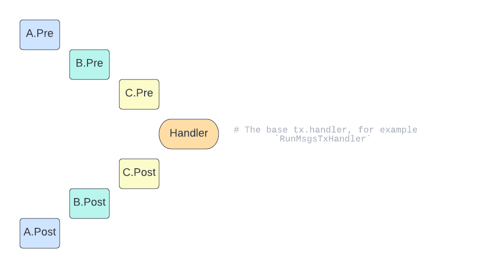

<!--
order: 3
-->

# Middlewares

`Middlewares` are objects that the developer can create to add logic before or after the transaction handler in a composable manner.
{synopsis}

## Pre-requisite Readings

* [Anatomy of a Cosmos SDK Application](../basics/app-anatomy.md) {prereq}
* [Transactons](transactions.md) {prereq}

## Middlewares

The SDK Baseapp's implementation of ABCI CheckTx, DeliverTx, and Baseapp's own Simulate methods use a middleware-based design. Middlewares can add logic to be executed before or after a transaction handler execution. Middlewares are like an `antehandler` with the added feature of being able to add post-transaction handler execution. Middlewares allow us to solve use cases like transaction Tips and refund unused gas (issue [#2150](https://github.com/cosmos/cosmos-sdk/issues/2150)).

### Type Definition

The two following interfaces are the base of the middleware design, and are defined in types/tx:

+++ https://github.com/cosmos/cosmos-sdk/blob/5491be27d02e796746bd78d3d08bd1b2a9b1deb2/types/tx/middleware.go#L62-L71

Where we define the following arguments and return types:

+++ https://github.com/cosmos/cosmos-sdk/blob/5491be27d02e796746bd78d3d08bd1b2a9b1deb2/types/tx/middleware.go#L25-L60

BaseApp holds a reference to a `tx.Handler`, which will process the incoming transactions. It could be a simple `sdk.Msg` executor, but in practice, it will be defined as a middleware stack wrapping around the base `sdk.Msg` executor.

```go
type BaseApp  struct {
    // other fields
    txHandler tx.Handler
}
```

## Implementing a Middleware

To implement a middleware is done simply by a Go function that takes as arguments and some parameters and returns a `tx.Middleware`.

For example, we can create a Generic middleware.

```go
// myTxHandler is the tx.Handler of this middleware. Note that it holds a
// reference to the next tx.Handler in the stack.
type myTxHandler struct {
    // next is the next tx.Handler in the middleware stack.
    next tx.Handler
    // some other fields that are relevant to the middleware can be added here
}

// NewMyMiddleware returns a middleware that does this and that.
func NewMyMiddleware(arg1, arg2) tx.Middleware {
    return func (txh tx.Handler) tx.Handler {
        return myTxHandler{
            next: txh,
            // optionally, set arg1, arg2... if they are needed in the middleware
        }
    }
}

// Assert myTxHandler is a tx.Handler.
var _ tx.Handler = myTxHandler{}
```

Next we need to implement the middleware [interface](#Type-Definition).

```go
func (h myTxHandler) CheckTx(ctx context.Context, req Request, checkReq RequestcheckTx) (Response, ResponseCheckTx, error) {
    // CheckTx specific pre-processing logic

    // run the next middleware
    res, checkRes, err := txh.next.CheckTx(ctx, req, checkReq)

    // CheckTx specific post-processing logic

    return res, checkRes, err
}

func (h myTxHandler) DeliverTx(ctx context.Context, req Request) (Response, error) {
    // DeliverTx specific pre-processing logic

    // run the next middleware
    res, err := txh.next.DeliverTx(ctx, tx, req)

    // DeliverTx specific post-processing logic

    return res, err
}

func (h myTxHandler) SimulateTx(ctx context.Context, req Request) (Response, error) {
    // SimulateTx specific pre-processing logic

    // run the next middleware
    res, err := txh.next.SimulateTx(ctx, tx, req)

    // SimulateTx specific post-processing logic

    return res, err
}
```

### Composing Middlewares

While BaseApp holds a reference to a `tx.Handler`, this `tx.Handler` itself is defined using a middleware stack. The Cosmos SDK exposes a base (i.e. innermost) `tx.Handler` called `RunMsgsTxHandler`, which executes messages. It holds a reference to the `MsgServiceRouter`, which is used to map each `sdk.Msg` to the correct module's `Msg` server handler.

Then, the app developer can compose multiple middlewares on top of the base `tx.Handler`. Each middleware can run pre-and-post-processing logic around its next middleware, as described in the section above. Conceptually, as an example, given the middlewares `A`, `B`, and `C` and the base `tx.Handler` `H` the stack looks like:



```text
A.pre
    B.pre
        C.pre
            Handler # The base tx.handler, for example `RunMsgsTxHandler`
        C.post
    B.post
A.post
```

We define a `ComposeMiddlewares` function for composing middlewares. It takes the base handler as first argument, and middlewares in the "outer to inner" order. For the above stack, the final `tx.Handler` is:

```go
txHandler := middleware.ComposeMiddlewares(H, A, B, C)
```

The middleware is set in BaseApp via its `SetTxHandler` setter:

```go
// simapp/app.go

txHandler := middleware.ComposeMiddlewares(...)
app.SetTxHandler(txHandler)
```

The app developer can define their own middlewares, or use the Cosmos SDK's pre-defined middlewares from `middleware.NewDefaultTxHandler()`.

### Middlewares Maintained by the Cosmos SDK

While the app developer can define and compose the middlewares of their choice, the Cosmos SDK provides a set of middlewares that caters to the ecosystem's most common use cases. These middlewares are:

| Middleware                | Description                                                                                                                                                                                                                                                                                                                                                                                                                                                                              |
| ------------------------- | ---------------------------------------------------------------------------------------------------------------------------------------------------------------------------------------------------------------------------------------------------------------------------------------------------------------------------------------------------------------------------------------------------------------------------------------------------------------------------------------- |
| RunMsgsTxHandler          | This is the base `tx.Handler`. It replaces the old baseapp's `runMsgs`, and executes a transaction's `Msg`s.                                                                                                                                                                                                                                                                                                                                                                             |
| TxDecoderMiddleware       | This middleware takes in transaction raw bytes, and decodes them into a `sdk.Tx`. It replaces the `baseapp.txDecoder` field, so that BaseApp stays as thin as possible. Since most middlewares read the contents of the `sdk.Tx`, the TxDecoderMiddleware should be run first in the middelware stack.                                                                                                                                                                                   |
| {Antehandlers}            | Each antehandler is converted to its own middleware. These middlewares perform signature verification, fee deductions and other validations on the incoming transaction.                                                                                                                                                                                                                                                                                                                 |
| IndexEventsTxMiddleware   | This is a simple middleware that chooses which events to index in Tendermint. Replaces `baseapp.indexEvents` (which unfortunately still exists in baseapp too, because it's used to index Begin/EndBlock events)                                                                                                                                                                                                                                                                         |
| RecoveryTxMiddleware      | This index recovers from panics. It replaces baseapp.runTx's panic recovery described in [ADR-022](./adr-022-custom-panic-handling.md).                                                                                                                                                                                                                                                                                                                                                  |
| GasTxMiddleware           | This replaces the [`Setup`](https://github.com/cosmos/cosmos-sdk/blob/v0.43.0/x/auth/ante/setup.go) Antehandler. It sets a GasMeter on sdk.Context. Note that before, GasMeter was set on sdk.Context inside the antehandlers, and there was some mess around the fact that antehandlers had their own panic recovery system so that the GasMeter could be read by baseapp's recovery system. Now, this mess is all removed: one middleware sets GasMeter, another one handles recovery. |
| TipMiddleware             | This pays for transaction fees using another denom than the native fee denom of the chain. [`docs`](tips.md)                                                                                                                                                                                                                                                                                                                                                                             |
| SigGasConsumeMiddleware   | SigGasConsumeMiddleware consumes parameter-defined amount of gas for each signature.                                                                                                                                                                                                                                                                                                                                                                                                     |
| SigVerificationMiddleware | verifies all signatures for a tx and return an error if any are invalid                                                                                                                                                                                                                                                                                                                                                                                                                  |
