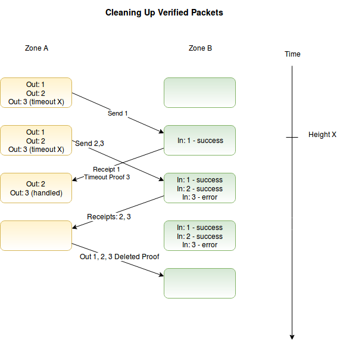

## 4 Optimizations

([Back to table of contents](README.md#contents))

The above sections describe a secure messaging protocol that can handle all normal situations between two blockchains. All messages are processed exactly once and in order, and applications can guarantee invariants over their combined state on both chains. IBC can be further extended and optimized to provide additional guarantees and minimize costs on the underlying blockchains. We detail two extensions: packet timeouts and packet cleanup.

### 4.1 Timeouts

Application semantics may require some timeout: an upper limit to how long the chain will wait for a transaction to be processed before considering it an error. Since the two chains have different local clocks, this is an obvious attack vector for a double spend - an attacker may delay the relay of the receipt or wait to send the packet until right after the timeout - so applications cannot safely implement naive timeout logic themselves.

One solution is to include a timeout in the IBC packet itself.  When sending a packet, one can specify a block height or timestamp on chain `B` after which the packet is no longer valid. If the packet is posted before the cutoff, it will be processed normally. If it is posted after the cutoff, it will be a guaranteed error. In order to provide the necessary guarantees, the timeout must be specified relative to a condition on the receiving chain, and the sending chain must have proof of this condition after the cutoff.

For a sending chain `A` and a receiving chain `B`, with an IBC packet `P={_, i, _, _, _}` and some height `h` on chain `B`, the base IBC protocol provides the following guarantees:

`A:M_kvh == ∅` if message `i` was not sent before height `h`

`A:M_kvh == ∅` if message `i` was sent and the corresponding receipt received before height `h` (and the receipts for all messages j < i were also handled)

`A:M_kvh /= ∅` otherwise, if message `i` was sent but the receipt has not yet been processed

`B:M_kvh == ∅` if message `i` was not received before height `h`

`B:M_kvh /= ∅` if message `i` was received before height `h`

We can make a few modifications of the above protocol to allow us to prove timeouts, by adding some fields to the messages in the send queue and defining an expired function that returns true iff `h > maxHeight` or `timestamp(H_h) > maxTime`.

`P = (type, sequence, source, destination, data, maxHeight, maxTime)`

`expired(H_h, P) ⇒ true | false`

We then update message handling in `receive`, so that chain `B` doesn't even call the handler function if the timeout was reached but instead directly writes an error in the receipt queue:

`receive`

```
case 
  ...
  expired(latestHeader, v) ⇒ push(incoming_b, R{..., TimeoutError})
  otherwise ⇒
    set result = f_type(data)
    push(incoming_B, R{tail(incoming_B), (B, connection, channel), (A, connection, channel), result})
```

The `receipt_handler` function on chain `A` can now verify timeouts and pass valid timeout receipts to the application handler (which can revert state changes such as escrowing assets):

`receipt_handler`

```
case
  ...
  result == TimeoutError ⇒ case
    not expired(H_h, P) ⇒ fail with "message timeout not yet reached"
    otherwise ⇒ f_type(R, TimeoutError)
  ...
```

This adds one more guarantee:

`A:M_kvh == ∅` if message i was sent and timeout proven before height h (and the receipts for all messages j < i were also handled).

Now chain `A` can rollback all transactions that were blocked by this flood of unrelayed packets - since they can never confirm - without waiting for chain `B` to process them and return a receipt. Adding reasonable timeouts to all packets allows us to gracefully handle any errors with the IBC relay processes or a flood of unrelayed "spam" IBC packets. If a blockchain requires a timeout on all messages and imposes some reasonable upper limit, we can guarantee that if a packet is not processed by the upper limit of the timeout period, then all previous packets must also have either been processed or reached the timeout period.

Note that in order to avoid any possible "double-spend" attacks, the timeout algorithm requires that the destination chain is running and reachable. One can prove nothing in a complete network partition, and must wait to connect; the timeout must be proven on the recipient chain, not simply the absence of a response on the sending chain.

Additionally, if timestamp-based timeouts are used instead of height-based timeouts, the destination chain's consensus ruleset must enforce always-increasing timestamps (or the sending chain must use a more complex `expired` function).

### 4.2 Cleanup

While we clean up the _send queue_ upon getting a receipt, if left to run indefinitely, the _receipt queues_ could grow without limit and create a major storage cost for the chains. However, we must not delete receipts until they have been proven to be processed by the sending chain, or we lose important information and sacrifice reliability.

Additionally, with the above timeout implementation, when we perform the timeout on the sending chain, we do not update the _receipt queue_ on the receiving chain, and now it is blocked waiting for a packet `i`, which no longer exists on the sending chain. We can update the guarantees of the receipt queue as follows to allow us to handle both:

`B:M_kvh == ∅` if packet `i` was not received before height `h`

`B:M_kvh == ∅` if packet i was provably resolved on the sending chain before height `h`

`B:M_kvh /= ∅` otherwise (if packet `i` was processed before height `h` but chain `A` has not handled the receipt)

Consider a connection where many messages have been sent, and their receipts processed on the sending chain, either explicitly or through a timeout. We wish to quickly advance over all the processed messages, either for a normal cleanup, or to prepare the queue for normal use again after timeouts.

Through the definition of the send queue, we know that all packets `i < head` have been fully processed and all packets `head <= i < tail` are awaiting processing. By proving a much advanced `head` of `outgoing_B`, we can demonstrate that the sending chain already handled all messages. Thus, we can safely advance `incoming_A` to the new head of `outgoing_B`.

```
cleanup(A, M_kvh, head) = case
  incoming_A == ∅ => fail with "unknown sender"
  H_h ∉ T_B => fail with "must submit header for height h"
  not valid(H_h, M_kvh, head) => fail with "invalid Merkle proof of outgoing_B queue height"
  head >= head(incoming_A) => fail with "cleanup must go forward"
  otherwise =>
    advance(incoming_A, head)
```

This allows us to invoke the `cleanup` function to resolve all outstanding messages up to and including `index` with one Merkle proof. Note that if this handles both recovering from a blocked queue after timeouts, as well as a routine cleanup method to recover space. In the cleanup scenario, we assume that there may also be a number of packets that have been processed by the receiving chain, but not yet posted to the sending chain, `tail(incoming_B) > head(outgoing_A)`. As such, `advance` must not modify any packets between the head and the tail.


