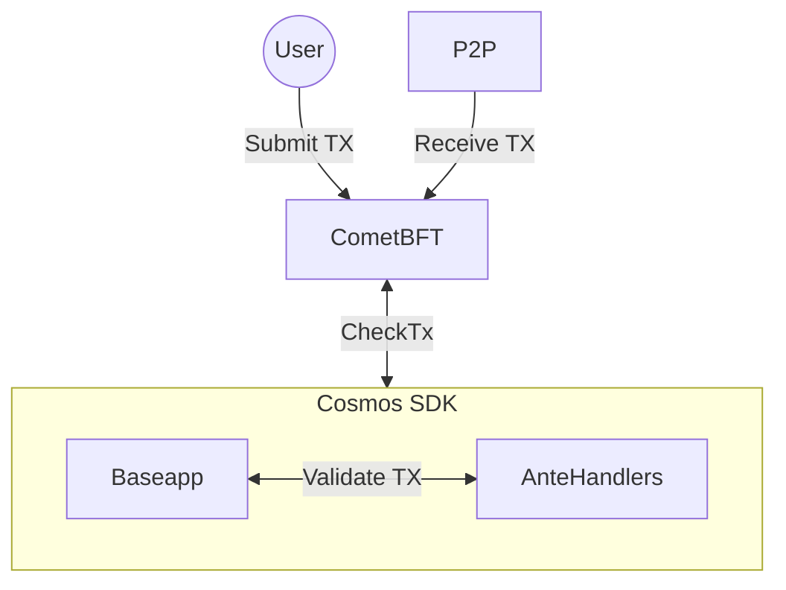

# CheckTx

CheckTx is called by the `BaseApp` when comet receives a transaction from a client, over the p2p network or RPC. The CheckTx method is responsible for validating the transaction and returning an error if the transaction is invalid. 



```go reference
https://github.com/cosmos/cosmos-sdk/blob/31c604762a434c7b676b6a89897ecbd7c4653a23/baseapp/abci.go#L350-L390
```

## CheckTx Handler

`CheckTxHandler` allows applications to extend the logic of `CheckTx`. It is invoked with the ABCI request and a `RunTx` function that executes the standard `CheckTx` pipeline (ante handlers, gas accounting and mempool interaction). The implementation of `CheckTxHandler` MUST be deterministic for a given `RequestCheckTx`.

```go
type CheckTxHandler func(RunTx, *abci.RequestCheckTx) (*abci.ResponseCheckTx, error)
```

The provided `RunTx` function does not override ante handlers and does not allow changing the execution mode; it simply runs the transaction through the normal `CheckTx` path and returns the result that can be used to construct a `ResponseCheckTx`.

Setting a custom `CheckTxHandler` is optional. It can be done from your `app.go` file by setting the handler on `BaseApp`:

```go
func NewSimApp(
	logger log.Logger,
	db corestore.KVStoreWithBatch,
	traceStore io.Writer,
	loadLatest bool,
	appOpts servertypes.AppOptions,
	baseAppOptions ...func(*baseapp.BaseApp),
) *SimApp {
	 ...
	 checkTxOpt := func(app *baseapp.BaseApp) {
	 	app.SetCheckTxHandler(func(runTx sdk.RunTx, req *abci.RequestCheckTx) (*abci.ResponseCheckTx, error) {
	 		// custom pre- or post-processing logic can be added here
	 		return runTx(req.Tx, nil)
	 	})
	 }
	 baseAppOptions = append(baseAppOptions, checkTxOpt)
	 ...
}
```

When `RequestCheckTx.Type` is `abci.CheckTxType_New`, the transaction is evaluated for admission into the mempool; when it is `abci.CheckTxType_Recheck`, the existing mempool transaction is re-evaluated and may be removed if it no longer passes validation. Successful `CheckTx` executions update an internal CheckTx state, which is reset when a block is committed.
