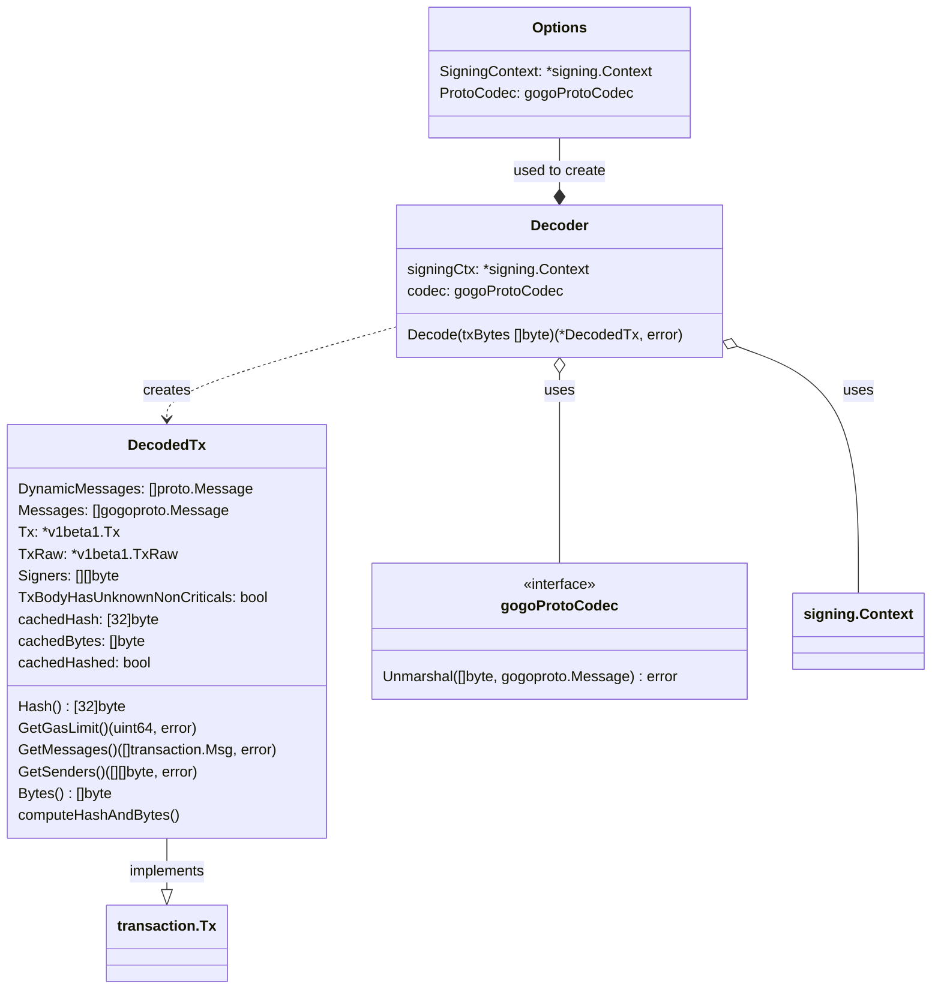
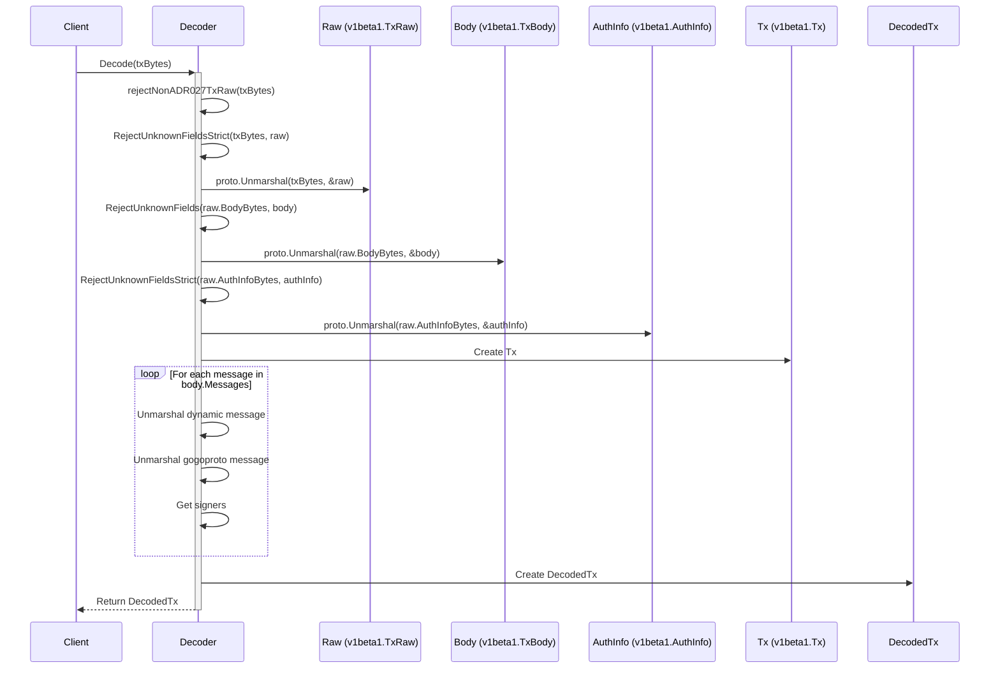

# x/tx

## Abstract

This document specifies the tx module of the Cosmos SDK.

The package is a crucial component of the Cosmos SDK, providing essential functionality for handling transactions
within the Cosmos ecosystem. It offers support for transaction decoding, allowing for parsing and interpretation of
transaction data. The package implements compatibility with ADR-027 for application-defined raw transaction
serialization, ensuring proper field ordering and encoding. A key feature of the package is its implementation of
various signing handlers. These handlers provide different methods for generating sign bytes. It also includes APIs for
custom signer definitions, allowing developers to tailor the signing process to their specific needs.

**Note**: `x/tx` is not a traditional Cosmos SDK module (it's not an AppModule).

## Contents

* [x/tx](#xtx)
  * [Abstract](#abstract)
  * [Contents](#contents)
  * [Signing](#signing)
    * [Key Features](#key-features)
  * [Decode](#decode)
    * [Key Features](#key-features-1)
    * [DecodedTx](#decodedtx)
    * [Class Diagram](#class-diagram)
    * [Decode Sequence Diagram](#decode-sequence-diagram)
  * [Disclaimer](#disclaimer)

## Signing

The signing package handles the process of providing the bytes to be signed for transactions. It provides a set of
interfaces and implementations for different signing modes and methods.

In summary, the signing package is responsible for preparing the data to be signed according to different signing modes,
but doesn't handle the actual signing process (i.e., applying a cryptographic signature to these bytes).

### Key Features

1. SignModeHandler Interface: this is the core interface that defines how different signing modes should be implemented.
2. SignModeHandler Implementations:
   * [aminojson](https://github.com/cosmos/cosmos-sdk/blob/v0.50.7/docs/architecture/adr-020-protobuf-transaction-encoding.md#sign_mode_legacy_amino)
   * [direct](https://github.com/cosmos/cosmos-sdk/blob/v0.50.7/docs/architecture/adr-020-protobuf-transaction-encoding.md#sign_mode_direct)
   * [direct aux](https://github.com/cosmos/cosmos-sdk/blob/v0.50.7/docs/architecture/adr-020-protobuf-transaction-encoding.md#sign_mode_direct_aux)
   * [textual](https://github.com/cosmos/cosmos-sdk/blob/v0.50.7/docs/architecture/adr-050-sign-mode-textual-annex1.md#adr-050-sign_mode_textual-annex-1-value-renderers)
3. Context: the signing Context provides necessary information for retrieving signers from messages and resolving protobuf types.
4. TxData and SignerData: these structures contain the necessary data for generating sign bytes. TxData includes transaction details, while SignerData contains information about the signer.
5. HandlerMap: a collection of SignModeHandlers, allowing the system to support multiple signing modes.

## Decode

The decode package provides functionality for decoding raw transaction bytes into structured transaction data. It's
designed to work with transactions that follow the [ADR-027](https://github.com/cosmos/cosmos-sdk/blob/v0.50.7/docs/architecture/adr-027-deterministic-protobuf-serialization.md#adr-027-deterministic-protobuf-serialization)
specification for application-defined raw transaction serialization.

### Key Features

1. Transaction Decoding: Parses raw transaction bytes into a structured `DecodedTx` object.
2. ADR-027 Compatibility: Ensures compatibility with the ADR-027 specification.
3. Unknown Field Handling: Rejects unknown fields in TxRaw and AuthInfo, while allowing non-critical unknown fields in TxBody.
4. Signer Extraction: Extracts and deduplicates signers from transaction messages.
5. Support for Dynamic Messages: Handles both protobuf dynamic messages and gogoproto messages.

### DecodedTx

`DecodedTx` is a struct that represents a decoded transaction by implementing `transaction.Tx`. It contains various
components of a transaction after it has been parsed from its raw bytes. Here's a breakdown of its structure:

The `DecodedTx` struct has the following fields:

1. DynamicMessages: A slice of proto.Message interfaces, representing the transaction messages in a dynamic format. 
2. Messages: A slice of gogoproto.Message interfaces, representing the transaction messages in the gogo protobuf format. 
3. Tx: A pointer to a v1beta1.Tx struct, which represents the full transaction in the Cosmos SDK v1beta1 format. 
4. TxRaw: A pointer to a v1beta1.TxRaw struct, representing the raw transaction data. 
5. Signers: A slice of byte slices, containing the addresses of the transaction signers. 
6. TxBodyHasUnknownNonCriticals: A boolean flag indicating whether the transaction body contains unknown non-critical fields.

The DecodedTx struct also implements several methods to satisfy the `transaction.Tx` interface, such as `Hash()`,
`GetGasLimit()`, `GetMessages()`, `GetSenders()`, and `Bytes()`. These methods allow the DecodedTx to be used in places
where a transaction is expected. The purpose of this struct is to provide a comprehensive representation of a decoded
transaction, making it easier for other parts of the system to work with transaction data in a structured format.

### Class Diagram

### Decode Sequence Diagram

## Disclaimer

It's important to clarify that `x/tx` is distinct from `x/auth/tx`:

* `x/tx`: This package (the one described in this README) provides core transaction handling functionality.
* `x/auth/tx`: This is a separate package and is typically used in the context of building a complete tx is that is going to be broadcast in Cosmos SDK applications.

When you see a "tx" module referenced in `app_config.go` or similar application configuration files, it refers to
`x/auth/tx/config`, not `x/tx` (as it's not an Appmodule). This naming similarity can be confusing, so it's crucial to pay
attention to the import paths and context when working with these packages.
