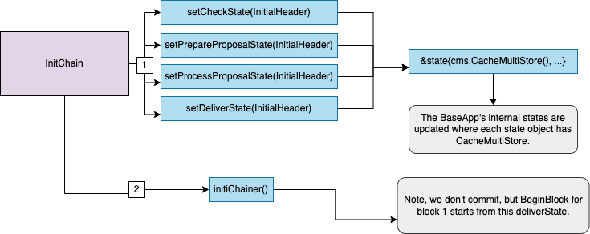
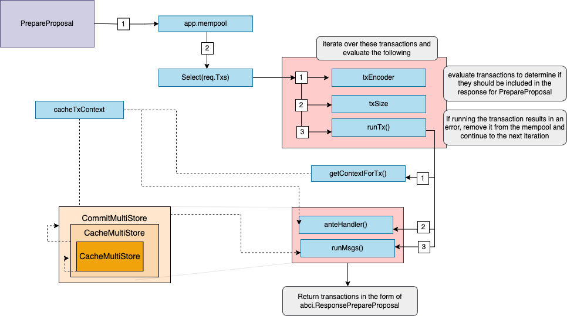
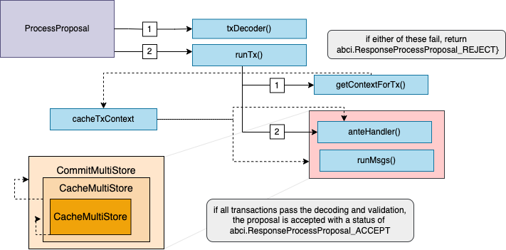
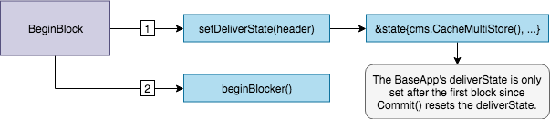
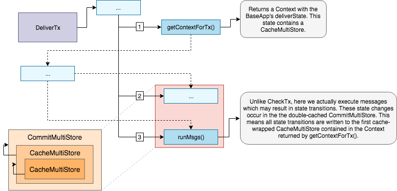

# BaseApp

:::note Synopsis
This document describes `BaseApp`, the abstraction that implements the core functionalities of a Cosmos SDK application.
:::

:::note

### Pre-requisite Readings

* [Anatomy of a Cosmos SDK application](../basics/00-app-anatomy.md)
* [Lifecycle of a Cosmos SDK transaction](../basics/01-tx-lifecycle.md)

:::

## Introduction

`BaseApp` is a base type that implements the core of a Cosmos SDK application, namely:

* The [Application Blockchain Interface](#main-abci-messages), for the state-machine to communicate with the underlying consensus engine (e.g. CometBFT).
* [Service Routers](#service-routers), to route messages and queries to the appropriate module.
* Different [states](#state-updates), as the state-machine can have different volatile states updated based on the ABCI message received.

The goal of `BaseApp` is to provide the fundamental layer of a Cosmos SDK application
that developers can easily extend to build their own custom application. Usually,
developers will create a custom type for their application, like so:

```go
type App struct {
  // reference to a BaseApp
  *baseapp.BaseApp

  // list of application store keys

  // list of application keepers

  // module manager
}
```

Extending the application with `BaseApp` gives the former access to all of `BaseApp`'s methods.
This allows developers to compose their custom application with the modules they want, while not
having to concern themselves with the hard work of implementing the ABCI, the service routers and state
management logic.

## Type Definition

The `BaseApp` type holds many important parameters for any Cosmos SDK based application.

```go reference
https://github.com/cosmos/cosmos-sdk/blob/v0.47.0-rc1/baseapp/baseapp.go#L50-L146
```

Let us go through the most important components.

> **Note**: Not all parameters are described, only the most important ones. Refer to the
> type definition for the full list.

First, the important parameters that are initialized during the bootstrapping of the application:

* [`CommitMultiStore`](./04-store.md#commitmultistore): This is the main store of the application,
  which holds the canonical state that is committed at the [end of each block](#commit). This store
  is **not** cached, meaning it is not used to update the application's volatile (un-committed) states.
  The `CommitMultiStore` is a multi-store, meaning a store of stores. Each module of the application
  uses one or multiple `KVStores` in the multi-store to persist their subset of the state.
* Database: The `db` is used by the `CommitMultiStore` to handle data persistence.
* [`Msg` Service Router](#msg-service-router): The `msgServiceRouter` facilitates the routing of `sdk.Msg` requests to the appropriate
  module `Msg` service for processing. Here a `sdk.Msg` refers to the transaction component that needs to be
  processed by a service in order to update the application state, and not to ABCI message which implements
  the interface between the application and the underlying consensus engine.
* [gRPC Query Router](#grpc-query-router): The `grpcQueryRouter` facilitates the routing of gRPC queries to the
  appropriate module for it to be processed. These queries are not ABCI messages themselves, but they
  are relayed to the relevant module's gRPC `Query` service.
* [`TxDecoder`](https://pkg.go.dev/github.com/cosmos/cosmos-sdk/types#TxDecoder): It is used to decode
  raw transaction bytes relayed by the underlying CometBFT engine.
* [`AnteHandler`](#antehandler): This handler is used to handle signature verification, fee payment,
  and other pre-message execution checks when a transaction is received. It's executed during
  [`CheckTx/RecheckTx`](#checktx) and [`DeliverTx`](#delivertx).
* [`InitChainer`](../basics/00-app-anatomy.md#initchainer),
  [`BeginBlocker` and `EndBlocker`](../basics/00-app-anatomy.md#beginblocker-and-endblocker): These are
  the functions executed when the application receives the `InitChain`, `BeginBlock` and `EndBlock`
  ABCI messages from the underlying CometBFT engine.

Then, parameters used to define [volatile states](#state-updates) (i.e. cached states):

* `checkState`: This state is updated during [`CheckTx`](#checktx), and reset on [`Commit`](#commit).
* `deliverState`: This state is updated during [`DeliverTx`](#delivertx), and set to `nil` on
  [`Commit`](#commit) and gets re-initialized on BeginBlock.
* `processProposalState`: This state is updated during [`ProcessProposal`](#process-proposal).
* `prepareProposalState`: This state is updated during [`PrepareProposal`](#prepare-proposal).

Finally, a few more important parameters:

* `voteInfos`: This parameter carries the list of validators whose precommit is missing, either
  because they did not vote or because the proposer did not include their vote. This information is
  carried by the [Context](#context) and can be used by the application for various things like
  punishing absent validators.
* `minGasPrices`: This parameter defines the minimum gas prices accepted by the node. This is a
  **local** parameter, meaning each full-node can set a different `minGasPrices`. It is used in the
  `AnteHandler` during [`CheckTx`](#checktx), mainly as a spam protection mechanism. The transaction
  enters the [mempool](https://github.com/cometbft/cometbft/blob/v0.37.x/spec/abci/abci++_basic_concepts.md#mempool-methods)
  only if the gas prices of the transaction are greater than one of the minimum gas price in
  `minGasPrices` (e.g. if `minGasPrices == 1uatom,1photon`, the `gas-price` of the transaction must be
  greater than `1uatom` OR `1photon`).
* `appVersion`: Version of the application. It is set in the
  [application's constructor function](../basics/00-app-anatomy.md#constructor-function).

## Constructor

```go
func NewBaseApp(
  name string, logger log.Logger, db dbm.DB, txDecoder sdk.TxDecoder, options ...func(*BaseApp),
) *BaseApp {

  // ...
}
```

The `BaseApp` constructor function is pretty straightforward. The only thing worth noting is the
possibility to provide additional [`options`](https://github.com/cosmos/cosmos-sdk/blob/v0.47.0-rc1/baseapp/options.go)
to the `BaseApp`, which will execute them in order. The `options` are generally `setter` functions
for important parameters, like `SetPruning()` to set pruning options or `SetMinGasPrices()` to set
the node's `min-gas-prices`.

Naturally, developers can add additional `options` based on their application's needs.

## State Updates

The `BaseApp` maintains four primary volatile states and a root or main state. The main state
is the canonical state of the application and the volatile states, `checkState`, `deliverState`, `prepareProposalState`, `processPreposalState`,
are used to handle state transitions in-between the main state made during [`Commit`](#commit).

Internally, there is only a single `CommitMultiStore` which we refer to as the main or root state.
From this root state, we derive four volatile states by using a mechanism called _store branching_ (performed by `CacheWrap` function).
The types can be illustrated as follows:


### InitChain State Updates

During `InitChain`, the four volatile states, `checkState`, `prepareProposalState`, `processProposalState` 
and `deliverState` are set by branching the root `CommitMultiStore`. Any subsequent reads and writes happen 
on branched versions of the `CommitMultiStore`.
To avoid unnecessary roundtrip to the main state, all reads to the branched store are cached.



### CheckTx State Updates

During `CheckTx`, the `checkState`, which is based off of the last committed state from the root
store, is used for any reads and writes. Here we only execute the `AnteHandler` and verify a service router
exists for every message in the transaction. Note, when we execute the `AnteHandler`, we branch
the already branched `checkState`.
This has the side effect that if the `AnteHandler` fails, the state transitions won't be reflected in the `checkState`
-- i.e. `checkState` is only updated on success.


### PrepareProposal State Updates

During `PrepareProposal`, the `prepareProposalState` is set by branching the root `CommitMultiStore`. 
The `prepareProposalState` is used for any reads and writes that occur during the `PrepareProposal` phase.
The function uses the `Select()` method of the mempool to iterate over the transactions. `runTx` is then called,
which encodes and validates each transaction and from there the `AnteHandler` is executed. 
If successful, valid transactions are returned inclusive of the events, tags, and data generated 
during the execution of the proposal. 
The described behavior is that of the default handler, applications have the flexibility to define their own 
[custom mempool handlers](https://docs.cosmos.network/main/building-apps/app-mempool#custom-mempool-handlers).



### ProcessProposal State Updates

During `ProcessProposal`, the `processProposalState` is set based off of the last committed state 
from the root store and is used to process a signed proposal received from a validator.
In this state, `runTx` is called and the `AnteHandler` is executed and the context used in this state is built with information 
from the header and the main state, including the minimum gas prices, which are also set. 
Again we want to highlight that the described behavior is that of the default handler and applications have the flexibility to define their own
[custom mempool handlers](https://docs.cosmos.network/main/building-apps/app-mempool#custom-mempool-handlers).



### BeginBlock State Updates

During `BeginBlock`, the `deliverState` is set for use in subsequent `DeliverTx` ABCI messages. The
`deliverState` is based off of the last committed state from the root store and is branched.
Note, the `deliverState` is set to `nil` on [`Commit`](#commit).



### DeliverTx State Updates

The state flow for `DeliverTx` is nearly identical to `CheckTx` except state transitions occur on
the `deliverState` and messages in a transaction are executed. Similarly to `CheckTx`, state transitions
occur on a doubly branched state -- `deliverState`. Successful message execution results in
writes being committed to `deliverState`. Note, if message execution fails, state transitions from
the AnteHandler are persisted.



### Commit State Updates

During `Commit` all the state transitions that occurred in the `deliverState` are finally written to
the root `CommitMultiStore` which in turn is committed to disk and results in a new application
root hash. These state transitions are now considered final. Finally, the `checkState` is set to the
newly committed state and `deliverState` is set to `nil` to be reset on `BeginBlock`.


## ParamStore

During `InitChain`, the `RequestInitChain` provides `ConsensusParams` which contains parameters
related to block execution such as maximum gas and size in addition to evidence parameters. If these
parameters are non-nil, they are set in the BaseApp's `ParamStore`. Behind the scenes, the `ParamStore`
is managed by an `x/consensus_params` module. This allows the parameters to be tweaked via
 on-chain governance.

## Service Routers

When messages and queries are received by the application, they must be routed to the appropriate module in order to be processed. Routing is done via `BaseApp`, which holds a `msgServiceRouter` for messages, and a `grpcQueryRouter` for queries.

### `Msg` Service Router

[`sdk.Msg`s](../building-modules/02-messages-and-queries.md#messages) need to be routed after they are extracted from transactions, which are sent from the underlying CometBFT engine via the [`CheckTx`](#checktx) and [`DeliverTx`](#delivertx) ABCI messages. To do so, `BaseApp` holds a `msgServiceRouter` which maps fully-qualified service methods (`string`, defined in each module's Protobuf  `Msg` service) to the appropriate module's `MsgServer` implementation.

The [default `msgServiceRouter` included in `BaseApp`](https://github.com/cosmos/cosmos-sdk/blob/v0.47.0-rc1/baseapp/msg_service_router.go) is stateless. However, some applications may want to make use of more stateful routing mechanisms such as allowing governance to disable certain routes or point them to new modules for upgrade purposes. For this reason, the `sdk.Context` is also passed into each [route handler inside `msgServiceRouter`](https://github.com/cosmos/cosmos-sdk/blob/v0.47.0-rc1/baseapp/msg_service_router.go#L31-L32). For a stateless router that doesn't want to make use of this, you can just ignore the `ctx`.

The application's `msgServiceRouter` is initialized with all the routes using the application's [module manager](../building-modules/01-module-manager.md#manager) (via the `RegisterServices` method), which itself is initialized with all the application's modules in the application's [constructor](../basics/00-app-anatomy.md#constructor-function).

### gRPC Query Router

Similar to `sdk.Msg`s, [`queries`](../building-modules/02-messages-and-queries.md#queries) need to be routed to the appropriate module's [`Query` service](../building-modules/04-query-services.md). To do so, `BaseApp` holds a `grpcQueryRouter`, which maps modules' fully-qualified service methods (`string`, defined in their Protobuf `Query` gRPC) to their `QueryServer` implementation. The `grpcQueryRouter` is called during the initial stages of query processing, which can be either by directly sending a gRPC query to the gRPC endpoint, or via the [`Query` ABCI message](#query) on the CometBFT RPC endpoint.

Just like the `msgServiceRouter`, the `grpcQueryRouter` is initialized with all the query routes using the application's [module manager](../building-modules/01-module-manager.md) (via the `RegisterServices` method), which itself is initialized with all the application's modules in the application's [constructor](../basics/00-app-anatomy.md#app-constructor).

## Main ABCI 1.0 Messages

The [Application-Blockchain Interface](https://github.com/cometbft/cometbft/blob/v0.37.x/spec/abci/abci++_basic_concepts.md) (ABCI) is a generic interface that connects a state-machine with a consensus engine to form a functional full-node. It can be wrapped in any language, and needs to be implemented by each application-specific blockchain built on top of an ABCI-compatible consensus engine like CometBFT.

The consensus engine handles two main tasks:

* The networking logic, which mainly consists in gossiping block parts, transactions and consensus votes.
* The consensus logic, which results in the deterministic ordering of transactions in the form of blocks.

It is **not** the role of the consensus engine to define the state or the validity of transactions. Generally, transactions are handled by the consensus engine in the form of `[]bytes`, and relayed to the application via the ABCI to be decoded and processed. At keys moments in the networking and consensus processes (e.g. beginning of a block, commit of a block, reception of an unconfirmed transaction, ...), the consensus engine emits ABCI messages for the state-machine to act on.

Developers building on top of the Cosmos SDK need not implement the ABCI themselves, as `BaseApp` comes with a built-in implementation of the interface. Let us go through the main ABCI messages that `BaseApp` implements:

* [`Prepare Proposal`](#prepare-proposal)
* [`Process Proposal`](#process-proposal)
* [`CheckTx`](#checktx)
* [`DeliverTx`](#delivertx)


### Prepare Proposal

The `PrepareProposal` function is part of the new methods introduced in Application Blockchain Interface (ABCI++) in CometBFT and is an important part of the application's overall governance system. In the Cosmos SDK, it allows the application to have more fine-grained control over the transactions that are processed, and ensures that only valid transactions are committed to the blockchain.

Here is how the `PrepareProposal` function can be implemented:

1.  Extract the `sdk.Msg`s from the transaction.
2.  Perform _stateful_ checks by calling `Validate()` on each of the `sdk.Msg`'s. This is done after _stateless_ checks as _stateful_ checks are more computationally expensive. If `Validate()` fails, `PrepareProposal` returns before running further checks, which saves resources.
3.  Perform any additional checks that are specific to the application, such as checking account balances, or ensuring that certain conditions are met before a transaction is proposed.hey are processed by the consensus engine, if necessary.
5.  Return the updated transactions to be processed by the consensus engine

Note that, unlike `CheckTx()`, `PrepareProposal` process `sdk.Msg`s, so it can directly update the state. However, unlike `DeliverTx()`, it does not commit the state updates. It's important to exercise caution when using `PrepareProposal` as incorrect coding could affect the overall liveness of the network.

It's important to note that `PrepareProposal` complements the `ProcessProposal` method which is executed after this method. The combination of these two methods means that it is possible to guarantee that no invalid transactions are ever committed. Furthermore, such a setup can give rise to other interesting use cases such as Oracles, threshold decryption and more.

`PrepareProposal` returns a response to the underlying consensus engine of type [`abci.ResponseCheckTx`](https://github.com/cometbft/cometbft/blob/v0.37.x/spec/abci/abci++_methods.md#processproposal). The response contains:

*   `Code (uint32)`: Response Code. `0` if successful.
*   `Data ([]byte)`: Result bytes, if any.
*   `Log (string):` The output of the application's logger. May be non-deterministic.
*   `Info (string):` Additional information. May be non-deterministic.


### Process Proposal

The `ProcessProposal` function is called by the BaseApp as part of the ABCI message flow, and is executed during the `BeginBlock` phase of the consensus process. The purpose of this function is to give more control to the application for block validation, allowing it to check all transactions in a proposed block before the validator sends the prevote for the block. It allows a validator to perform application-dependent work in a proposed block, enabling features such as immediate block execution, and allows the Application to reject invalid blocks.

The `ProcessProposal` function performs several key tasks, including:

1.  Validating the proposed block by checking all transactions in it.
2.  Checking the proposed block against the current state of the application, to ensure that it is valid and that it can be executed.
3.  Updating the application's state based on the proposal, if it is valid and passes all checks.
4.  Returning a response to CometBFT indicating the result of the proposal processing.

The `ProcessProposal` is an important part of the application's overall governance system. It is used to manage the network's parameters and other key aspects of its operation. It also ensures that the coherence property is adhered to i.e. all honest validators must accept a proposal by an honest proposer.

It's important to note that `ProcessProposal` complements the `PrepareProposal` method which enables the application to have more fine-grained transaction control by allowing it to reorder, drop, delay, modify, and even add transactions as they see necessary. The combination of these two methods means that it is possible to guarantee that no invalid transactions are ever committed. Furthermore, such a setup can give rise to other interesting use cases such as Oracles, threshold decryption and more.

CometBFT calls it when it receives a proposal and the CometBFT algorithm has not locked on a value. The Application cannot modify the proposal at this point but can reject it if it is invalid. If that is the case, CometBFT will prevote `nil` on the proposal, which has strong liveness implications for CometBFT. As a general rule, the Application SHOULD accept a prepared proposal passed via `ProcessProposal`, even if a part of the proposal is invalid (e.g., an invalid transaction); the Application can ignore the invalid part of the prepared proposal at block execution time.

However, developers must exercise greater caution when using these methods. Incorrectly coding these methods could affect liveness as CometBFT is unable to receive 2/3 valid precommits to finalize a block.

`ProcessProposal` returns a response to the underlying consensus engine of type [`abci.ResponseCheckTx`](https://github.com/cometbft/cometbft/blob/v0.37.x/spec/abci/abci++_methods.md#processproposal). The response contains:

*   `Code (uint32)`: Response Code. `0` if successful.
*   `Data ([]byte)`: Result bytes, if any.
*   `Log (string):` The output of the application's logger. May be non-deterministic.
*   `Info (string):` Additional information. May be non-deterministic.


### CheckTx

`CheckTx` is sent by the underlying consensus engine when a new unconfirmed (i.e. not yet included in a valid block)
transaction is received by a full-node. The role of `CheckTx` is to guard the full-node's mempool
(where unconfirmed transactions are stored until they are included in a block) from spam transactions.
Unconfirmed transactions are relayed to peers only if they pass `CheckTx`.

`CheckTx()` can perform both _stateful_ and _stateless_ checks, but developers should strive to
make the checks **lightweight** because gas fees are not charged for the resources (CPU, data load...) used during the `CheckTx`. 

In the Cosmos SDK, after [decoding transactions](./05-encoding.md), `CheckTx()` is implemented
to do the following checks:

1. Extract the `sdk.Msg`s from the transaction.
2. **Optionally** perform _stateless_ checks by calling `ValidateBasic()` on each of the `sdk.Msg`s. This is done
   first, as _stateless_ checks are less computationally expensive than _stateful_ checks. If
   `ValidateBasic()` fail, `CheckTx` returns before running _stateful_ checks, which saves resources.
   This check is still performed for messages that have not yet migrated to the new message validation mechanism defined in [RFC 001](https://docs.cosmos.network/main/rfc/rfc-001-tx-validation) and still have a `ValidateBasic()` method.
3. Perform non-module related _stateful_ checks on the [account](../basics/03-accounts.md). This step is mainly about checking
   that the `sdk.Msg` signatures are valid, that enough fees are provided and that the sending account
   has enough funds to pay for said fees. Note that no precise [`gas`](../basics/04-gas-fees.md) counting occurs here,
   as `sdk.Msg`s are not processed. Usually, the [`AnteHandler`](../basics/04-gas-fees.md#antehandler) will check that the `gas` provided
   with the transaction is superior to a minimum reference gas amount based on the raw transaction size,
   in order to avoid spam with transactions that provide 0 gas.

`CheckTx` does **not** process `sdk.Msg`s -  they only need to be processed when the canonical state need to be updated, which happens during `DeliverTx`.

Steps 2. and 3. are performed by the [`AnteHandler`](../basics/04-gas-fees.md#antehandler) in the [`RunTx()`](#runtx-antehandler-and-runmsgs)
function, which `CheckTx()` calls with the `runTxModeCheck` mode. During each step of `CheckTx()`, a
special [volatile state](#state-updates) called `checkState` is updated. This state is used to keep
track of the temporary changes triggered by the `CheckTx()` calls of each transaction without modifying
the [main canonical state](#main-state). For example, when a transaction goes through `CheckTx()`, the
transaction's fees are deducted from the sender's account in `checkState`. If a second transaction is
received from the same account before the first is processed, and the account has consumed all its
funds in `checkState` during the first transaction, the second transaction will fail `CheckTx`() and
be rejected. In any case, the sender's account will not actually pay the fees until the transaction
is actually included in a block, because `checkState` never gets committed to the main state. The
`checkState` is reset to the latest state of the main state each time a blocks gets [committed](#commit).

`CheckTx` returns a response to the underlying consensus engine of type [`abci.ResponseCheckTx`](https://github.com/cometbft/cometbft/blob/v0.37.x/spec/abci/abci++_methods.md#checktx).
The response contains:

* `Code (uint32)`: Response Code. `0` if successful.
* `Data ([]byte)`: Result bytes, if any.
* `Log (string):` The output of the application's logger. May be non-deterministic.
* `Info (string):` Additional information. May be non-deterministic.
* `GasWanted (int64)`: Amount of gas requested for transaction. It is provided by users when they generate the transaction.
* `GasUsed (int64)`: Amount of gas consumed by transaction. During `CheckTx`, this value is computed by multiplying the standard cost of a transaction byte by the size of the raw transaction. Next is an example:

```go reference
https://github.com/cosmos/cosmos-sdk/blob/v0.47.0-rc1/x/auth/ante/basic.go#L96
```

* `Events ([]cmn.KVPair)`: Key-Value tags for filtering and indexing transactions (eg. by account). See [`event`s](./08-events.md) for more.
* `Codespace (string)`: Namespace for the Code.

#### RecheckTx

After `Commit`, `CheckTx` is run again on all transactions that remain in the node's local mempool
excluding the transactions that are included in the block. To prevent the mempool from rechecking all transactions
every time a block is committed, the configuration option `mempool.recheck=false` can be set. As of
Tendermint v0.32.1, an additional `Type` parameter is made available to the `CheckTx` function that
indicates whether an incoming transaction is new (`CheckTxType_New`), or a recheck (`CheckTxType_Recheck`).
This allows certain checks like signature verification can be skipped during `CheckTxType_Recheck`.

### DeliverTx

When the underlying consensus engine receives a block proposal, each transaction in the block needs to be processed by the application. To that end, the underlying consensus engine sends a `DeliverTx` message to the application for each transaction in a sequential order.

Before the first transaction of a given block is processed, a [volatile state](#state-updates) called `deliverState` is initialized during [`BeginBlock`](#beginblock). This state is updated each time a transaction is processed via `DeliverTx`, and committed to the [main state](#main-state) when the block is [committed](#commit), after what it is set to `nil`.

`DeliverTx` performs the **exact same steps as `CheckTx`**, with a little caveat at step 3 and the addition of a fifth step:

1. The `AnteHandler` does **not** check that the transaction's `gas-prices` is sufficient. That is because the `min-gas-prices` value `gas-prices` is checked against is local to the node, and therefore what is enough for one full-node might not be for another. This means that the proposer can potentially include transactions for free, although they are not incentivised to do so, as they earn a bonus on the total fee of the block they propose.
2. For each `sdk.Msg` in the transaction, route to the appropriate module's Protobuf [`Msg` service](../building-modules/03-msg-services.md). Additional _stateful_ checks are performed, and the branched multistore held in `deliverState`'s `context` is updated by the module's `keeper`. If the `Msg` service returns successfully, the branched multistore held in `context` is written to `deliverState` `CacheMultiStore`.

During the additional fifth step outlined in (2), each read/write to the store increases the value of `GasConsumed`. You can find the default cost of each operation:

```go reference
https://github.com/cosmos/cosmos-sdk/blob/v0.47.0-rc1/store/types/gas.go#L230-L241
```

At any point, if `GasConsumed > GasWanted`, the function returns with `Code != 0` and `DeliverTx` fails.

`DeliverTx` returns a response to the underlying consensus engine of type [`abci.ResponseDeliverTx`](https://github.com/cometbft/cometbft/blob/v0.37.x/spec/abci/abci++_methods.md#delivertx). The response contains:

* `Code (uint32)`: Response Code. `0` if successful.
* `Data ([]byte)`: Result bytes, if any.
* `Log (string):` The output of the application's logger. May be non-deterministic.
* `Info (string):` Additional information. May be non-deterministic.
* `GasWanted (int64)`: Amount of gas requested for transaction. It is provided by users when they generate the transaction.
* `GasUsed (int64)`: Amount of gas consumed by transaction. During `DeliverTx`, this value is computed by multiplying the standard cost of a transaction byte by the size of the raw transaction, and by adding gas each time a read/write to the store occurs.
* `Events ([]cmn.KVPair)`: Key-Value tags for filtering and indexing transactions (eg. by account). See [`event`s](./08-events.md) for more.
* `Codespace (string)`: Namespace for the Code.

## RunTx, AnteHandler, RunMsgs, PostHandler

### RunTx

`RunTx` is called from `CheckTx`/`DeliverTx` to handle the transaction, with `runTxModeCheck` or `runTxModeDeliver` as parameter to differentiate between the two modes of execution. Note that when `RunTx` receives a transaction, it has already been decoded.

The first thing `RunTx` does upon being called is to retrieve the `context`'s `CacheMultiStore` by calling the `getContextForTx()` function with the appropriate mode (either `runTxModeCheck` or `runTxModeDeliver`). This `CacheMultiStore` is a branch of the main store, with cache functionality (for query requests), instantiated during `BeginBlock` for `DeliverTx` and during the `Commit` of the previous block for `CheckTx`. After that, two `defer func()` are called for [`gas`](../basics/04-gas-fees.md) management. They are executed when `runTx` returns and make sure `gas` is actually consumed, and will throw errors, if any.

After that, `RunTx()` calls `ValidateBasic()`, when available and for backward compatibility, on each `sdk.Msg`in the `Tx`, which runs preliminary _stateless_ validity checks. If any `sdk.Msg` fails to pass `ValidateBasic()`, `RunTx()` returns with an error.

Then, the [`anteHandler`](#antehandler) of the application is run (if it exists). In preparation of this step, both the `checkState`/`deliverState`'s `context` and `context`'s `CacheMultiStore` are branched using the `cacheTxContext()` function.

```go reference
https://github.com/cosmos/cosmos-sdk/blob/v0.47.0-rc1/baseapp/baseapp.go#L663-L672
```

This allows `RunTx` not to commit the changes made to the state during the execution of `anteHandler` if it ends up failing. It also prevents the module implementing the `anteHandler` from writing to state, which is an important part of the [object-capabilities](./10-ocap.md) of the Cosmos SDK.

Finally, the [`RunMsgs()`](#runmsgs) function is called to process the `sdk.Msg`s in the `Tx`. In preparation of this step, just like with the `anteHandler`, both the `checkState`/`deliverState`'s `context` and `context`'s `CacheMultiStore` are branched using the `cacheTxContext()` function.

### AnteHandler

The `AnteHandler` is a special handler that implements the `AnteHandler` interface and is used to authenticate the transaction before the transaction's internal messages are processed.

```go reference
https://github.com/cosmos/cosmos-sdk/blob/v0.47.0-rc1/types/handler.go#L6-L8
```

The `AnteHandler` is theoretically optional, but still a very important component of public blockchain networks. It serves 3 primary purposes:

* Be a primary line of defense against spam and second line of defense (the first one being the mempool) against transaction replay with fees deduction and [`sequence`](./01-transactions.md#transaction-generation) checking.
* Perform preliminary _stateful_ validity checks like ensuring signatures are valid or that the sender has enough funds to pay for fees.
* Play a role in the incentivisation of stakeholders via the collection of transaction fees.

`BaseApp` holds an `anteHandler` as parameter that is initialized in the [application's constructor](../basics/00-app-anatomy.md#application-constructor). The most widely used `anteHandler` is the [`auth` module](https://github.com/cosmos/cosmos-sdk/blob/v0.47.0-rc1/x/auth/ante/ante.go).

Click [here](../basics/04-gas-fees.md#antehandler) for more on the `anteHandler`.

### RunMsgs

`RunMsgs` is called from `RunTx` with `runTxModeCheck` as parameter to check the existence of a route for each message the transaction, and with `runTxModeDeliver` to actually process the `sdk.Msg`s.

First, it retrieves the `sdk.Msg`'s fully-qualified type name, by checking the `type_url` of the Protobuf `Any` representing the `sdk.Msg`. Then, using the application's [`msgServiceRouter`](#msg-service-router), it checks for the existence of `Msg` service method related to that `type_url`. At this point, if `mode == runTxModeCheck`, `RunMsgs` returns. Otherwise, if `mode == runTxModeDeliver`, the [`Msg` service](../building-modules/03-msg-services.md) RPC is executed, before `RunMsgs` returns.

### PostHandler

`PostHandler` is similar to `AnteHandler`, but it, as the name suggests, executes custom post tx processing logic after [`RunMsgs`](#runmsgs) is called. `PostHandler` receives the `Result` of the the `RunMsgs` in order to enable this customizable behavior.

Like `AnteHandler`s, `PostHandler`s are theoretically optional, one use case for `PostHandler`s is transaction tips (enabled by default in simapp).
Other use cases like unused gas refund can also be enabled by `PostHandler`s.

```go reference
https://github.com/cosmos/cosmos-sdk/blob/v0.47.0-rc1/x/auth/posthandler/post.go#L1-L15
```

Note, when `PostHandler`s fail, the state from `runMsgs` is also reverted, effectively making the transaction fail.

## Other ABCI Messages

### InitChain

The [`InitChain` ABCI message](https://github.com/cometbft/cometbft/blob/v0.37.x/spec/abci/abci++_basic_concepts.md#method-overview) is sent from the underlying CometBFT engine when the chain is first started. It is mainly used to **initialize** parameters and state like:

* [Consensus Parameters](https://github.com/cometbft/cometbft/blob/v0.37.x/spec/abci/abci++_app_requirements.md#consensus-parameters) via `setConsensusParams`.
* [`checkState` and `deliverState`](#state-updates) via `setState`.
* The [block gas meter](../basics/04-gas-fees.md#block-gas-meter), with infinite gas to process genesis transactions.

Finally, the `InitChain(req abci.RequestInitChain)` method of `BaseApp` calls the [`initChainer()`](../basics/00-app-anatomy.md#initchainer) of the application in order to initialize the main state of the application from the `genesis file` and, if defined, call the [`InitGenesis`](../building-modules/08-genesis.md#initgenesis) function of each of the application's modules.

### BeginBlock

The [`BeginBlock` ABCI message](https://github.com/cometbft/cometbft/blob/v0.37.x/spec/abci/abci++_basic_concepts.md#method-overview) is sent from the underlying CometBFT engine when a block proposal created by the correct proposer is received, before [`DeliverTx`](#delivertx) is run for each transaction in the block. It allows developers to have logic be executed at the beginning of each block. In the Cosmos SDK, the `BeginBlock(req abci.RequestBeginBlock)` method does the following:

* Initialize [`deliverState`](#state-updates) with the latest header using the `req abci.RequestBeginBlock` passed as parameter via the `setState` function.

  ```go reference
  https://github.com/cosmos/cosmos-sdk/blob/v0.47.0-rc1/baseapp/baseapp.go#L406-L433
  ```
  
  This function also resets the [main gas meter](../basics/04-gas-fees.md#main-gas-meter).

* Initialize the [block gas meter](../basics/04-gas-fees.md#block-gas-meter) with the `maxGas` limit. The `gas` consumed within the block cannot go above `maxGas`. This parameter is defined in the application's consensus parameters.
* Run the application's [`beginBlocker()`](../basics/00-app-anatomy.md#beginblocker-and-endblock), which mainly runs the [`BeginBlocker()`](../building-modules/05-beginblock-endblock.md#beginblock) method of each of the application's modules.
* Set the [`VoteInfos`](https://github.com/cometbft/cometbft/blob/v0.37.x/spec/abci/abci++_methods.md#voteinfo) of the application, i.e. the list of validators whose _precommit_ for the previous block was included by the proposer of the current block. This information is carried into the [`Context`](./02-context.md) so that it can be used during `DeliverTx` and `EndBlock`.

### EndBlock

The [`EndBlock` ABCI message](https://github.com/cometbft/cometbft/blob/v0.37.x/spec/abci/abci++_basic_concepts.md#method-overview) is sent from the underlying CometBFT engine after [`DeliverTx`](#delivertx) as been run for each transaction in the block. It allows developers to have logic be executed at the end of each block. In the Cosmos SDK, the bulk `EndBlock(req abci.RequestEndBlock)` method is to run the application's [`EndBlocker()`](../basics/00-app-anatomy.md#beginblocker-and-endblock), which mainly runs the [`EndBlocker()`](../building-modules/05-beginblock-endblock.md#beginblock) method of each of the application's modules.

### Commit

The [`Commit` ABCI message](https://github.com/cometbft/cometbft/blob/v0.37.x/spec/abci/abci++_basic_concepts.md#method-overview) is sent from the underlying CometBFT engine after the full-node has received _precommits_ from 2/3+ of validators (weighted by voting power). On the `BaseApp` end, the `Commit(res abci.ResponseCommit)` function is implemented to commit all the valid state transitions that occurred during `BeginBlock`, `DeliverTx` and `EndBlock` and to reset state for the next block.

To commit state-transitions, the `Commit` function calls the `Write()` function on `deliverState.ms`, where `deliverState.ms` is a branched multistore of the main store `app.cms`. Then, the `Commit` function sets `checkState` to the latest header (obtained from `deliverState.ctx.BlockHeader`) and `deliverState` to `nil`.

Finally, `Commit` returns the hash of the commitment of `app.cms` back to the underlying consensus engine. This hash is used as a reference in the header of the next block.

### Info

The [`Info` ABCI message](https://github.com/cometbft/cometbft/blob/v0.37.x/spec/abci/abci++_basic_concepts.md#info-methods) is a simple query from the underlying consensus engine, notably used to sync the latter with the application during a handshake that happens on startup. When called, the `Info(res abci.ResponseInfo)` function from `BaseApp` will return the application's name, version and the hash of the last commit of `app.cms`.

### Query

The [`Query` ABCI message](https://github.com/cometbft/cometbft/blob/v0.37.x/spec/abci/abci++_basic_concepts.md#info-methods) is used to serve queries received from the underlying consensus engine, including queries received via RPC like CometBFT RPC. It used to be the main entrypoint to build interfaces with the application, but with the introduction of [gRPC queries](../building-modules/04-query-services.md) in Cosmos SDK v0.40, its usage is more limited. The application must respect a few rules when implementing the `Query` method, which are outlined [here](https://github.com/cometbft/cometbft/blob/v0.37.x/spec/abci/abci++_app_requirements.md#query).

Each CometBFT `query` comes with a `path`, which is a `string` which denotes what to query. If the `path` matches a gRPC fully-qualified service method, then `BaseApp` will defer the query to the `grpcQueryRouter` and let it handle it like explained [above](#grpc-query-router). Otherwise, the `path` represents a query that is not (yet) handled by the gRPC router. `BaseApp` splits the `path` string with the `/` delimiter. By convention, the first element of the split string (`split[0]`) contains the category of `query` (`app`, `p2p`, `store` or `custom` ). The `BaseApp` implementation of the `Query(req abci.RequestQuery)` method is a simple dispatcher serving these 4 main categories of queries:

* Application-related queries like querying the application's version, which are served via the `handleQueryApp` method.
* Direct queries to the multistore, which are served by the `handlerQueryStore` method. These direct queries are different from custom queries which go through `app.queryRouter`, and are mainly used by third-party service provider like block explorers.
* P2P queries, which are served via the `handleQueryP2P` method. These queries return either `app.addrPeerFilter` or `app.ipPeerFilter` that contain the list of peers filtered by address or IP respectively. These lists are first initialized via `options` in `BaseApp`'s [constructor](#constructor).
