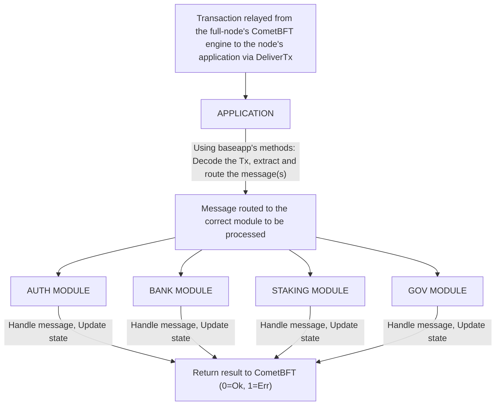

# Main Components of the Cosmos SDK

The Cosmos SDK is a framework that facilitates the development of secure state-machines on top of CometBFT. At its core, the Cosmos SDK is a boilerplate implementation of the [ABCI](./02-sdk-app-architecture.md#abci) in Golang. It comes with a [`multistore`](../advanced/04-store.md#multistore) to persist data and a [`router`](../advanced/00-baseapp.md#routing) to handle transactions.

Here is a simplified view of how transactions are handled by an application built on top of the Cosmos SDK when transferred from CometBFT via `DeliverTx`:

1. Decode `transactions` received from the CometBFT consensus engine (remember that CometBFT only deals with `[]bytes`).
2. Extract `messages` from `transactions` and do basic sanity checks.
3. Route each message to the appropriate module so that it can be processed.
4. Commit state changes.

## `baseapp`

`baseapp` is the boilerplate implementation of a Cosmos SDK application. It comes with an implementation of the ABCI to handle the connection with the underlying consensus engine. Typically, a Cosmos SDK application extends `baseapp` by embedding it in [`app.go`](../beginner/00-app-anatomy.md#core-application-file).

Here is an example of this from `simapp`, the Cosmos SDK demonstration app:

```go reference
https://github.com/cosmos/cosmos-sdk/blob/v0.53.0/simapp/app.go#L137-L180
```

The goal of `baseapp` is to provide a secure interface between the store and the extensible state machine while defining as little about the state machine as possible (staying true to the ABCI).

For more on `baseapp`, please click [here](../advanced/00-baseapp.md).

## Multistore

The Cosmos SDK provides a [`multistore`](../advanced/04-store.md#multistore) for persisting state. The multistore allows developers to declare any number of [`KVStores`](../advanced/04-store.md#base-layer-kvstores). These `KVStores` only accept the `[]byte` type as value and therefore any custom structure needs to be marshalled using [a codec](../advanced/05-encoding.md) before being stored.

The multistore abstraction is used to divide the state in distinct compartments, each managed by its own module. For more on the multistore, click [here](../advanced/04-store.md#multistore)

## Modules

The power of the Cosmos SDK lies in its modularity. Cosmos SDK applications are built by aggregating a collection of interoperable modules. Each module defines a subset of the state and contains its own message/transaction processor, while the Cosmos SDK is responsible for routing each message to its respective module.

Here is a simplified view of how a transaction is processed by the application of each full-node when it is received in a valid block:



Each module can be seen as a little state-machine. Developers need to define the subset of the state handled by the module, as well as custom message types that modify the state (*Note:* `messages` are extracted from `transactions` by `baseapp`). In general, each module declares its own `KVStore` in the `multistore` to persist the subset of the state it defines. Most developers will need to access other 3rd party modules when building their own modules. Given that the Cosmos SDK is an open framework, some of the modules may be malicious, which means there is a need for security principles to reason about inter-module interactions. These principles are based on [object-capabilities](../advanced/10-ocap.md). In practice, this means that instead of having each module keep an access control list for other modules, each module implements special objects called `keepers` that can be passed to other modules to grant a pre-defined set of capabilities.

Cosmos SDK modules are defined in the `x/` folder of the Cosmos SDK. Some core modules include:

* `x/auth`: Used to manage accounts and signatures.
* `x/bank`: Used to enable tokens and token transfers.
* `x/staking` + `x/slashing`: Used to build Proof-of-Stake blockchains.

In addition to the already existing modules in `x/`, which anyone can use in their app, the Cosmos SDK lets you build your own custom modules. You can check an [example of that in the tutorial](https://tutorials.cosmos.network/).
