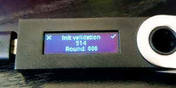
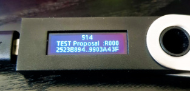

# Setting up Tendermint KMS + Ledger

::: danger Warning
The following instructions are a brief walkthrough and not a comprehensive guideline. You should consider and [research more about the security implications](./security.md) of activating an external KMS.
:::

::: danger Warning
KMS and Ledger Tendermint app are currently work in progress. Details may vary. Use with care under your own risk.
:::

## Tendermint Validator app (for Ledger devices)

You should be able to find the Tendermint app in Ledger Live.

*Note: at the moment, you might need to enable `developer mode` in Ledger Live settings*

## KMS configuration

In this section, we will configure a KMS to use a Ledger device running the Tendermint Validator App. 

### Config file

You can find other configuration examples [here](https://github.com/tendermint/kms/blob/master/tmkms.toml.example)

- Create a `~/.tmkms/tmkms.toml` file with the following content (use an adequate `chain_id`)

```toml
# Example KMS configuration file
[[validator]]
addr = "tcp://localhost:26658"    # or "unix:///path/to/socket"
chain_id = "gaia-11001"
reconnect = true # true is the default
secret_key = "~/.tmkms/secret_connection.key"

[[providers.ledgertm]]
chain_ids = ["gaia-11001"]
```

- Edit `addr` to point to your `gaiad` instance.
- Adjust `chain-id` to match your `.gaiad/config/config.toml` settings.
- `provider.ledgertm` has not additional parameters at the moment, however, it is important that you keep that header to enable the feature.

*Plug your Ledger device and open the Tendermint validator app.*

### Generate secret key

Now you need to generate secret_key:

```bash
tmkms keygen ~/.tmkms/secret_connection.key
```

### Retrieve validator key

The last step is to retrieve the validator key that you will use in `gaiad`.

Start the KMS:

```bash
tmkms start -c ~/.tmkms/tmkms.toml
```

The output should look similar to:

```text
07:28:24 [INFO] tmkms 0.3.0 starting up...
07:28:24 [INFO] [keyring:ledgertm:ledgertm] added validator key cosmosvalconspub1zcjduepqy53m39prgp9dz3nz96kaav3el5e0th8ltwcf8cpavqdvpxgr5slsd6wz6f
07:28:24 [INFO] KMS node ID: 1BC12314E2E1C29015B66017A397F170C6ECDE4A
```

The KMS may complain that it cannot connect to gaiad. That is fine, we will fix it in the next section.

This output indicates the validator key linked to this particular device is: `cosmosvalconspub1zcjduepqy53m39prgp9dz3nz96kaav3el5e0th8ltwcf8cpavqdvpxgr5slsd6wz6f`

Take note of the validator pubkey that appears in your screen. *We will use it in the next section.*

## Gaia configuration

You need to enable KMS access by editing `.gaiad/config/config.toml`. In this file, modify `priv_validator_laddr` to create a listening address/port or a unix socket in `gaiad`.

For example:

```toml
...
# TCP or UNIX socket address for Tendermint to listen on for
# connections from an external PrivValidator process
priv_validator_laddr = "tcp://127.0.0.1:26658"
...
```

Let's assume that you have set up your validator account and called it `kmsval`. You can tell gaiad the key that we've got in the previous section.

```bash
gaiad gentx --name kmsval --pubkey {.ValidatorKey} 
```

Now start `gaiad`. You should see that the KMS connects and receives a signature request.

Once the ledger receives the first message, it will ask for confirmation that the values are adequate.



Click the right button, if the height and round are correct.

After that, you will see that the KMS will start forwarding all signature requests to the ledger:



::: danger Warning
The word TEST in the second picture, second line appears because they were taken on a pre-release version.

Once the app as been released in Ledger's app store, this word should NOT appear.
:::
