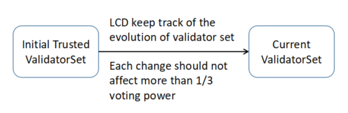

# Light Client Overview

**See the Cosmos SDK Light Client RPC documentation [here](https://cosmos.network/rpc/)**

## Introduction

A light client allows clients, such as mobile phones, to receive proofs of the state of the
blockchain from any full node. Light clients do not have to trust any full node, since they are able
to verify any proof they receive.

A light client can provide the same security as a full node with minimal requirements for
bandwidth, computing and storage resource. It can also provide modular functionality
according to users' configuration. These features allow developers to build secure, efficient,
and usable mobile apps, websites, and other applications without deploying or
maintaining any full blockchain nodes.

### What is a Light Client?

The Cosmos SDK Light Client (Gaia-lite) is split into two separate components. The first component is generic for
any Tendermint-based application. It handles the security and connectivity aspects of following the header
chain and verify proofs from full nodes against a locally trusted validator set. Furthermore, it exposes the same
API as any Tendermint Core node. The second component is specific for the Cosmos Hub (`gaiad`). It works as a query
endpoint and exposes the application specific functionality, which can be arbitrary. All queries against the
application state must go through the query endpoint. The advantage of the query endpoint is that it can verify
the proofs that the application returns.

### High-Level Architecture

An application developer that wants to build a third party client application for the Cosmos Hub (or any
other zone) should build it against its canonical API. That API is a combination of multiple parts.
All zones have to expose ICS0 (TendermintAPI). Beyond that any zone is free to choose any
combination of module APIs, depending on which modules the state machine uses. The Cosmos Hub will
initially support [ICS0](https://cosmos.network/rpc/#/ICS0) (TendermintAPI), [ICS1](https://cosmos.network/rpc/#/ICS1) (KeyAPI), [ICS20](https://cosmos.network/rpc/#/ICS20) (TokenAPI), [ICS21](https://cosmos.network/rpc/#/ICS21) (StakingAPI),
[ICS22](https://cosmos.network/rpc/#/ICS22) (GovernanceAPI) and [ICS23](https://cosmos.network/rpc/#/ICS23) (SlashingAPI).

All applications are expected to run only against Gaia-lite. Gaia-lite is the only piece of software
that offers stability guarantees around the zone API.

### Comparison

A full node of ABCI is different from a light client in the following ways:

|| Full Node | Gaia-lite | Description|
|-| ------------- | ----- | -------------- |
| Execute and verify transactions|Yes|No|A full node will execute and verify all transactions while Gaia-lite won't.|
| Verify and save blocks|Yes|No|A full node will verify and save all blocks while Gaia-lite won't.|
| Consensus participation|Yes|No|Only when a full node is a validator will it participate in consensus. Lite nodes never participate in consensus.|
| Bandwidth cost|High|Low|A full node will receive all blocks. If bandwidth is limited, it will fall behind the main network. What's more, if it happens to be a validator, it will slow down the consensus process. Light clients require little bandwidth, only when serving local requests.|
| Computing resources|High|Low|A full node will execute all transactions and verify all blocks, which requires considerable computing resources.|
| Storage resources|High|Low|A full node will save all blocks and ABCI states. Gaia-lite just saves validator sets and some checkpoints.|
| Power consumption|High|Low|Full nodes must be deployed on machines which have high performance and will be running all the time. Gaia-lite can be deployed on the same machines as users' applications, or on independent machines but with lower performance. Light clients can be shut down anytime when necessary. Gaia-lite consumes very little power, so even mobile devices can meet the power requirements.|
| Provide APIs|All cosmos APIs|Modular APIs|A full node supports all Cosmos APIs. Gaia-lite provides modular APIs according to users' configuration.|
| Secuity level| High|High|A full node will verify all transactions and blocks by itself. A light client can't do this, but it can query data from other full nodes and verify the data independently. Therefore, both full nodes and light clients don't need to trust any third nodes and can achieve high security.|

According to the above table, Gaia-lite can meet many users' functionality and security requirements, but require little bandwidth, computing, storage, and power.

## Achieving Security

### Trusted Validator Set

The base design philosophy of Gaia-lite follows two rules:

1. **Doesn't trust any blockchain nodes, including validator nodes and other full nodes**
2. **Only trusts the whole validator set**

The original trusted validator set should be prepositioned into its trust store. Usually this
validator set comes from a genesis file. During runtime, if Gaia-lite detects a different validator set,
it will verify it and save the new validated validator set to the trust store.

### Trust Propagation

From the above section, we come to know how to get a trusted validator set and how lcd keeps track of
validator set evolution. The validator set is the foundation of trust, and the trust can propagate to
other blockchain data, such as blocks and transactions. The propagation architecture is shown as

follows:

In general, with a trusted validator set, a light client can verify each block commit which contains all pre-commit
data and block header data. Then the block hash, data hash and appHash are trusted. Based on this
and merkle proof, all transactions data and ABCI states can be verified too.
