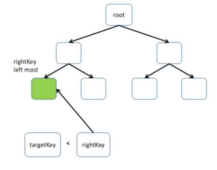

# 라이트 클라이언트 스펙

이 문서는 LCD(Light Client Daemon)을 사용하는 방법을 설명합니다. LCD는 모듈러 API를 지원합니다. 현재 LCD는 ICS0 (텐더민트API), ICS1 (키API)와 ICS20 (토큰API) 만을 지원하는 상태입니다. 추후에 추가 모듈을 지원할 예정입니다.

## ABCI 상태 빌드/검증하기

코스모스 SDK 기반 애플리케이션은 멀티-서브스토어(multi-substore)를 이용해 저장을 합니다. 각 서브스토어는 IAVL 스토어를 응용합니다. 서브스토어는 단순한 머클 트리(Merkle tree) 형태로 정렬됩니다. 머클 트리를 만들기 위해서는 각 서브스토어의 이름, 블록 높이 그리고 스토어 루트 해시(store root hash) 필요하며, 이를 기반으로 간단한 머클 가지 노드(Merkle leaf node)를 만들 수 있습니다. 이후 가지 노드를 이용해 해시값을 머클 뿌리(Merkle root)까지 연산하게 됩니다. 단순 머클 트리(simple Merkle tree)의 루트 해시(Root hash)는 블록 헤더에 포함되는 앱 해시(AppHash)입니다.


[LCD 신뢰 전파](https://github.com/irisnet/cosmos-sdk/tree/bianjie/lcd_spec/docs/spec/lcd#trust-propagation)에서 설명했던바와 같이, 앱해시는 신뢰할 수 있는 검증인 세트의 보팅파워(총 스테이킹 수량)를 검증하는 방식으로 확인할 수 있습니다. 이 절차에는 ABCI 상태에서부터 앱해시 증거를 찾으면 됩니다. 증거에는 다음과 같은 정보가 포함되어있습니다:

* IAVL 증거
* 섭스토어에서 앱해시까지의 증거

### IAVL 증거 (IAVL proof)

증거물에는 두 가지의 종류가 있습니다: 존재 증거(existance proof)와 부재 증거(absence proof). 만약 쿼리 키가 IAVL 스토어에 존재하는 경우 키 밸류(key-value)와 존재 증거를 제공하게 됩니다. 반면, 만약 키가 존재하지 않는다면 해당 키가 존재하지 않는 것을 증명할 수 있는 부재 증거를 제공합니다.

### IAVL 존재 증거 (IAVL Existance Proof)

```go
type CommitID struct {
    Version int64
    Hash    []byte
}

type storeCore struct {
    CommitID CommitID
}

type MultiStoreCommitID struct {
    Name string
    Core storeCore
}

type proofInnerNode struct {
    Height  int8
    Size    int64
    Version int64
    Left    []byte
    Right   []byte
}

type KeyExistsProof struct {
    MultiStoreCommitInfo []MultiStoreCommitID //All substore commitIDs
    StoreName string //Current substore name
    Height  int64 //The commit height of current substore
    RootHash cmn.HexBytes //The root hash of this IAVL tree
    Version  int64 //The version of the key-value in this IAVL tree
    InnerNodes []proofInnerNode //The path from to root node to key-value leaf node
}
```

존재 증거의 데이터 형식은 위와 같이 나열되어 있습니다. 존재 증거를 생성하고 검증하는 방식은 다음과 같습니다:


증거 생성 절차:

* 루트 노드에서 IAVL 트리를 액세스
* 방문 노드(visited node)를 InnerNodes에 기록
* 타겟 가지 노드(leaf node)를 찾은 경우, 가지 노드 버전을 증거 버전에 할당
* 현재 IAVL 트리 높이(IAVL tree height)를 증거 높이(proof height)에 할당
* 현재 IAVL 트리의 루트해시(rootHash)를 증거 루트해시에 할당
* 현재 서브스토어 이름을 증거 스토어 이름(proof StoreName)에 할당
* db에서 멀티스토어 커밋 정보(multistore commitInfo)를 읽은 후 증거 StoreCommitInfo에 할당

검증 절차:

* 키, 값 그리고 증거 버전(proof version)을 이용해 리프 노드(leaf node)를 생성
* 리프 노드 해시값을 연산
* 해시 값을 innerNoder의 rightHash에 할당한 후, 첫 innnerNode의 해시를 연산
* 해시 연산 절차를 전파. 만약 위의 innerNode가 다음 innerNode의 left child(좌측 자녀)인 경우, 해당 innerNode를 다음 innerNode의 좌측 해시로 배정한다. 이 외의 경우, 위의 innerNode 해시를 다음 innerNode의 우측 해시로 배정한다.
* 마지막 innerNode의 해시값은 해당 증거의 rootHash와 동일해야 한다. 그렇지 않은 경우, 증거는 무효하다.

### IAVL 부재 증거(IAVL Absence Proof)

모든 IAVL 리프 노드는 각 리프노드의 키로 정렬되어있습니다. 그렇기 때문에 IAVL 트리의 전체 키 내의 목표 키 위치를 찾을 수 있습니다. 아래와 같이, 키가 좌측 키 또는 우측 키인지 확인이 가능합니다. 만약 우측 키와 좌측 키의 존재를 증명할 수 있을 경우, 인접 노드(adjecent node) 여부를 증명할 수 있는 것이며 타겟 키가 존재하지 않는다는 것을 증명하게 됩니다.


만약 타겟 키가 최우측 리프 노드(right most leaf node) 보다 크거나 또는 최좌측 키(left most key) 보다 작은 경우 타겟 키는 존재하지 않음을 증명합니다.



```go
type proofLeafNode struct {
    KeyBytes   cmn.HexBytes
    ValueBytes cmn.HexBytes
    Version    int64
}

type pathWithNode struct {
    InnerNodes []proofInnerNode
    Node proofLeafNode
}

type KeyAbsentProof struct {
    MultiStoreCommitInfo []MultiStoreCommitID
    StoreName string
    Height  int64
    RootHash cmn.HexBytes
    Left  *pathWithNode // Proof the left key exist
    Right *pathWithNode  //Proof the right key exist
}
```

위는 부재 증거의 데이터 구조입니다. 증거를 생성하는 절차는 다음과 같습니다:

* 루트 노드에서 IAVL 트리를 액세스
* 전체 키 세트의 deserved index(INDEX로 표기됨)을 받는다
* 만약 받은 인덱스의 값이 0일 경우, 우측 인덱스의 값은 0이며 좌측 노드는 존재하지 않는다
* 만약 받은 인덱스의 값이 전체 키 세트의 크기와 동일한 경우, 좌측 노드 인덱스는 INDEX-1 이어야 하며 우측 노드는 존재하지 않는다
* 이외의 경우, 우측 노드 인덱스는 INDEX여야 하며 좌측 노드 인덱스는 INDEX-1이다
* 현재 IAVL 트리의 높이를 증거 높이에 할당한다
* 현재 IAVL 트리의 rootHash를 증거 rootHash로 할당한다
* 현재 substore 이름을 증거의 StoreName으로 할당한다
* db에서 multistore commitInfo를 읽은 후 증거의 StoreCommitInfo에 할당한다

증거 검증 절차:

* 만약 우측 노드만 존재하는 경우, 존재 증거(exist proof)를 검증하여 최좌특 노드인지 확인한다
* 만약 우측 노드만 존재하는 경우, 존재 증거(exist proof)를 검증하여 최우측 노드인지 확인한다
* 만약 좌측 노드와 우측 노드가 동시에 존재하는 경우, 두 노드가 인접(adjacent)한지 확인한다 

### Substores 증거와 AppHash 증거 확인하기

IAVL 증거를 검증했다면 substore 증거와 AppHash를 비교하여 검증할 수 있습니다. 우선 MultiStoreCommitInfo를 반복(iterate)하여 proof StoreName을 이용해 서브스토어의 commitID를 찾을 수 있습니다. 여기에서 commitID의 해시가 RootHash의 proof와 동일하다는 것을 검증합니다. 만약 동일하지 않을 경우, 증거는 유효하지 않습니다. 이후 서브스토어 commitInfo 어레이를 서브스토어 이름의 해시 값으로 정렬합니다. 마지막으로, 모든 서브스토어 commitInfo 어레이를 기반으로 단순 머클 트리(simple Merkle tree)를 빌드하여 머클 루트 해시가 앱 해시와 동일한지 검증합니다.


```go
func SimpleHashFromTwoHashes(left []byte, right []byte) []byte {
    var hasher = ripemd160.New()

    err := encodeByteSlice(hasher, left)
    if err != nil {
        panic(err)
    }

    err = encodeByteSlice(hasher, right)
    if err != nil {
        panic(err)
    }

    return hasher.Sum(nil)
}

func SimpleHashFromHashes(hashes [][]byte) []byte {
    // Recursive impl.
    switch len(hashes) {
        case 0:
            return nil
        case 1:
            return hashes[0]
        default:
            left := SimpleHashFromHashes(hashes[:(len(hashes)+1)/2])
            right := SimpleHashFromHashes(hashes[(len(hashes)+1)/2:])
            return SimpleHashFromTwoHashes(left, right)
    }
}
```

## 검증인 세트를 이용한 블록헤더 검증하기

위 항목에서는 appHash를 자주 언급합니다. 그렇다면 appHash는 어디에서 존재하는 것일까요? appHash는 블록 헤더에 존재합니다. 그렇기 때문에 특정 블록 높이의 블록헤더를 LCD가 신뢰하는 검증인 세트에 검증해야 합니다. 검증 절차는 다음과 같습니다:


만약 신뢰 검증인 세트가 블록 헤더와 일치하지 않는 경우, 해당 블록 높이의 검증인 세트로 업데이트를 해야합니다. LCD는 검증인 세트의 변경이 보팅 파워의 1/3을 초과할 수 없다는 규칙을 따릅니다. 만약 타겟 검증인 세트가 현재 신뢰되는 검증인 세트에서 1/3 보팅파워를 초과하는 변화가 있는 경우, 타겟 검증인 세트 전에 숨겨진 검증인 세트 변경이 있었는지 확인해야 합니다. 모든 검증인 세트 변경이 이 규칙을 따를때 검증인 세트 업데이트가 이루어질 수 있습니다.

예를 들어:


* Update to 10000, tooMuchChangeErr
* Update to 5050,  tooMuchChangeErr
* Update to 2575, Success
* Update to 5050, Success
* Update to 10000,tooMuchChangeErr
* Update to 7525, Success
* Update to 10000, Success
