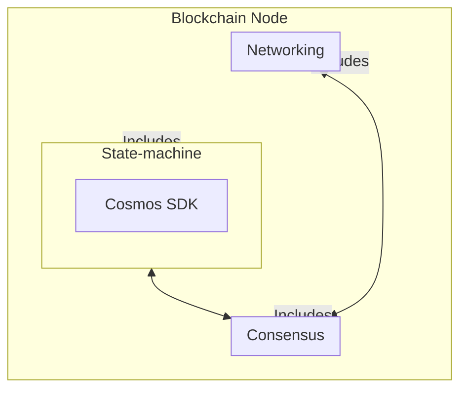

# Application-Specific Blockchains

:::note Synopsis
This document explains what application-specific blockchains are, and why developers would want to build one as opposed to writing Smart Contracts.
:::

## What are application-specific blockchains

Application-specific blockchains are blockchains customized to operate a single application. Instead of building a decentralized application on top of an underlying blockchain like Ethereum, developers build their own blockchain from the ground up. This means building a full-node client, a light-client, and all the necessary interfaces (CLI, REST, ...) to interact with the nodes.

## What are the shortcomings of Smart Contracts

Virtual-machine blockchains like Ethereum addressed the demand for more programmability back in 2014. At the time, the options available for building decentralized applications were quite limited. Most developers would build on top of the complex and limited Bitcoin scripting language, or fork the Bitcoin codebase which was hard to work with and customize.

Virtual-machine blockchains came in with a new value proposition. Their state-machine incorporates a virtual-machine that is able to interpret turing-complete programs called Smart Contracts. These Smart Contracts are very good for use cases like one-time events (e.g. ICOs), but they can fall short for building complex decentralized platforms. Here is why:

* Smart Contracts are generally developed with specific programming languages that can be interpreted by the underlying virtual-machine. These programming languages are often immature and inherently limited by the constraints of the virtual-machine itself. For example, the Ethereum Virtual Machine does not allow developers to implement automatic execution of code. Developers are also limited to the account-based system of the EVM, and they can only choose from a limited set of functions for their cryptographic operations. These are examples, but they hint at the lack of **flexibility** that a smart contract environment often entails.
* Smart Contracts are all run by the same virtual machine. This means that they compete for resources, which can severely restrain **performance**. And even if the state-machine were to be split in multiple subsets (e.g. via sharding), Smart Contracts would still need to be interpreted by a virtual machine, which would limit performance compared to a native application implemented at state-machine level (our benchmarks show an improvement on the order of 10x in performance when the virtual-machine is removed).
* Another issue with the fact that Smart Contracts share the same underlying environment is the resulting limitation in **sovereignty**. A decentralized application is an ecosystem that involves multiple players. If the application is built on a general-purpose virtual-machine blockchain, stakeholders have very limited sovereignty over their application, and are ultimately superseded by the governance of the underlying blockchain. If there is a bug in the application, very little can be done about it.

Application-Specific Blockchains are designed to address these shortcomings.

## Application-Specific Blockchains Benefits

### Flexibility

Application-specific blockchains give maximum flexibility to developers:

* In Cosmos blockchains, the state-machine is typically connected to the underlying consensus engine via an interface called the [ABCI](https://docs.cometbft.com/v1.0/spec/abci/) (Application Blockchain Interface). This interface can be wrapped in any programming language, meaning developers can build their state-machine in the programming language of their choice.

* Developers can choose among multiple frameworks to build their state-machine. The most widely used today is the Cosmos SDK, but others exist (e.g. [Lotion](https://github.com/nomic-io/lotion), [Weave](https://github.com/iov-one/weave), ...). Typically the choice will be made based on the programming language they want to use (Cosmos SDK and Weave are in Golang, Lotion is in Javascript, ...).
* The ABCI also allows developers to swap the consensus engine of their application-specific blockchain. Today, only CometBFT is production-ready, but in the future other consensus engines are expected to emerge.
* Even when they settle for a framework and consensus engine, developers still have the freedom to tweak them if they don't perfectly match their requirements in their pristine forms.
* Developers are free to explore the full spectrum of tradeoffs (e.g. number of validators vs transaction throughput, safety vs availability in asynchrony, ...) and design choices (DB or IAVL tree for storage, UTXO or account model, ...).
* Developers can implement automatic execution of code. In the Cosmos SDK, logic can be automatically triggered at the beginning and the end of each block. They are also free to choose the cryptographic library used in their application, as opposed to being constrained by what is made available by the underlying environment in the case of virtual-machine blockchains.

The list above contains a few examples that show how much flexibility application-specific blockchains give to developers. The goal of Cosmos and the Cosmos SDK is to make developer tooling as generic and composable as possible, so that each part of the stack can be forked, tweaked and improved without losing compatibility. As the community grows, more alternatives for each of the core building blocks will emerge, giving more options to developers.

### Performance

Decentralized applications built with Smart Contracts are inherently capped in performance by the underlying environment. For a decentralized application to optimise performance, it needs to be built as an application-specific blockchain. Next are some of the benefits an application-specific blockchain brings in terms of performance:

* Developers of application-specific blockchains can choose to operate with a novel consensus engine such as CometBFT.
* An application-specific blockchain only operates a single application, so that the application does not compete with others for computation and storage. This is the opposite of most non-sharded virtual-machine blockchains today, where smart contracts all compete for computation and storage.
* Even if a virtual-machine blockchain offered application-based sharding coupled with an efficient consensus algorithm, performance would still be limited by the virtual-machine itself. The real throughput bottleneck is the state-machine, and requiring transactions to be interpreted by a virtual-machine significantly increases the computational complexity of processing them.

### Security

Security is hard to quantify, and greatly varies from platform to platform. That said here are some important benefits an application-specific blockchain can bring in terms of security:

* Developers can choose proven programming languages like Go when building their application-specific blockchains, as opposed to smart contract programming languages that are often more immature.
* Developers are not constrained by the cryptographic functions made available by the underlying virtual-machines. They can use their own custom cryptography, and rely on well-audited crypto libraries.
* Developers do not have to worry about potential bugs or exploitable mechanisms in the underlying virtual-machine, making it easier to reason about the security of the application.

### Sovereignty

One of the major benefits of application-specific blockchains is sovereignty. A decentralized application is an ecosystem that involves many actors: users, developers, third-party services, and more. When developers build on virtual-machine blockchain where many decentralized applications coexist, the community of the application is different than the community of the underlying blockchain, and the latter supersedes the former in the governance process. If there is a bug or if a new feature is needed, stakeholders of the application have very little leeway to upgrade the code. If the community of the underlying blockchain refuses to act, nothing can happen.

The fundamental issue here is that the governance of the application and the governance of the network are not aligned. This issue is solved by application-specific blockchains. Because application-specific blockchains specialize to operate a single application, stakeholders of the application have full control over the entire chain. This ensures that the community will not be stuck if a bug is discovered, and that it has the freedom to choose how it is going to evolve.
