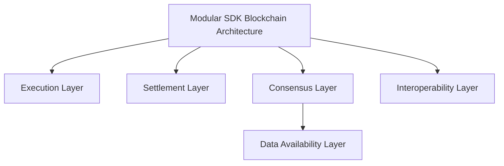
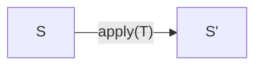
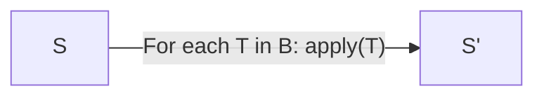
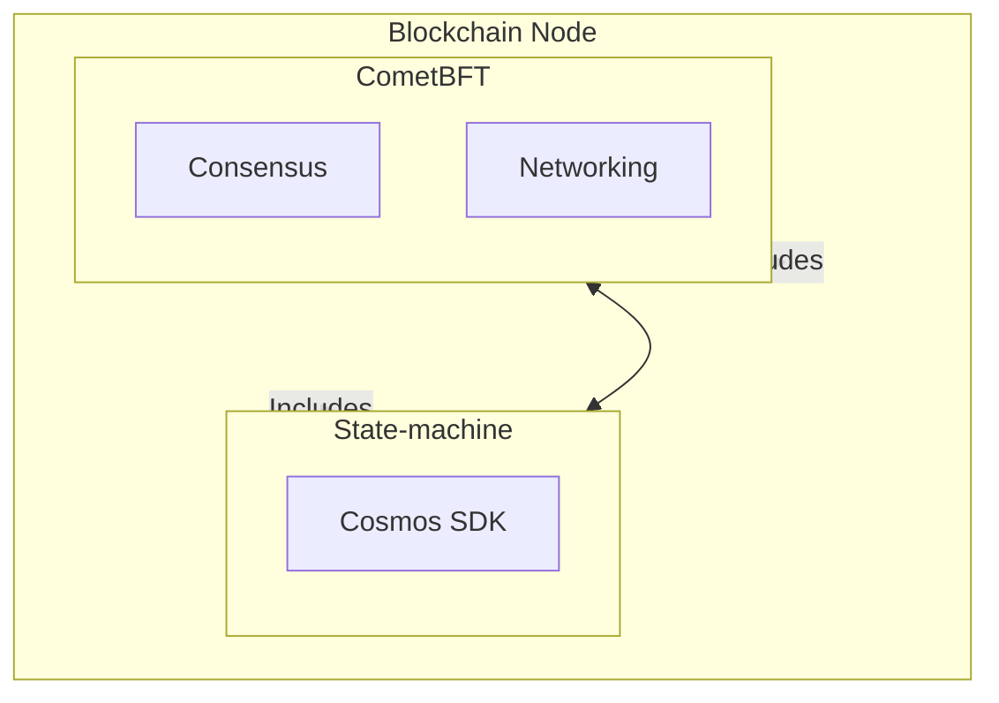
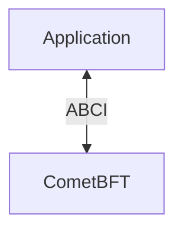

# Blockchain Architecture

## Introduction 

Blockchain architecture is a complex topic that involves many different components. In this section, we will cover the main layers of a blockchain application built with the Cosmos SDK. 

At its core, a blockchain is a replicated deterministic state machine. This document explores the various layers of blockchain architecture, focusing on the execution, settlement, consensus, data availability, and interoperability layers.

## Layered Architecture

Understanding blockchain architecture through the lens of different layers helps in comprehending its complex functionalities. We will give a high-level overview of the execution layer, settlement layer, consensus layer, data availability layer, and interoperability layer.

## Execution Layer

The Execution Layer is where the blockchain processes and executes transactions. The state machine within the blockchain handles the execution of transaction logic. This is done by the blockchain itself, ensuring that every transaction follows the predefined rules and state transitions. When a transaction is submitted, the execution layer processes it, updates the state, and ensures that the output is deterministic and consistent across all nodes. In the context of the Cosmos SDK, this typically involves predefined modules and transaction types rather than general-purpose smart contracts, which are used in chains with CosmWasm.

### State machine

At its core, a blockchain is a [replicated deterministic state machine](https://en.wikipedia.org/wiki/State_machine_replication).

A state machine is a computer science concept whereby a machine can have multiple states, but only one at any given time. There is a `state`, which describes the current state of the system, and `transactions`, that trigger state transitions.

Given a state S and a transaction T, the state machine will return a new state S'.

In practice, the transactions are bundled in blocks to make the process more efficient. Given a state S and a block of transactions B, the state machine will return a new state S'.

In a blockchain context, the state machine is deterministic. This means that if a node is started at a given state and replays the same sequence of transactions, it will always end up with the same final state.

The Cosmos SDK gives developers maximum flexibility to define the state of their application, transaction types and state transition functions. The process of building state machines with the Cosmos SDK will be described more in-depth in the following sections. But first, let us see how the state machine is replicated using various consensus engines, such as CometBFT.

## Settlement Layer

The Settlement Layer is responsible for finalising and recording transactions on the blockchain. This layer ensures that all transactions are accurately settled and immutable, providing a verifiable record of all activities on the blockchain. It is critical for maintaining the integrity and trustworthiness of the blockchain.

The settlement layer can be performed on the chain itself or it can be externalised, allowing for the possibility of plugging in a different settlement layer as needed. For example if we were to use Rollkit and celestia for our Data Availability and Consensus, we could separate our settlement layer by introducing fraud or validity proofs. From there the settlement layer can create trust-minimised light clients, further enhancing security and efficiency. This process ensures that all transactions are accurately finalized and immutable, providing a verifiable record of all activities.

## Consensus Layer

The Consensus Layer ensures that all nodes in the network agree on the order and validity of transactions. This layer uses consensus algorithms like Byzantine Fault Tolerance (BFT) or Proof of Stake (PoS) to achieve agreement, even in the presence of malicious nodes. Consensus is crucial for maintaining the security and reliability of the blockchain.

What has been a default consensus engine in the Cosmos SDK has been CometBFT. In the most recent releases we have been moving away from this and allowing users to plug and play their own consensus engines. This is a big step forward for the Cosmos SDK as it allows for more flexibility and customisation. Other consensus engine options for example can be Rollkit with Celestias Data Availability Layer.

Here is an example of how the consensus layer works with CometBFT in the context of the Cosmos SDK:

### CometBFT

Thanks to the Cosmos SDK, developers just have to define the state machine, and [*CometBFT*](https://docs.cometbft.com/v1.0/explanation/introduction/) will handle replication over the network for them.

[CometBFT](https://docs.cometbft.com/v1.0/explanation/introduction/) is an application-agnostic engine that is responsible for handling the *networking* and *consensus* layers of a blockchain. In practice, this means that CometBFT is responsible for propagating and ordering transaction bytes. CometBFT relies on an eponymous Byzantine-Fault-Tolerant (BFT) algorithm to reach consensus on the order of transactions.

The [consensus algorithm adopted by CometBFT](https://docs.cometbft.com/v1.0/explanation/introduction/#consensus-overview) works with a set of special nodes called *Validators*. Validators are responsible for adding blocks of transactions to the blockchain. At any given block, there is a validator set V. A validator in V is chosen by the algorithm to be the proposer of the next block. This block is considered valid if more than two thirds of V signed a `prevote` and a `precommit` on it, and if all the transactions that it contains are valid. The validator set can be changed by rules written in the state-machine.

## ABCI

CometBFT passes transactions to the application through an interface called the [ABCI](https://docs.cometbft.com/v1.0/spec/abci/), which the application must implement.

Note that **CometBFT only handles transaction bytes**. It has no knowledge of what these bytes mean. All CometBFT does is order these transaction bytes deterministically. CometBFT passes the bytes to the application via the ABCI, and expects a return code to inform it if the messages contained in the transactions were successfully processed or not.

Here are the most important messages of the ABCI:

* `CheckTx`: When a transaction is received by CometBFT, it is passed to the application to check if a few basic requirements are met. `CheckTx` is used to protect the mempool of full-nodes against spam transactions. . A special handler called the [`AnteHandler`](../beginner/04-gas-fees.md#antehandler) is used to execute a series of validation steps such as checking for sufficient fees and validating the signatures. If the checks are valid, the transaction is added to the [mempool](https://docs.cometbft.com/v1.0/explanation/core/mempool) and relayed to peer nodes. Note that transactions are not processed (i.e. no modification of the state occurs) with `CheckTx` since they have not been included in a block yet.
* `DeliverTx`: When a [valid block](https://docs.cometbft.com/v1.0/spec/core/data_structures#block) is received by CometBFT, each transaction in the block is passed to the application via `DeliverTx` in order to be processed. It is during this stage that the state transitions occur. The `AnteHandler` executes again, along with the actual [`Msg` service](../../build/building-modules/03-msg-services.md) RPC for each message in the transaction.
* `BeginBlock`/`EndBlock`: These messages are executed at the beginning and the end of each block, whether the block contains transactions or not. It is useful to trigger automatic execution of logic. Proceed with caution though, as computationally expensive loops could slow down your blockchain, or even freeze it if the loop is infinite.

Find a more detailed view of the ABCI methods from the [CometBFT docs](https://docs.cometbft.com/v1.0/spec/abci/).

Any application built on CometBFT needs to implement the ABCI interface in order to communicate with the underlying local CometBFT engine. Fortunately, you do not have to implement the ABCI interface. The Cosmos SDK provides a boilerplate implementation of it in the form of [baseapp](./03-sdk-design.md#baseapp).

## Data Availability Layer

The Data Availability (DA) Layer is a critical component of within the umbrella of the consensus layer that ensures all necessary data for transactions is available to all network participants. This layer is essential for preventing data withholding attacks, where some nodes might attempt to disrupt the network by not sharing critical transaction data.

If we use the example of Rollkit, a user initiates a transaction, which is then propagated through the rollup network by a light node. The transaction is validated by full nodes and aggregated into a block by the sequencer. This block is posted to a data availability layer like Celestia, ensuring the data is accessible and correctly ordered. The rollup light node verifies data availability from the DA layer. Full nodes then validate the block and generate necessary proofs, such as fraud proofs for optimistic rollups or zk-SNARKs/zk-STARKs for zk-rollups. These proofs are shared across the network and verified by other nodes, ensuring the rollup's integrity. Once all validations are complete, the rollup's state is updated, finalising the transaction

## Interoperability Layer

The Interoperability Layer enables communication and interaction between different blockchains. This layer facilitates cross-chain transactions and data sharing, allowing various blockchain networks to interoperate seamlessly. Interoperability is key for building a connected ecosystem of blockchains, enhancing their functionality and reach.

In this case we have separated the layers even further to really illustrate the components that make-up the blockchain architecture and it is important to note that the Cosmos SDK is designed to be interoperable with other blockchains. This is achieved through the use of the Inter-Blockchain Communication (IBC) protocol, which allows different blockchains to communicate and transfer assets between each other.
