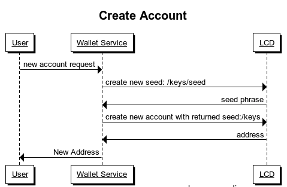
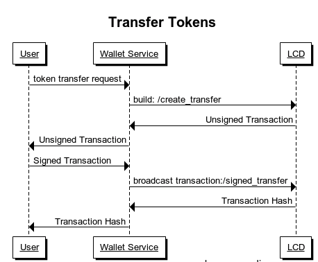

# Getting Started

To start a rest server, we need to specify the following parameters:
| Parameter   | Type      | Default                 | Required | Description                                          |
| ----------- | --------- | ----------------------- | -------- | ---------------------------------------------------- |
| chain-id    | string    | null                    | true     | chain id of the full node to connect                 |
| node        | URL       | "tcp://localhost:46657" | true     | address of the full node to connect                  |
| laddr       | URL       | "tcp://localhost:1317"  | true     | address to run the rest server on                    |
| trust-node  | bool      | "false"                 | true     | Whether this LCD is connected to a trusted full node |
| trust-store | DIRECTORY | "$HOME/.lcd"            | false    | directory for save checkpoints and validator sets    |

Sample command:

```bash
gaiacli light-client --chain-id=test --laddr=tcp://localhost:1317  --node tcp://localhost:46657 --trust-node=false
```

## Gaia Light Use Cases

LCD could be very helpful for related service providers. For a wallet service provider, LCD could
make transaction faster and more reliable in the following cases.

### Create an account



First you need to get a new seed phrase :[get-seed](api.md#keysseed---get)

After having new seed, you could generate a new account with it : [keys](api.md#keys---post)

### Transfer a token



The first step is to build an asset transfer transaction. Here we can post all necessary parameters
to /create_transfer to get the unsigned transaction byte array. Refer to this link for detailed
operation: [build transaction](api.md#create_transfer---post)

Then sign the returned transaction byte array with users' private key. Finally broadcast the signed
transaction. Refer to this link for how to broadcast the signed transaction: [broadcast transaction](api.md#create_transfer---post)
