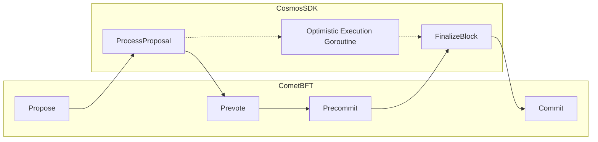

# RFC 002: Optimistic Execution

## Changelog

* 2023-06-07: Refactor for Cosmos SDK (@facundomedica)
* 2022-08-16: Initial draft by Sei Network

## Background

Before ABCI++/1.0, the first and only time a CometBFT blockchain's application layer would know about a block proposal is after the voting period, at which point CometBFT would invoke `BeginBlock`, `DeliverTx`, `EndBlock`, and `Commit` ABCI methods of the application, with the block proposal contents passed in.

With the introduction of ABCI++/1.0, the application layer now receives the block proposal before the voting period commences. This can be used to optimistically execute the block proposal in parallel with the voting process, thus reducing the block time.

## Proposal

Given that the application receives the block proposal in an earlier stage (`ProcessProposal`), it can be executed in the background so when `FinalizeBlock` is called the response can returned instantly.

## Decision

The newly introduced ABCI method `ProcessProposal` is called after a node receives the full block proposal of the current height but before prevote starts. CometBFT states that preemptively executing the block proposal is a potential use case for it:

> * **Usage**:
>     * Contains all information on the proposed block needed to fully execute it.
>         * The Application may fully execute the block as though it was handling
>          `RequestFinalizeBlock`.
>         * However, any resulting state changes must be kept as _candidate state_,
>           and the Application should be ready to discard it in case another block is decided.
>     * The Application MAY fully execute the block &mdash; immediate execution

Nevertheless, synchronously executing the proposal preemptively would not improve block time because it would just change the order of events (so the time we would like to save will be spent at `ProcessProposal` instead of `FinalizeBlock`).

Instead we need to make block execution asynchronous by starting a goroutine in `ProcessProposal` (whose termination signal is kept in the application context) and returning a response immediately. That way, the actual block execution would happen at the same time as voting. When voting finishes and `FinalizeBlock` is called, the application handler can wait for the previously started goroutine to finish, and commit the resulting cache store if the block hash matches.

Assuming average voting period takes `P` and average block execution takes `Q`, this would reduce the average block time by `P + Q - max(P, Q)`.

Sei Network reported `P=~600ms` and `Q=~300ms` during a load test, meaning that optimistic execution could cut the block time by ~300ms.

The following diagram illustrates the intended flow:



Some considerations:

- In the case that a proposal is being rejected by the local node, this node won't
attempt to execute the proposal.
- The app must drop any previous Optimistic Execution data if `ProcessProposal` is called, in other words, abort and restart.

### Implementation

The execution context needs to have the following information:
- The block proposal (`abci.RequestFinalizeBlock`)
- Termination and completion signal for the OE goroutine

The OE goroutine would run on top of a cached branch of the KVStore (which is the default behavior for `FinalizeBlock` as we only write to the underlying store once we've reached the end).

The OE goroutine would periodically check if a termination signal has been sent to it, and stops if so. Once the OE goroutine finishes the execution it will set the completion signal.

To prevent bad validators from overwhelming other nodes, we will only allow optimistic processing for the first round proposal of a given height. (??? what does this mean exactly?)

> Sei reported issues when there's a planned upgrade, once I figure out why, I'll add it here.

Upon receiving a `ProcessProposal` call, the SDK would adopt the following procedure:

```
if height > initial height
    set OE fields
    create branches for all mutable states
    kick off an OP goroutine that optimistically process the proposal with the state branches
else if block hash != OE hash
    send termination signal to the running OE goroutine
    clear up OE fields from the context
else
    do nothing
respond to CometBFT
```


> Maybe add more details about the implementation.


## Consequences

### Backwards Compatibility

This could be backported as far as Cosmos SDK v0.47 as that's the first version that includes the new ABCI++/1.0 interface.

### Positive

- Shorter block times for the same amount of transactions

### Negative

- 

### Neutral

- 


### References

- [Original RFC by Sei Network](https://github.com/sei-protocol/sei-chain/blob/81b8af7980df722a63a910cc35ff96e60a94cbfe/docs/rfc/rfc-000-optimistic-proposal-processing.md)
- [ABCI++ methods in CometBFT](https://github.com/cometbft/cometbft/blob/a09f5d33ecd8846369b93cae9063291eb8abc3a0/spec/abci/abci%2B%2B_methods.md)