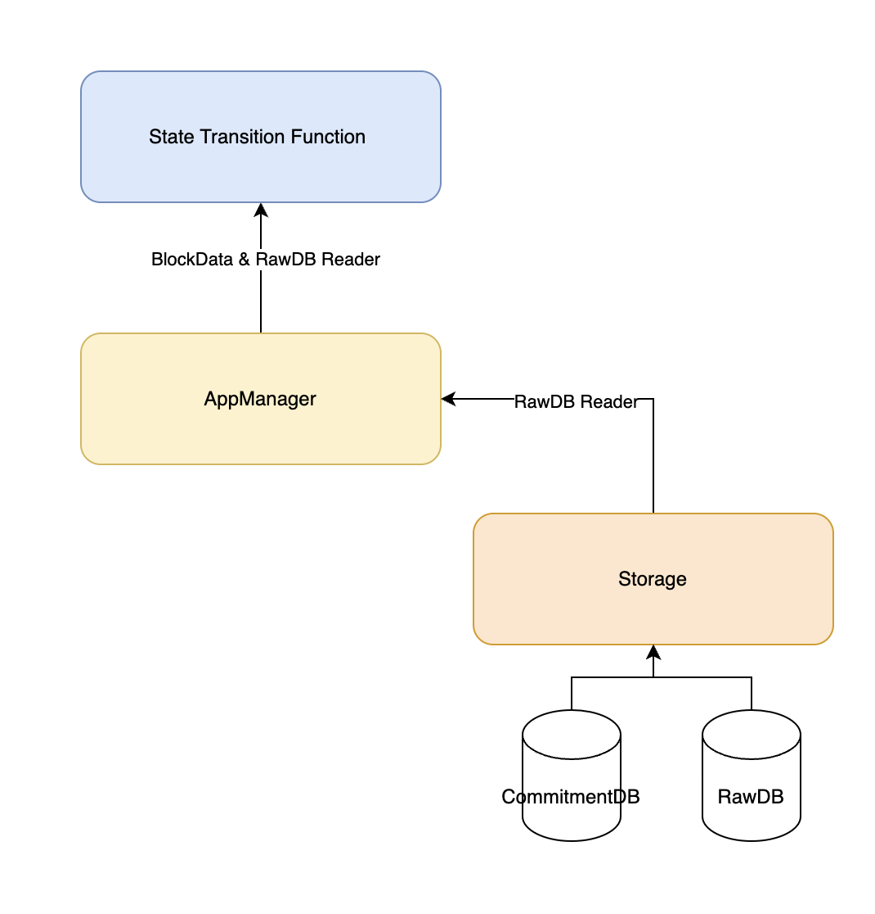
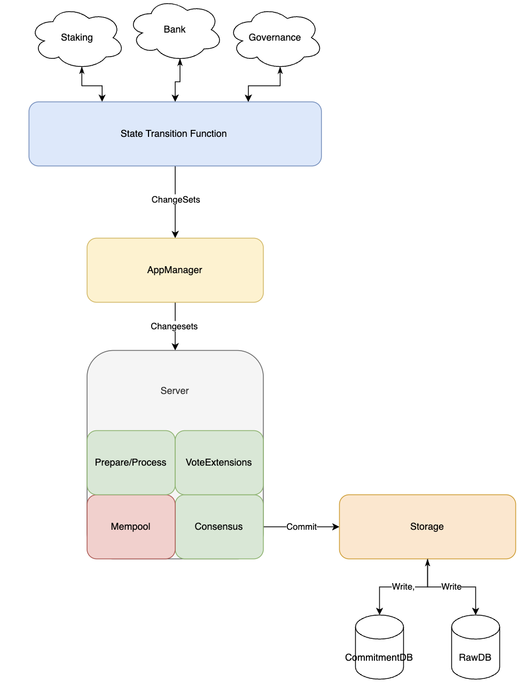

# RFC 007: Server v2

## Changelog

* October 18, 2023: Created

## Background

The Cosmos SDK is one of the most used frameworks to build a blockchain in the past years. While this is an achievement, there are more advanced users emerging (Berachain, Celestia, Rollkit, etc..) that require modifying the Cosmos SDK beyond the capabilities of the current framework. Within this RFC we will walk through the current pitfalls and proposed modifications to the Cosmos SDK to allow for more advanced users to build on top of the Cosmos SDK. 

Currently, the Cosmos SDK is tightly coupled with CometBFT in both production and in testing, with more environments emerging offering a simple and efficient manner to modify the Cosmos SDK to take advantage of these environments is necessary. Today, users must fork and maintain baseapp in order to modify the Cosmos SDK to work with these environments. This is not ideal as it requires users to maintain a fork of the Cosmos SDK and keep it up to date with the latest changes. We have seen this cause issues and forces teams to maintain a small team of developers to maintain the fork.

Secondly the current design, while it works, can have edge cases. With the combination of transaction validation, message execution and interaction with the consensus engine, it can be difficult to understand the flow of the transaction execution. This is especially true when trying to modify the Cosmos SDK to work with a new consensus engine. Some of these newer engines also may want to modify ABCI or introduce a custom interface to allow for more advanced features, currently this is not possible unless you fork both CometBFT and the Cosmos SDK.


## Proposal

This proposal is centered around modularity and simplicity of the Cosmos SDK. The goal is to allow for more advanced users to build on top of the Cosmos SDK without having to maintain a fork of the Cosmos SDK. Within the design we create clear separations between state transition, application, client and consensus. These four unique and separate componets interact with each other through well defined interfaces. While we aim to create a generalized framework, we understand that we can not fit every use case into a few simple interfaces, this is why we opted to create the seperation between the five components. If a user would like to extend one componenet they are able to do so without, potentially, needing to fork other components. This brings in a new case in which users will not need to fork the entirety of the Cosmos SDK, but only a single component.

### Server

The server is the workhorse of the state machine. It is where all the services are initialized, combined and started. The server is where the consensus engine lives, meaning that every server will be custom to a consensus engine or logic for the application. The default server will be using comet with its async client to enable better concurrency. 

#### Services 

All services should be treated as services and have `Start` `Stop` and `Refresh` methods. If a service needs to be started and stopped due to handling of different concurrent processes the Service interface is what would be needed. If a service does not have the need to be started and stopped, it will be treated as a component of another service. 


#### Consensus

Consensus is part of server and the component that controls the rest of the state machine. It receives a block and tells the STF (state transition function) what to execute, in which order and possibly in parallel. The consensus engine receives multiple service and componenets from the server, application manager and many smaller component, the transaction codec. 

#### Mempool

Mempool is a pool of transactions held in memory. Mempool is a componenet of the server/consensus. Being that we are unable to predict how different consensus engines will integrate into the Cosmos SDK, we opted to not have a single mempool interface. Instead, we have a mempool component that is specific to the consensus engine. If a team opts to implement a new consensus engine, they can implement their own mempool or use the defaults we have available.

```go
// Mempool defines the required methods of an application's mempool.
type Mempool[T transaction.Tx] interface {
	// Insert attempts to insert a Tx into the app-side mempool returning
	// an error upon failure.
	Insert(context.Context, T) error

	// Select returns an Iterator over the app-side mempool. If txs are specified,
	// then they shall be incorporated into the Iterator. The Iterator must be
	// closed by the caller.
	Select(context.Context, []T) Iterator[T]

	// Remove attempts to remove a transaction from the mempool, returning an error
	// upon failure.
	Remove([]T) error
}

```

#### Transaction Codec

The transaction codec is a component in the server, it defines how a transaction will work in the Cosmos SDK. Users will have the option to use the default transaction codec or create their own. The default transaction codec will be the current Cosmos SDK one, Protobuf transactions.

The codec only supports decoding in the state machine. Inside the state machine we should avoid encoding transactions at all costs due to malleability concerns. 

```go
// Codec defines the TX codec, which converts a TX from bytes to its concrete representation.
type Codec[T Tx] interface {
	// Decode decodes the tx bytes into a DecodedTx, containing
	// both concrete and bytes representation of the tx.
	Decode([]byte) (T, error)
}
```

The transaction is defined as: 

```go
type (
	Type     = proto.Message
	Identity = []byte
)

type Tx interface {
	// Hash returns the unique identifier for the Tx.
	Hash() [32]byte
	// GetMessages returns the list of state transitions of the Tx.
	GetMessages() []Type
	// GetSenders returns the tx state transition sender.
	GetSenders() []Identity // TODO reduce this to a single identity if accepted
	// GetGasLimit returns the gas limit of the tx. Must return math.MaxUint64 for infinite gas
	// txs.
	GetGasLimit() uint64
	// Bytes returns the encoded version of this tx. Note: this is ideally cached
	// from the first instance of the decoding of the tx.
	Bytes() []byte
}
```

#### Application Manager

The application manager is the component that interacts with the state transition function (STF), storage and consensus. Consensus will pass the blockdata to the application manager. The application manager then opens a reader from storage and passes the block data and the reader to STF. 


```go
type BlockRequest[T any] struct {
	Height            uint64
	Time              time.Time
	Hash              []byte
	Txs               []T
	ConsensusMessages []Type
}

type BlockResponse struct {
	Apphash          []byte
	ValidatorUpdates []appmodulev2.ValidatorUpdate
	PreBlockEvents   []event.Event
	BeginBlockEvents []event.Event
	TxResults        []TxResult
	EndBlockEvents   []event.Event
}
```




#### State Transition Function (STF)

The state transition function (STF) is the component that is responsible for executing the transactions in the block. It is responsible for validating the transactions, executing them and updating the state. STF does not write directly to storage instead it returns a set of changes to the state. The changes are then applied to the storage when consensus decides. 

STF is meant to be used for proving the state transition of a transaction. It will be used in the future for proving in the case of a validity or optimistic proofs. For this reason, STF will not be responsible for gas calculations, gasKV and gas meter, and the cacheKV layer. This removes complexity from the storage layer, allows for a more efficient storage layer and allows for proving in the future.

Application manager and STF do not have the concept of writing to storage or commitment of state. Consensus is responsible for committing state to storage. Storage is responsible for writing state to disk and producing a commit hash to be used as the state root.




The benefits of the above approach are that the entire transaction and query flow is concurrently safe. Queries do not block execution of transations, checktx does not block execution, execution does not block query and checktx.


## Descision

We will move forward with the above design. 


### Backwards Compatibility

* Modules are required to migrate from sdk.Context to `appmodule.Environment`. For comet specific information, querying the consensus module is required.
* Legacy params module is not supported any longer in the new designs.
* 

### Positive

* concurrently safe
* loose coupling between server modules
* simpler to maintain
* pre and post message hooks

### Negative

* required state compatible migrations for modules
* no support for legacy params module

### Neutral


### References


## Discussion
