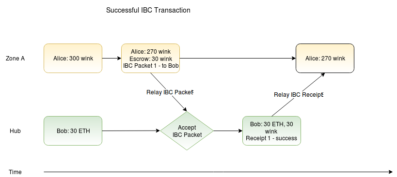
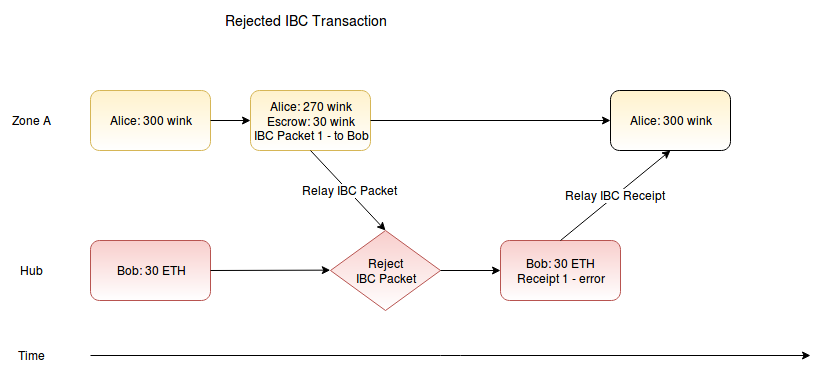

## 3 Channels & Packets

([Back to table of contents](README.md#contents))

### 3.1 Background

IBC uses a cross-chain message passing model that makes no assumptions about network synchrony. IBC *data packets* (hereafter just *packets*) are relayed from one blockchain to the other by external infrastructure. Chain `A` and chain `B` confirm new blocks independently, and packets from one chain to the other may be delayed or censored arbitrarily. The speed of packet transmission and confirmation is limited only by the speed of the underlying chains.

The IBC protocol as defined here is payload-agnostic. The packet receiver on chain `B` decides how to act upon the incoming message, and may add its own application logic to determine which state transactions to apply according to what data the packet contains. Both chains must only agree that the packet has been received.

To facilitate useful application logic, we introduce an IBC *channel*: a set of reliable messaging queues that allows us to guarantee a cross-chain causal ordering[[5](./references.md#5)] of IBC packets. Causal ordering means that if packet *x* is processed before packet *y* on chain `A`, packet *x* must also be processed before packet *y* on chain `B`.

IBC channels implement a vector clock[[2](references.md#2)] for the restricted case of two processes (in our case, blockchains). Given *x* → *y* means *x* is causally before *y*, chains `A` and `B`, and *a* ⇒ *b* means *a* implies *b*:

*A:send(msg<sub>i </sub>)* → *B:receive(msg<sub>i </sub>)*

*B:receive(msg<sub>i </sub>)* → *A:receipt(msg<sub>i </sub>)*

*A:send(msg<sub>i </sub>)* → *A:send(msg<sub>i+1 </sub>)*

*x* → *A:send(msg<sub>i </sub>)* ⇒
*x* → *B:receive(msg<sub>i </sub>)*

*y* → *B:receive(msg<sub>i </sub>)* ⇒
*y* → *A:receipt(msg<sub>i </sub>)*

Every transaction on the same chain already has a well-defined causality relation (order in history). IBC provides an ordering guarantee across two chains which can be used to reason about the combined state of both chains as a whole.

For example, an application may wish to allow a single tokenized asset to be transferred between and held on multiple blockchains while preserving fungibility and conservation of supply. The application can mint asset vouchers on chain `B` when a particular IBC packet is committed to chain `B`, and require outgoing sends of that packet on chain `A` to escrow an equal amount of the asset on chain `A` until the vouchers are later redeemed back to chain `A` with an IBC packet in the reverse direction. This ordering guarantee along with correct application logic can ensure that total supply is preserved across both chains and that any vouchers minted on chain `B` can later be redeemed back to chain `A`.

This section provides definitions for packets and channels, a high-level specification of the queue interface, and a list of the necessary proofs. To implement amino-compatible IBC, chain `A` and chain `B` must also use a common encoding format. An example binary encoding format can be found in [Appendix C](appendices.md#appendix-c-merkle-proof-formats).

### 3.2 Definitions

#### 3.2.1 Packet

We define an IBC *packet* `P` as the five-tuple `(type, sequence, source, destination, data)`, where:

`type` is an opaque routing field

`sequence` is an unsigned, arbitrary-precision integer

`source` is a string uniquely identifying the chain, connection, and channel from which this packet was sent

`destination` is a string uniquely identifying the chain, connection, and channel which should receive this packet

`data` is an opaque application payload

#### 3.2.2 Receipt

We define an IBC *receipt* `R` as the four-tuple `(sequence, source, destination, result)`, where

`sequence` is an unsigned, arbitrary-precision integer

`source` is a string uniquely identifying the chain, connection, and channel from which this packet was sent

`destination` is a string uniquely identifying the chain, connection, and channel which should receive this packet

`result` is an opaque application result payload

#### 3.2.3 Queue

To implement strict message ordering, we introduce an ordered *queue*. A queue can be conceptualized as a slice of an infinite array. Two numerical indices - `q_head` and `q_tail` - bound the slice, such that for every `index` where `q_head <= index < q_tail`, there is a queue element `q[index]`. Elements can be appended to the tail (end) and removed from the head (beginning). We introduce one further method, `advance`, to facilitate efficient queue cleanup.

Each IBC-supporting blockchain must provide a queue abstraction with the following functionality:

`init`

```
set q_head = 0
set q_tail = 0
```

`peek ⇒ e`

```
match q_head == q_tail with
  true ⇒ return nil
  false ⇒ 
    return q[q_head]
```

`pop ⇒ e`

```
match q_head == q_tail with   
  true ⇒ return nil
  false ⇒ 
    set q_head = q_head + 1
    return q_head - 1  
```

`retrieve(i) ⇒ e`

```
match q_head <= i < q_tail with
  true ⇒ return q[i]
  false ⇒ return nil
```

`push(e)`

```
set q[q_tail] = e
set q_tail = q_tail + 1
```

`advance(i)`

```
set q_head = i
set q_tail = max(q_tail, i)
```
  
`head ⇒ i`

```
return q_head
```

`tail ⇒ i`

```
return q_tail
```

#### 3.2.4 Channel

We introduce the abstraction of an IBC *channel*: a set of the required packet queues to facilitate ordered bidirectional communication between two blockchains `A` and `B`. An IBC connection, as defined earlier, can have any number of associated channels. IBC connections handle header initialization & updates. All IBC channels use the same connection, but implement independent queues and thus independent ordering guarantees.

An IBC channel consists of four distinct queues, two on each chain:

`outgoing_A`: Outgoing IBC packets from chain `A` to chain `B`, stored on chain `A`

`incoming_A`: IBC receipts for incoming IBC packets from chain `B`, stored on chain `A`

`outgoing_B`: Outgoing IBC packets from chain `B` to chain `A`, stored on chain `B`

`incoming_B`: IBC receipts for incoming IBC packets from chain `A`, stored on chain `B`

### 3.3 Requirements

In order to provide the ordering guarantees specified above, each blockchain utilizing the IBC protocol must provide proofs that particular IBC packets have been stored at particular indices in the outgoing packet queue, and particular IBC packet execution results have been stored at particular indices in the incoming packet queue.

We use the previously-defined Merkle proof `M_kvh` to provide the requisite proofs. In order to do so, we must define a unique, deterministic key in the Merkle store for each message in the queue:

`key = (queue name, head | tail | index)`

The index is stored as a fixed-length unsigned integer in big endian format, so that the lexicographical order of the byte representation of the key is consistent with their sequence number. This allows us to quickly iterate over the queue, as well as prove the content of a packet (or lack of packet) at a given sequence. `head` and `tail` are two special constants that store an integer index, and are chosen such that their serializated representation cannot collide with that of any possible index.

Once written to the queue, a packet must be immutable (except for deletion when popped from the queue). That is, if a value `v` is written to a queue, then every valid proof `M_kvh` must refer to the same `v`. In practice, this means that an IBC implementation must ensure that only the IBC module can write to the IBC subspace of the blockchain's Merkle store.

Each incoming & outgoing queue for each connection must be provably associated with another uniquely identified chain, connection, and channel so that an observer can prove that a message was intended for that chain and only that chain. This can easily be done by prefixing the queue keys in the Merkle store with strings unique to the chain (such as chain identifier), connection, and channel.

### 3.4 Sending a packet

To send an IBC packet, an application module on the source chain must call the send method of the IBC module, providing a packet as defined above. The IBC module must ensure that the destination chain was already properly registered and that the calling module has permission to write this packet. If all is in order, the IBC module simply pushes the packet to the tail of `outgoing_a`, which enables all the proofs described above.

The packet must provide routing information in the `type` field, so that different modules can write different kinds of packets and maintain any application-level invariants related to this area. For example, a "coin" module can ensure a fixed supply, or a "NFT" module can ensure token uniqueness. The IBC module on the destination chain must associate every supported packet type with a particular handler (`f_type`).

To send an IBC packet from blockchain `A` to blockchain `B`:

`send(P{type, sequence, source, destination, data}) ⇒ success | failure`

```
case
  source /= (A, connection, channel) ⇒ fail with "wrong sender"
  sequence /= tail(outgoing_A) ⇒ fail with "wrong sequence"
  otherwise ⇒
    push(outgoing_A, P)
    success
```

Note that the `sequence`, `source`, and `destination` can all be encoded in the Merkle tree key for the channel and do not need to be stored individually in each packet.

### 3.5 Receiving a packet

Upon packet receipt, chain `B` must check that the packet is valid, that it was intended for the destination, and that all previous packets have been processed. `receive` must write the receipt queue upon accepting a valid packet regardless of the result of handler execution so that future packets can be processed.

To receive an IBC packet on blockchain `B` from a source chain `A`, with a Merkle proof `M_kvh` and the current set of trusted headers for that chain `T_A`:

`receive(P{type, sequence, source, destination, data}, M_kvh) ⇒ success | failure`

```
case
  incoming_B == nil ⇒ fail with "unregistered sender"
  destination /= (B, connection, channel) ⇒ fail with "wrong destination"
  sequence /= head(Incoming_B) ⇒ fail with "out of order"
  H_h not in T_A ⇒ fail with "must submit header for height h"
  valid(H_h, M_kvh) == false ⇒ fail with "invalid Merkle proof"
  otherwise ⇒ 
    set result = f_type(data)
    push(incoming_B, R{tail(incoming_B), (B, connection, channel), (A, connection, channel), result})
    success
```

### 3.6 Handling a receipt

When we wish to create a transaction that atomically commits or rolls back across two chains, we must look at the execution result returned in the IBC receipt. For example, if I want to send tokens from Alice on chain `A` to Bob on chain `B`, chain `A` must decrement Alice's account *if and only if* Bob's account was incremented on chain `B`. We can achieve that by storing a protected intermediate state on chain `A` (escrowing the assets in question), which is then committed or rolled back based on the result of executing the transaction on chain `B`.

To do this requires that we not only provably send a packet from chain `A` to chain `B`, but provably return the result of executing that packet (the receipt `data`) from chain `B` to chain `A`. If a valid IBC packet was sent from `A` to `B`, then the result of executing it is stored in `incoming_B`. Since the receipts are stored in a queue with the same key construction as the sending queue, we can generate the same set of proofs for them, and perform a similar sequence of steps to handle a receipt coming back to `A` for a message previously sent to `B`. Receipts, like packets, are processed in order.

To handle an IBC receipt on blockchain `A` received from blockchain `B`, with a Merkle proof `M_kvh` and the current set of trusted headers for that chain `T_B`:

`handle_receipt(R{sequence, source, destination, data}, M_kvh)`

```
case
  outgoing_A == nil ⇒ fail with "unregistered sender"
  destination /= (A, connection, channel) ⇒ fail with "wrong destination"
  sequence /= head(incoming_A) ⇒ fail with "out of order"
  H_h not in T_B ⇒ fail with "must submit header for height h"
  valid(H_h, M_kvh) == false ⇒ fail with "invalid Merkle proof"
  otherwise ⇒
    set P{type, _, _, _, _} = pop(outgoing_A)
    f_type(result)
    success
```

This allows applications to reason about ordering and enforce application-level guarantees by committing or reverting state changes on chain `A` based on the result of packet execution on chain `B`:





### 3.7 Packet relayer

The blockchain itself only records the *intention* to send the given message to the recipient chain. Physical network packet relay must be performed by off-chain infrastructure. We define the concept of a *relay* process that connects two chains by querying one for all outgoing packets & proofs, then committing those packets & proofs to the recipient chain.

The relay process must have access to accounts on both chains with sufficient balance to pay for transaction fees but needs no other permissions. Relayers may employ application-level methods to recoup these fees. Any number of *relay* processes may be safely run in parallel. However, they will consume unnecessary fees if they submit the same proof multiple times, so some minimal coordination is ideal.

As an example, here is a naive algorithm for relaying outgoing packets from `A` to `B` and incoming receipts from `B` back to `A`. All reads of variables belonging to a chain imply queries and all function calls imply submitting a transaction to the blockchain.

```
while true
   set pending = tail(outgoing_A)
   set received = tail(incoming_B)
   if pending > received
       set U_h = A.latestHeader
       if U_h /= B.knownHeaderA
          B.updateHeader(U_h)
       for i from received to pending
           set P = outgoing_A[i]
           set M_kvh = A.prove(U_h, P)
           B.receive(P, M_kvh)
```

Note that updating a header is a costly transaction compared to posting a Merkle proof for a known header. Thus, a process could wait until many messages are pending, then submit one header along with multiple Merkle proofs, rather than a separate header for each message. This decreases total computation cost (and fees) at the price of additional latency and is a trade-off each relay can dynamically adjust.
