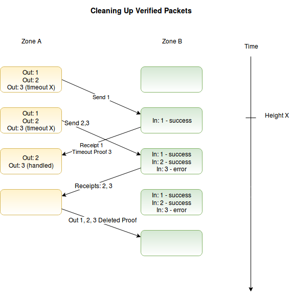

## 4 Optimizations

([Back to table of contents](README.md#contents))

The above sections describe a secure messaging protocol that can handle all normal situations between two blockchains. All messages are processed exactly once and in order, and applications can guarantee invariants over their combined state on both chains. IBC can be further extended and optimized to provide additional guarantees and minimize costs on the underlying blockchains. We detail two extensions: packet timeouts, and packet cleanup.

### 4.1 Timeouts

Application semantics may require some timeout: an upper limit to how long the chain will wait for a transaction to be processed before considering it an error. Since the two chains have different local clocks, this is an obvious attack vector for a double spend - an attacker may delay the relay of the receipt or wait to send the packet until right after the timeout - so applications cannot safely implement naive timeout logic themselves.

One solution is to include a timeout in the IBC packet itself.  When sending a packet, one can specify a block height or timestamp on chain `B` after which the packet is no longer valid. If the packet is posted before the cutoff, it will be processed normally. If it is posted after the cutoff, it will be a guaranteed error. In order to provide the necessary guarantees, the timeout must be specified relative to a condition on the receiving chain, and the sending chain must have proof of this condition after the cutoff.

For a sending chain `A` and a receiving chain `B`, with an IBC packet `P={_, sequence, _, _, _}`, the base IBC protocol provides the following guarantees:

_A:Mk,v,h =_ &#8709; _if message i was not sent before height h_

_A:Mk,v,h =_ &#8709; _if message i was sent and receipt received before height h (and the receipts for all messages j < i were also handled)_

_A:Mk,v,h _ &#8800; &#8709; _otherwise (message result is not yet processed)_

_B:Mk,v,h =_ &#8709; _if message i was not received before height h_

_B:Mk,v,h _ &#8800; &#8709; _if message i was received before height h (and all messages j < i were received)_

Based on these guarantees, we can make a few modifications of the above protocol to allow us to prove timeouts, by adding some fields to the messages in the send queue, and defining an expired function that returns true iff _h > maxHeight_ or _timestamp(Hh ) > maxTime_.

_Vsend = (maxHeight, maxTime, type, data)_

_expired(Hh ,Vsend )_ &#8658; _[true|false]_

We then update message handling in `receive`, so that chain `B` doesn't even call the handler function if the timeout was reached, but instead directly writes an error in the receipt queue:

`receive`

  * ….
  * _expired(latestHeader, v)_ &#8658; _push(qS.receipt , (None, TimeoutError)),_
  * _v = (\_, \_, type, data)_ &#8658; _(result, err) := ftype(data); push(qS.receipt , (result, err));_

and add a new _IBCtimeout_ function to accept tail proofs to demonstrate that the message was not processed at some given header on the recipient chain. This allows the sender chain to assert timeouts locally.

_S:IBCtimeout(A, Mk,v,h)_ &#8658; _match_
  * _qA.send =_ &#8709; &#8658; _Error("unregistered sender"),_
  * _k = (\_, send, \_)_ &#8658; _Error("must be a receipt"),_
  * _k = (d, \_, \_) and d_ &#8800; _S_ &#8658; _Error("sent to a different chain"),_
  * _Hh_ &#8713; _TA_ &#8658; _Error("must submit header for height h"),_
  * _not valid(Hh , Mk,v,h )_ &#8658; _Error("invalid merkle proof"),_
  * _k = (S, receipt, tail)_ &#8658; _match_
    * _tail_ &#8805; _head(qS.send )_ &#8658; _Error("receipt exists, no timeout proof")_
    * _not expired(peek(qS.send ))_ &#8658; _Error("message timeout not yet reached")_
    * _default_ &#8658; _(\_, \_, type, data) := pop(qS.send ); rollbacktype(data); Success_
  * _default_ &#8658; _Error("must be a tail proof")_

which processes timeouts in order, and adds one more condition to the queues:

_A:Mk,v,h =_ &#8709; _if message i was sent and timeout proven before height h (and the receipts for all messages j < i were also handled)_

Now chain A can rollback all transactions that were blocked by this flood of unrelayed messages, without waiting for chain B to process them and return a receipt. Adding reasonable time outs to all packets allows us to gracefully handle any errors with the IBC relay processes, or a flood of unrelayed "spam" IBC packets. If a blockchain requires a timeout on all messages, and imposes some reasonable upper limit (or just assigns it automatically), we can guarantee that if message _i_ is not processed by the upper limit of the timeout period, then all previous messages must also have either been processed or reached the timeout period.

Note that in order to avoid any possible "double-spend" attacks, the timeout algorithm requires that the destination chain is running and reachable. One can prove nothing in a complete network partition, and must wait to connect; the timeout must be proven on the recipient chain, not simply the absence of a response on the sending chain.

### 4.2 Cleanup

While we clean up the _send queue_ upon getting a receipt, if left to run indefinitely, the _receipt queues_ could grow without limit and create a major storage requirement for the chains.  However, we must not delete receipts until they have been proven to be processed by the sending chain, or we lose important information and sacrifice reliability.

The observant reader may also notice, that when we perform the timeout on the sending chain, we do not update the _receipt queue_ on the receiving chain, and now it is blocked waiting for a message _i_, which **no longer exists** on the sending chain. We can update the guarantees of the receipt queue as follows to allow us to handle both:

_B:Mk,v,h =_ &#8709; _if message i was not received before height h_

_B:Mk,v,h =_ &#8709; _if message i was provably resolved on the sending chain before height h_

_B:Mk,v,h _ &#8800; &#8709; _otherwise (if message i was processed before height h, and no ack of receipt from the sending chain)_

Consider a connection where many messages have been sent, and their receipts processed on the sending chain, either explicitly or through a timeout. We wish to quickly advance over all the processed messages, either for a normal cleanup, or to prepare the queue for normal use again after timeouts.

Through the definition of the send queue above, we see that all messages _i < head_ have been fully processed, and all messages _head <= i < tail_ are awaiting processing. By proving a much advanced _head_ of the _send queue_, we can demonstrate that the sending chain already handled all messages. Thus, we can safely advance our local _receipt queue_ to the new head of the remote _send queue_.

_S:IBCcleanup(A, Mk,v,h)_ &#8658; _match_
  * _qA.receipt =_ &#8709; &#8658; _Error("unknown sender"),_
  * _k = (\_, send, \_)_ &#8658; _Error("must be for the send queue"),_
  * _k = (d, \_, \_) and d_ &#8800; _S_ &#8658; _Error("sent to a different chain"),_
  * _k_ &#8800; _(\_, \_, head)_ &#8658; _Error("Need a proof of the head of the queue"),_
  * _Hh_ &#8713; _TA_ &#8658; _Error("must submit header for height h"),_
  * _not valid(Hh ,Mk,v,h )_ &#8658; _Error("invalid merkle proof"),_
  * _head := v_ &#8658; _match_
    * _head <= head(qA.receipt)_ &#8658; _Error("cleanup must go forward"),_
    * _default_ &#8658; _advance(qA.receipt  , head); Success_

This allows us to invoke the _IBCcleanup _function to resolve all outstanding messages up to and including _head_ with one merkle proof. Note that if this handles both recovering from a blocked queue after timeouts, as well as a routine cleanup method to recover space. In the cleanup scenario, we assume that there may also be a number of messages that have been processed by the receiving chain, but not yet posted to the sending chain, _tail(B:qA.reciept ) > head(A:qB.send )_. As such, the _advance_ function must not modify any messages between the head and the tail.

