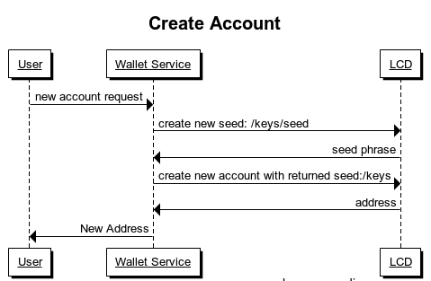
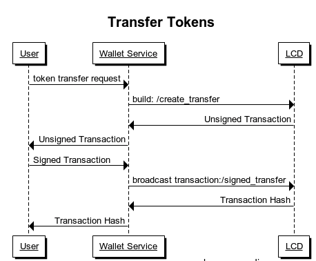

## Getting Started

To start a rest server, we need to specify the following parameters:

| Parameter   | Type      | Default                 | Required | Description                                          |
| ----------- | --------- | ----------------------- | -------- | ---------------------------------------------------- |
| chain-id    | string    | null                    | true     | chain id of the full node to connect                 |
| node-list   | URL       | "tcp://localhost:26657" | false     | address list of the full node to connect, for example: "tcp://10.10.10.10:26657,tcp://20.20.20.20:26657"                  |
| laddr       | URL       | "tcp://localhost:1317"  | false     | address to run the rest server on                    |
| trust-node  | bool      | "false"                 | false     | Whether this LCD is connected to a trusted full node |

**Sample command** :

```
gaiacli advanced rest-server-swagger --chain-id=test-chain-RtAS0K
```

## LCD Use Cases

LCD could be very helpful for related service providers. For a wallet service provider, LCD could make transaction faster and more reliable in the following cases. 

1. Create An Account



First you need to get a new seed phrase :[get-seed](api.md#keysseed---get)

After having new seed, you could generate a new account with it : [keys](api.md#keys---post)

  

2. Transfer Asset

   


  The first step is to build an asset transfer transaction. Here we can post all necessary parameters to /create_transfer to get the unsigned transaction byte array. Refer to this link for detailed operation: [build transaction](api.md#create_transfer---post)

  Then sign the returned transaction byte array with users' private key. Finally broadcast the signed transaction. Refer to this link for how to broadcast the signed transaction: [broadcast transaction](api.md#create_transfer---post)