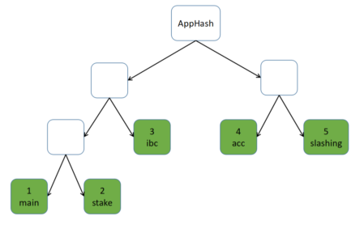
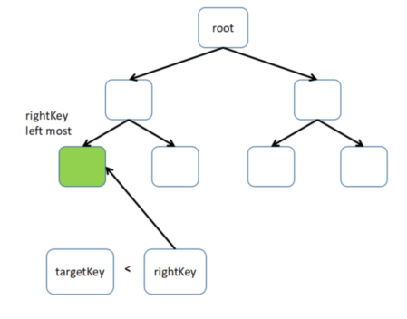
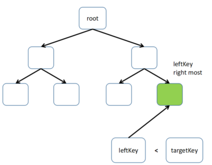
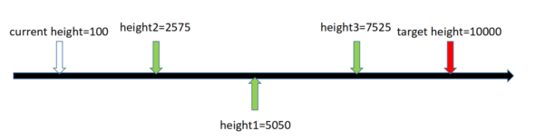

# 规范

该规范描述了如何实现 LCD。 LCD 支持模块化 API。 目前，仅支持ICS0（TendermintAPI），ICS1（密钥API）和ICS20（Key API）。 如有必要，后续可以包含更多API。

## 构建并验证 ABCI 状态的证明

众所周知，基于 cosmos-sdk 的应用程序的存储包含多个子库。 每个子目录由 IAVL 存储实现。 这些子组件由简单的 Merkle 树组成。 创建树时，我们需要从这些子库中提取名字、高度和存储根哈希以构建一组简单的 Merkle 叶节点，然后计算从叶节点到根的哈希。 简单 Merkle 树的根哈希是 AppHash，它将包含在块头中。



正如我们在[LCD信任传播](https://github.com/irisnet/cosmos-sdk/tree/bianjie/lcd_spec/docs/spec/lcd#trust-propagation)中所讨论的那样，可以通过检查针对可信验证人集的投票权来验证 AppHash。 这里我们只需要建立从 ABCI 状态到 AppHash 的证明。 证据包含两部分：

* IAVL 证明
* 子库到 AppHash 的证明

### IAVL 证明

证明有两种类型：存在证明和缺席证明。 如果查询密钥存在于 IAVL 存储中，则它返回键值及其存在证明。 另一方面，如果密钥不存在，那么它只返回缺席证明，这可以证明密钥肯定不存在。

### IAVL 存在证明

```go
type CommitID struct {
    Version int64
    Hash    []byte
}

type storeCore struct {
    CommitID CommitID
}

type MultiStoreCommitID struct {
    Name string
    Core storeCore
}

type proofInnerNode struct {
    Height  int8
    Size    int64
    Version int64
    Left    []byte
    Right   []byte
}

type KeyExistsProof struct {
    MultiStoreCommitInfo []MultiStoreCommitID // 所有子库提交id
    StoreName string // 当前子库名字
    Height  int64 // 当前子库提交高度
    RootHash cmn.HexBytes // 此 IAVL 树的根哈希
    Version  int64 // 此 IAVL 树中 key-value 的版本号
    InnerNodes []proofInnerNode // 从根节点到 key-value 叶子节点的路径
}
```

存在证据的数据结构如上所示。 构建和验证存在证明的过程如下所示：


构建证明的步骤：

* 从根节点访问IAVL树
* 记录 InnerNodes 中的访问节点
* 找到目标叶节点后，将叶节点版本赋值给证明版本
* 将当前 IAVL 树高赋值给证明高度
* 将当前 IAVL 树根哈希赋值给证明根哈希
* 将当前的子目录名称赋值给证明 StoreName
* 从 multistore 读取指定高度的 commitInfo 并将其赋值给证明 StoreCommitInfo

验证证明的步骤：

* 使用证明版本中的键、值构建叶节点
* 计算叶节点哈希
* 将哈希值分配给第一个 innerNode 的 rightHash，然后计算第一个 innerNode 哈希值
* 传播哈希计算过程。 如果先前的 innerNode 是下一个 innerNode 的左子节点，则将先前的 innerNode 散列分配给下一个 innerNode 的左散列。否则，将先前的 innerNode 散列分配给下一个innerNode的右散列
* 最后 innerNode 的哈希应该等于此证明的根哈希， 否则证明无效。

###  IAVL 缺席证明

众所周知，所有 IAVL 叶节点都按每个叶节点的密钥排序。 因此，我们可以在 IAVL 树的整个密钥集中计算出目标密钥的位置。 如下图所示，我们可以找到左键和右键。 如果我们可以证明左键和右键肯定存在，并且它们是相邻的节点，那么目标密钥肯定不存在。


如果目标密钥大于最右边的叶节点或小于最左边的叶子节点，则目标密钥肯定不存在。



```go
type proofLeafNode struct {
    KeyBytes   cmn.HexBytes
    ValueBytes cmn.HexBytes
    Version    int64
}

type pathWithNode struct {
    InnerNodes []proofInnerNode
    Node proofLeafNode
}

type KeyAbsentProof struct {
    MultiStoreCommitInfo []MultiStoreCommitID
    StoreName string
    Height  int64
    RootHash cmn.HexBytes
    Left  *pathWithNode // Proof the left key exist
    Right *pathWithNode  //Proof the right key exist
}
```

以上是缺席证明的数据结构。 构建证据的步骤：

* 从根节点访问IAVL树
* 获取整个密钥集中密钥的对应索引（标记为INDEX）
* 如果返回的索引等于0，则右索引应为0，且左节点不存在
* 如果返回的索引等于整个密钥集的大小，则左节点索引应为INDEX-1，且右节点不存在
* 否则，右节点索引应为INDEX，左节点索引应为INDEX-1
* 将当前 IAVL 树高赋值给证明高度
* 将当前 IAVL 树根哈希赋值给证明根哈希
* 将当前的子目录名称赋值给证明 StoreName
* 从 multistore 读取指定高度的 commitInfo 并将其赋值给证明 StoreCommitInfo

验证证明的步骤：

* 如果只存在右节点，请验证其存在的证明，并验证它是否是最左侧的节点
* 如果仅存在左节点，请验证其存在的证据，并验证它是否是最右侧的节点
* 如果右节点和左节点都存在，请验证它们是否相邻

### Substores 到 AppHash 的证明

在验证了 IAVL 证明之后，我们就可以开始验证针对 AppHash 的 substore 证明。 首先，迭代 MultiStoreCommitInfo 并通过证明 StoreName 找到 substore commitID。 验证 commitID 中的哈希是否等于证明根哈希，如果不相等则证明无效。 然后通过 substore name 的哈希对 substore commitInfo 数组进行排序。 最后，使用所有 substore commitInfo 数组构建简单的 Merkle 树，并验证 Merkle 根哈希值是否等于appHash。


```go
func SimpleHashFromTwoHashes(left []byte, right []byte) []byte {
    var hasher = ripemd160.New()

    err := encodeByteSlice(hasher, left)
    if err != nil {
        panic(err)
    }

    err = encodeByteSlice(hasher, right)
    if err != nil {
        panic(err)
    }

    return hasher.Sum(nil)
}

func SimpleHashFromHashes(hashes [][]byte) []byte {
    // Recursive impl.
    switch len(hashes) {
        case 0:
            return nil
        case 1:
            return hashes[0]
        default:
            left := SimpleHashFromHashes(hashes[:(len(hashes)+1)/2])
            right := SimpleHashFromHashes(hashes[(len(hashes)+1)/2:])
            return SimpleHashFromTwoHashes(left, right)
    }
}
```

## 根据验证人集验证区块头

上面的小节中经常提到 appHash，但可信的appHash来自哪里？ 实际上，appHash 存在于区块头中，因此接下来我们需要针对 LCD 可信验证人集验证特定高度的区块头。 验证流程如下所示：


当可信验证人集与区块头不匹配时，我们需要尝试将验证人集更新为此块的高度。 LCD 有一条规则，即每个验证人集的变化不应超过1/3投票权。 如果目标验证人集的投票权变化超过1/3，则与可信验证人集进行比较。 我们必须验证，在目标验证人集之前是否存在隐含的验证人集变更。 只有当所有验证人集变更都遵循这条规则时，才能完成验证人集的更新。

例如：



* 更新到 10000，失败，变更太大
* 更新到 5050，失败，变更太大
* 更新至 2575，成功
* 更新至 5050，成功
* 更新到 10000，失败，变更太大
* 更新至 7525，成功
* 更新至 10000，成功