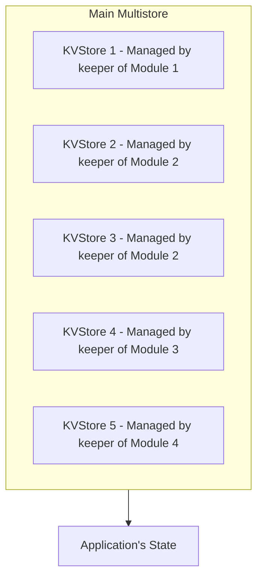

# Store

:::note Synopsis
A store is a data structure that holds the state of the application.
:::

:::note Pre-requisite Readings

* [Anatomy of a Cosmos SDK application](../beginner/00-app-anatomy.md)

:::

## Introduction to Cosmos SDK Stores

The Cosmos SDK comes with a large set of stores to persist the state of applications. By default, the main store of Cosmos SDK applications is a `multistore`, i.e. a store of stores. Developers can add any number of key-value stores to the multistore, depending on their application's needs. The multistore exists to support the modularity of the Cosmos SDK, as it lets each module declare and manage their own subset of the state. Key-value stores in the multistore can only be accessed with a specific capability `key`, which is typically held in the [`keeper`](../../build/building-modules/06-keeper.md) of the module that declared the store.



### Store Interface

At its very core, a Cosmos SDK `store` is an object that holds a `CacheWrapper` and has a `GetStoreType()` method:

```go reference
https://github.com/cosmos/cosmos-sdk/blob/store/v1.1.1/store/types/store.go#L15-L18
```

The `GetStoreType` is a simple method that returns the type of store, whereas a `CacheWrapper` is a simple interface that implements store read caching and write branching through the `Write` method:

```go reference
https://github.com/cosmos/cosmos-sdk/blob/store/v1.1.1/store/types/store.go#L287-L303
```

Branching and cache is used ubiquitously in the Cosmos SDK and required to be implemented on every store type. A storage branch creates an isolated, ephemeral branch of a store that can be passed around and updated without affecting the main underlying store. This is used to trigger temporary state-transitions that may be reverted later should an error occur. Read more about it in [context](./02-context.md#store-branching)

### Commit Store

A commit store is a store that has the ability to commit changes made to the underlying tree or db. The Cosmos SDK differentiates simple stores from commit stores by extending the basic store interfaces with a `Committer`:

```go reference
https://github.com/cosmos/cosmos-sdk/blob/store/v1.1.1/store/types/store.go#L32-L36
```

The `Committer` is an interface that defines methods to persist changes to disk:

```go reference
https://github.com/cosmos/cosmos-sdk/blob/store/v1.1.1/store/types/store.go#L20-L30
```

The `CommitID` is a deterministic commit of the state tree. Its hash is returned to the underlying consensus engine and stored in the block header. Note that commit store interfaces exist for various purposes, one of which is to make sure not every object can commit the store. As part of the [object-capabilities model](./10-ocap.md) of the Cosmos SDK, only `baseapp` should have the ability to commit stores. For example, this is the reason why the `ctx.KVStore()` method by which modules typically access stores returns a `KVStore` and not a `CommitKVStore`.

The Cosmos SDK comes with many types of stores, the most used being [`CommitMultiStore`](#multistore), [`KVStore`](#base-layer-kvstores) and [`GasKv` store](#gaskv-store). Other types of stores include `Transient` and `TraceKV` stores.

## Multistore

### Multistore Interface

Each Cosmos SDK application holds a multistore at its root to persist its state. The multistore is a store of `KVStores` that follows the `Multistore` interface:

```go reference
https://github.com/cosmos/cosmos-sdk/blob/store/v1.1.1/store/types/store.go#L123-L155
```

If tracing is enabled, then branching the multistore will firstly wrap all the underlying `KVStore` in [`TraceKv.Store`](#tracekv-store).

### CommitMultiStore

The main type of `Multistore` used in the Cosmos SDK is `CommitMultiStore`, which is an extension of the `Multistore` interface:

```go reference
https://github.com/cosmos/cosmos-sdk/blob/store/v1.1.1/store/types/store.go#L163-L227
```

As for concrete implementation, the [`rootMulti.Store`](https://github.com/cosmos/cosmos-sdk/blob/store/v1.1.1/store/rootmulti/store.go) is the go-to implementation of the `CommitMultiStore` interface.

```go reference
https://github.com/cosmos/cosmos-sdk/blob/store/v1.1.1/store/rootmulti/store.go#L55-L77
```

The `rootMulti.Store` is a base-layer multistore built around a `db` on top of which multiple `KVStores` can be mounted, and is the default multistore store used in [`baseapp`](./00-baseapp.md).

### CacheMultiStore

Whenever the `rootMulti.Store` needs to be branched, a [`cachemulti.Store`](https://github.com/cosmos/cosmos-sdk/blob/store/v1.1.1/store/cachemulti/store.go) is used.

```go reference
https://github.com/cosmos/cosmos-sdk/blob/store/v1.1.1/store/cachemulti/store.go#L20-L33
```

`cachemulti.Store` branches all substores (creates a virtual store for each substore) in its constructor and hold them in `Store.stores`. Moreover caches all read queries. `Store.GetKVStore()` returns the store from `Store.stores`, and `Store.Write()` recursively calls `CacheWrap.Write()` on all the substores.

## Base-layer KVStores

### `KVStore` and `CommitKVStore` Interfaces

A `KVStore` is a simple key-value store used to store and retrieve data. A `CommitKVStore` is a `KVStore` that also implements a `Committer`. By default, stores mounted in `baseapp`'s main `CommitMultiStore` are `CommitKVStore`s. The `KVStore` interface is primarily used to restrict modules from accessing the committer.

Individual `KVStore`s are used by modules to manage a subset of the global state. `KVStores` can be accessed by objects that hold a specific key. This `key` should only be exposed to the [`keeper`](../../build/building-modules/06-keeper.md) of the module that defines the store.

`CommitKVStore`s are declared by proxy of their respective `key` and mounted on the application's [multistore](#multistore) in the [main application file](../beginner/00-app-anatomy.md#core-application-file). In the same file, the `key` is also passed to the module's `keeper` that is responsible for managing the store.

```go reference
https://github.com/cosmos/cosmos-sdk/blob/store/v1.1.1/store/types/store.go#L229-L266
```

Apart from the traditional `Get` and `Set` methods, that a `KVStore` must implement via the `BasicKVStore` interface; a `KVStore` must provide an `Iterator(start, end)` method which returns an `Iterator` object. It is used to iterate over a range of keys, typically keys that share a common prefix. Below is an example from the bank's module keeper, used to iterate over all account balances:

```go reference
https://github.com/cosmos/cosmos-sdk/blob/v0.52.0-beta.2/x/bank/keeper/view.go#L114-L134
```

### `IAVL` Store

The default implementation of `KVStore` and `CommitKVStore` used in `baseapp` is the `iavl.Store`.

```go reference
https://github.com/cosmos/cosmos-sdk/blob/store/v1.1.1/store/iavl/store.go#L36-L41
```

`iavl` stores are based around an [IAVL Tree](https://github.com/cosmos/iavl), a self-balancing binary tree which guarantees that:

* `Get` and `Set` operations are O(log n), where n is the number of elements in the tree.
* Iteration efficiently returns the sorted elements within the range.
* Each tree version is immutable and can be retrieved even after a commit (depending on the pruning settings).

The documentation on the IAVL Tree is located [here](https://github.com/cosmos/iavl/blob/master/docs/overview.md).

### `DbAdapter` Store

`dbadapter.Store` is an adapter for `corestore.KVStoreWithBatch` making it fulfilling the `KVStore` interface.

```go reference
https://github.com/cosmos/cosmos-sdk/blob/store/v1.1.1/store/dbadapter/store.go#L13-L16
```

`dbadapter.Store` embeds `corestore.KVStoreWithBatch`, meaning most of the `KVStore` interface functions are implemented. The other functions (mostly miscellaneous) are manually implemented. This store is primarily used within [Transient Stores](#transient-store)

### `Transient` Store 

`Transient.Store` is a base-layer `KVStore` which is automatically discarded at the end of the block.

```go reference
https://github.com/cosmos/cosmos-sdk/blob/store/v1.1.1/store/transient/store.go#L16-L19
```

`Transient.Store` is a `dbadapter.Store` with a `coretesting.NewMemDB()`. All `KVStore` methods are reused. When `Store.Commit()` is called, a new `dbadapter.Store` is assigned, discarding previous reference and making it garbage collected.

This type of store is useful to persist information that is only relevant per-block. One example would be to store parameter changes (i.e. a bool set to `true` if a parameter changed in a block).

```go reference
https://github.com/cosmos/cosmos-sdk/blob/v0.52.0-beta.2/x/params/types/subspace.go#L23-L33
```

Transient stores are typically accessed via the [`context`](./02-context.md) via the `TransientStore()` method:

```go reference
https://github.com/cosmos/cosmos-sdk/blob/v0.52.0-beta.2/types/context.go#L344-L347
```

## KVStore Wrappers

### CacheKVStore

`cachekv.Store` is a wrapper `KVStore` which provides buffered writing / cached reading functionalities over the underlying `KVStore`.

```go reference
https://github.com/cosmos/cosmos-sdk/blob/store/v1.1.1/store/cachekv/store.go#L26-L35
```

This is the type used whenever an IAVL Store needs to be branched to create an isolated store (typically when we need to mutate a state that might be reverted later).

#### `Get`

`Store.Get()` firstly checks if `Store.cache` has an associated value with the key. If the value exists, the function returns it. If not, the function calls `Store.parent.Get()`, caches the result in `Store.cache`, and returns it.

#### `Set`

`Store.Set()` sets the key-value pair to the `Store.cache`. `cValue` has the field dirty bool which indicates whether the cached value is different from the underlying value. When `Store.Set()` caches a new pair, the `cValue.dirty` is set `true` so when `Store.Write()` is called it can be written to the underlying store.

#### `Iterator`

`Store.Iterator()` have to traverse on both cached items and the original items. In `Store.iterator()`, two iterators are generated for each of them, and merged. `memIterator` is essentially a slice of the `KVPairs`, used for cached items. `mergeIterator` is a combination of two iterators, where traverse happens ordered on both iterators.

### `GasKv` Store

Cosmos SDK applications use [`gas`](../beginner/04-gas-fees.md) to track resources usage and prevent spam. [`GasKv.Store`](https://github.com/cosmos/cosmos-sdk/blob/store/v1.1.1/store/gaskv/store.go) is a `KVStore` wrapper that enables automatic gas consumption each time a read or write to the store is made. It is the solution of choice to track storage usage in Cosmos SDK applications.

```go reference
https://github.com/cosmos/cosmos-sdk/blob/store/v1.1.1/store/gaskv/store.go#L11-L17
```

When methods of the parent `KVStore` are called, `GasKv.Store` automatically consumes appropriate amount of gas depending on the `Store.gasConfig`:

```go reference
https://github.com/cosmos/cosmos-sdk/blob/store/v1.1.1/store/types/gas.go#L220-L229
```

By default, all `KVStores` are wrapped in `GasKv.Stores` when retrieved. This is done in the `KVStore()` method of the [`context`](./02-context.md):

```go reference
https://github.com/cosmos/cosmos-sdk/blob/v0.52.0-beta.2/types/context.go#L339-L342
```

In this case, the gas configuration set in the `context` is used. The gas configuration can be set using the `WithKVGasConfig` method of the `context`.
Otherwise it uses the following default:

```go reference
https://github.com/cosmos/cosmos-sdk/blob/store/v1.1.1/store/types/gas.go#L231-L242
```

### `TraceKv` Store

`tracekv.Store` is a wrapper `KVStore` which provides operation tracing functionalities over the underlying `KVStore`. It is applied automatically by the Cosmos SDK on all `KVStore` if tracing is enabled on the parent `MultiStore`.

```go reference
https://github.com/cosmos/cosmos-sdk/blob/store/v1.1.1/store/tracekv/store.go#L20-L43
```

When each `KVStore` methods are called, `tracekv.Store` automatically logs `traceOperation` to the `Store.writer`. `traceOperation.Metadata` is filled with `Store.context` when it is not nil. `TraceContext` is a `map[string]interface{}`.

### `Prefix` Store

`prefix.Store` is a wrapper `KVStore` which provides automatic key-prefixing functionalities over the underlying `KVStore`.

```go reference
https://github.com/cosmos/cosmos-sdk/blob/store/v1.1.1/store/prefix/store.go#L15-L21
```

When `Store.{Get, Set}()` is called, the store forwards the call to its parent, with the key prefixed with the `Store.prefix`.

When `Store.Iterator()` is called, it does not simply prefix the `Store.prefix`, since it does not work as intended. In that case, some of the elements are traversed even if they are not starting with the prefix.

### `ListenKv` Store

`listenkv.Store` is a wrapper `KVStore` which provides state listening capabilities over the underlying `KVStore`.
It is applied automatically by the Cosmos SDK on any `KVStore` whose `StoreKey` is specified during state streaming configuration.
Additional information about state streaming configuration can be found in the [store/streaming/README.md](https://github.com/cosmos/cosmos-sdk/blob/store/v1.1.1/store/streaming/README.md).

```go reference
https://github.com/cosmos/cosmos-sdk/blob/store/v1.1.1/store/listenkv/store.go#L11-L18
```

When `KVStore.Set` or `KVStore.Delete` methods are called, `listenkv.Store` automatically writes the operations to the set of `Store.listeners`.

## `BasicKVStore` interface

An interface providing only the basic CRUD functionality (`Get`, `Set`, `Has`, and `Delete` methods), without iteration or caching. This is used to partially expose components of a larger store.
