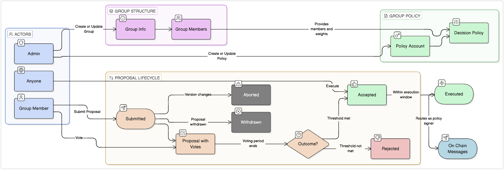

# Group Cosmos SDK Module

> **Part of Cosmos SDK Enterprise Modules** | [Enterprise Modules](../README.md)
>
> **Full Documentation**: [docs.cosmos.network/enterprise/components/group/overview](https://docs.cosmos.network/enterprise/components/group/overview)
>
> **License Notice**: This module uses the [Source Available Evaluation License](./LICENSE), different from the core SDK's Apache-2.0 license. See the [License](#license) section for details.

A Cosmos SDK module that enables on-chain multisig accounts and collective decision-making through configurable voting policies.

## Overview

The Group module allows any set of accounts to form a named group, attach one or more decision policies to it, and collectively authorize the execution of arbitrary messages through a proposal-and-vote workflow.

### Key Features

- **Flexible Membership**: Groups aggregate accounts with weighted voting power; members can be added, removed, or reweighted by the group admin
- **Multiple Decision Policies**: Each group can have multiple group policy accounts, each with its own threshold or percentage-based decision policy
- **Proposal Execution**: When a proposal is accepted according to its policy, any account can trigger execution of the embedded messages
- **Automatic Tally**: At the end of every block, proposals whose voting period has expired are tallied and pruned automatically

## Architecture



### Module Interactions

| Module | Purpose | Interface |
|--------|---------|-----------|
| **Auth** | Account management | Creates group policy accounts; provides address codec |
| **Bank** | Balance checks | Queried for spendable coins on group policy accounts |
| **BaseApp** | Message routing | Executes proposal messages via the message router |
| **EndBlock** | Lifecycle management | Tallies proposals at voting period end; prunes expired proposals |

## Quick Start

### Prerequisites

- Go 1.25+
- Docker (for proto generation)

## Usage

### Query Commands

**Get info about a group by ID:**
```bash
simd q group group-info [group-id]
```

**Get info about a group policy by account address:**
```bash
simd q group group-policy-info [group-policy-account]
```

**List members of a group:**
```bash
simd q group group-members [group-id]
```

**List groups by admin address:**
```bash
simd q group groups-by-admin [admin]
```

**List group policies for a group:**
```bash
simd q group group-policies-by-group [group-id]
```

**Get a proposal by ID:**
```bash
simd q group proposal [proposal-id]
```

**List proposals for a group policy:**
```bash
simd q group proposals-by-group-policy [group-policy-account]
```

**Get a vote:**
```bash
simd q group vote [proposal-id] [voter]
```

**Get the current tally for a proposal:**
```bash
simd q group tally-result [proposal-id]
```

**List all groups on chain:**
```bash
simd q group groups
```

### Transaction Commands

**Create a group:**
```bash
simd tx group create-group [admin] [metadata] [members-json-file]
```

Where `members.json` contains:
```json
{
  "members": [
    {
      "address": "cosmos1...",
      "weight": "1",
      "metadata": "member description"
    }
  ]
}
```

**Create a group policy with a threshold decision policy:**
```bash
simd tx group create-group-policy [admin] [group-id] [metadata] [decision-policy-json]
```

Where the threshold decision policy JSON is:
```json
{
  "@type": "/cosmos.group.v1.ThresholdDecisionPolicy",
  "threshold": "2",
  "windows": {
    "voting_period": "24h",
    "min_execution_period": "0s"
  }
}
```

**Submit a proposal:**
```bash
simd tx group submit-proposal [proposal-json-file] \
    --from proposer \
    --keyring-backend test
```

**Vote on a proposal:**
```bash
simd tx group vote [proposal-id] [voter] [vote-option] [metadata]
# vote-option: VOTE_OPTION_YES | VOTE_OPTION_NO | VOTE_OPTION_ABSTAIN | VOTE_OPTION_NO_WITH_VETO
```

**Execute an accepted proposal:**
```bash
simd tx group exec [proposal-id] \
    --from executor \
    --keyring-backend test
```

**Update group members (set weight to "0" to remove):**
```bash
simd tx group update-group-members [admin] [group-id] [members-json-file]
```

**Leave a group:**
```bash
simd tx group leave-group [member-address] [group-id]
```

**Withdraw a submitted proposal:**
```bash
simd tx group withdraw-proposal [proposal-id] [group-policy-admin-or-proposer]
```

## License

**IMPORTANT**: This module uses a different license than the core Cosmos SDK.

This module is licensed under the **Source Available Evaluation License** for non-commercial evaluation, testing, and educational purposes only. Commercial use requires a separate license.

- **Group Module License**: [Source Available Evaluation License](./LICENSE) - Evaluation/testing only
