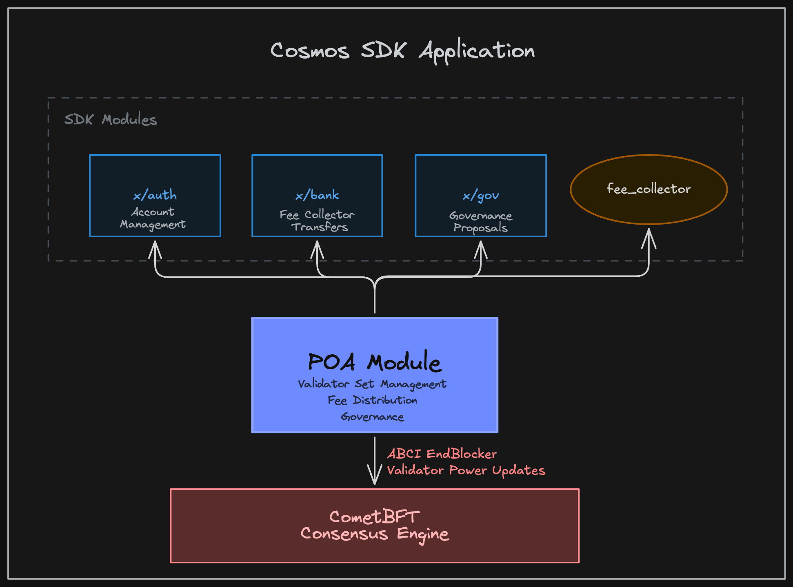

# PoA Module Architecture

## Overview

The Proof of Authority (PoA) module is a Cosmos SDK module that implements a permissioned consensus mechanism where a designated admin controls the validator set. Unlike traditional Proof of Stake systems, PoA validators are explicitly authorized and managed by an administrative authority rather than being selected based on staked tokens.

## Table of Contents

- [Architecture](#architecture)
    - [SDK Integration Points](#sdk-integration-points)
    - [Architectural Decisions](#architectural-decisions)
- [Admin Control Flow](#admin-control-flow)
    - [Setting Admin Authority](#setting-admin-authority)
    - [Managing Validator Set](#managing-validator-set)
    - [Updating Parameters](#updating-parameters)
- [Validator Lifecycle](#validator-lifecycle)
    - [Validator Registration](#validator-registration)
    - [Gaining Consensus Power](#gaining-consensus-power)
    - [Removing Validators](#removing-validators)
- [Fee Distribution](#fee-distribution) → See [distribution.md](./distribution.md)
- [Governance](#governance) → See [governance.md](./governance.md)
- [Technical Implementation](#technical-implementation)
    - [Storage Design](#storage-design)
    - [ABCI Integration](#abci-integration)
    - [Dependencies](#dependencies)
- [Security Considerations](#security-considerations)

## Architecture

### SDK Integration Points

The PoA module plugs into the Cosmos SDK as a replacement for the standard staking module, providing an alternative consensus mechanism:



*The diagram above shows how the PoA module integrates with Cosmos SDK modules (x/auth, x/bank, x/gov), the fee_collector account, and CometBFT consensus engine.*

**Key Integration Points:**

1. **Replaces [x/staking](../../../x/staking/README.md)**: PoA provides validator management without token delegation or bonding
2. **Integrates with [x/gov](../../../x/gov/README.md)**: Custom governance hooks ensure only active validators can participate and tally function override allocates vote weight to validator power ([details](#governance))
3. **Uses [x/auth](../../../x/auth/README.md) & [x/bank](../../../x/bank/README.md)**: Standard account and token management for fee distribution ([details](#fee-distribution))
4. **ABCI Lifecycle**: Implements `EndBlocker` to communicate validator updates to CometBFT ([details](#abci-integration))

### Architectural Decisions

**Admin-Controlled Validator Set**

Unlike proof-of-stake where validators are determined by token weight, PoA uses a single admin address to authorize validators. This design choice:
- Enables permissioned networks with known validator identities
- Removes token requirement from validator participation (no token bonding required)
- Centralizes trust in the admin address (see [Security Considerations](#security-considerations))

**Custom Fee Distribution**

Rather than using the standard [x/distribution](../../../x/distribution/README.md) module, PoA implements its own fee mechanism:
- Fees allocated proportionally to validator power (not delegated stake)
- Validators withdraw fees on-demand
- See [Fee Distribution](#fee-distribution) for complete details

**Governance Without Staking**

Standard SDK [governance](../../../x/gov/README.md) uses bonded tokens for voting weight. PoA replaces this with validator power:
- Only active validators (power > 0) can submit, deposit, or vote on proposals
- Voting weight determined by validator power, not token holdings
- Prevents non-validator governance participation
- See [Governance](#governance) for implementation details

**Storage Design Philosophy**

The module uses `cosmossdk.io/collections` with a composite key structure:
- Primary key: `(power, consensus_address)` enables efficient power-sorted iteration
- Secondary indexes on consensus and operator addresses for fast lookups
- Requires re-keying when power changes, but eliminates need for separate sorting
- See [Storage Design](#storage-design) for technical details

## Admin Control Flow

### Setting Admin Authority

The PoA module is controlled by a single admin address configured at genesis. This admin has exclusive authority to:
- Update validator power (grant/revoke consensus participation)
- Modify module parameters
- Batch update the entire validator set

The admin could be set to any authority that has an address. This includes a group from x/groups, the governance module account, and multisigs.

**Location**: Admin address stored in [`x/poa/types/keys.go:10`](../x/poa/types/keys.go#L10) (params prefix)

Only the admin can update itself with a parameter change.

### Managing Validator Set

**MsgUpdateValidators** ([`x/poa/keeper/msg_server.go:72`](../x/poa/keeper/msg_server.go#L72))

The admin can batch update validators through a single transaction:

1. **Authentication**: Transaction must be signed by the admin address
2. **Validation**: Each validator update is validated for:
   - Valid public key
   - Non-negative power
   - Valid metadata (operator address, moniker, description)
   - No duplicate operator addresses
3. **Power Changes**: Any power change triggers:
   - Fee checkpoint (allocates pending fees before power changes)
   - Total power recalculation
   - ABCI validator update queue
4. **Consensus Update**: Changes take effect at the end of the current block

### Updating Parameters

**MsgUpdateParams** ([`x/poa/keeper/msg_server.go:26`](../x/poa/keeper/msg_server.go#L26))

The admin can update module parameters (currently only the admin address itself). This requires:
- Transaction signed by current admin
- Validation of new parameters

## Validator Lifecycle

### Validator Registration

**MsgCreateValidator** ([`x/poa/keeper/msg_server.go:45`](../x/poa/keeper/msg_server.go#L45))

**Permissionless Creation**: Any address can register as a validator candidate:

1. **Submit Registration**: Provide public key and metadata
   - **PubKey**: Ed25519
   - **Operator Address**: Account that will receive fees and manage the validator
   - **Moniker**: Human-readable name (max 256 chars)
   - **Description**: Additional details (max 256 chars)

2. **Initial State**: Created validators have **power = 0** until the admin updates it via `MsgUpdateValidators`
   - Not participating in consensus
   - Not earning fees
   - Cannot vote in governance

**Location**: [`x/poa/keeper/validator.go:95`](../x/poa/keeper/validator.go#L95)

### Gaining Consensus Power

Validators can only gain consensus power through admin action:

1. **Admin Updates Power**: Via [`MsgUpdateValidators`](#managing-validator-set)
2. **Power > 0**: Validator becomes active
3. **ABCI Update**: CometBFT adds validator to active set at next block
4. **Fee Eligibility**: Validator starts accumulating fees proportionally
5. **Governance Rights**: Validator can submit proposals, deposit, and vote

**Power Mechanics**:
- Power is an integer representing voting weight
- Higher power = more consensus influence and fee share
- Power can be adjusted up or down by admin
- Setting power = 0 removes validator from consensus without deleting

**Location**: [`x/poa/keeper/validator.go:19`](../x/poa/keeper/validator.go#L19)

### Removing Validators

**Soft Removal** (Removing power):
   - Admin sets validator power to 0
   - Validator remains registered but inactive
   - Can be reactivated by admin later
   - Validator entry is preserved in the map of validators

## Fee Distribution

The PoA module implements a custom checkpoint-based fee distribution system that allocates block fees proportionally to validator power.

**Key Features**:
- Fees accumulate in the `fee_collector` module account
- Allocated proportionally to validator power at checkpoints
- Checkpoints triggered by power changes or withdrawals
- Validators withdraw accumulated fees on-demand
- Uses DecCoins for precision to prevent dust accumulation

**Why Checkpointing?**: Allows for efficient, lazy distribution rather than actively moving funds every block.

**See [Fee Distribution Documentation](./distribution.md)** for complete details.

**Location**: [`x/poa/keeper/distribution.go`](../x/poa/keeper/distribution.go)

## Governance

The PoA module restricts governance participation to active validators only, using validator power as voting weight instead of bonded tokens.

**Key Features**:
- Uses existing x/gov module
- Only active validators (power > 0) can submit, deposit, or vote on proposals
- Voting weight equals validator power
- Custom tally function replaces standard governance tallying
- Admin indirectly controls governance through power distribution

**Power-Based Voting**: Each validator's vote is weighted by their validator power set in the x/poa module.

**See [Governance Documentation](./governance.md)** for complete details.

**Location**: [`x/poa/keeper/governance.go`](../x/poa/keeper/governance.go) and [`x/poa/keeper/hooks.go`](../x/poa/keeper/hooks.go)

## Technical Implementation

### Storage Design

**Collections Schema** ([`x/poa/types/keys.go`](../x/poa/types/keys.go))

The module uses `cosmossdk.io/collections` for type-safe state management:

| Prefix | Collection | Key Type | Value Type | Purpose |
|--------|------------|----------|------------|---------|
| 0 | `params` | - | `Params` | Admin address and module config |
| 1 | `validators` | `(int64, string)` | `Validator` | Primary map, sorted by power |
| 2 | `validator_by_consensus` | `string` | `(int64, string)` | Index: consensus addr → composite key |
| 3 | `validator_by_operator` | `string` | `(int64, string)` | Index: operator addr → composite key |
| 4 | `total_power` | - | `int64` | Sum of all validator power |
| 5 | `total_allocated` | - | `ValidatorFees` | Sum of allocated fees |


**Location**: [`x/poa/keeper/keeper.go:16`](../x/poa/keeper/keeper.go#L16)

### ABCI Integration

**EndBlocker** ([`x/poa/keeper/abci.go:9`](../x/poa/keeper/abci.go#L9))

The module integrates with CometBFT consensus through ABCI:

1. **Power Changes**: When validator power changes, create `ValidatorUpdate`
2. **Queue Updates**: Store updates in memory queue
3. **EndBlock**: At end of block, return all queued updates
4. **CometBFT Processing**: Consensus engine applies updates for next block
5. **Clear Queue**: After returning, clear the queue

**ValidatorUpdate Format**:
```
ValidatorUpdate {
    PubKey: PublicKey  // Consensus public key
    Power:  int64      // New power (0 = remove)
}
```

**Location**: [`x/poa/module.go:128`](../x/poa/module.go#L128)

## Security Considerations

1. **Single Point of Control**:
   - Admin address controls entire validator set

2. **Validator Registration**:
   - Anyone can register as validator candidate
   - Only admin can grant consensus power

3. **Total Power Invariant**:
   - Total power must remain > 0
   - Prevents zero-power chain halts
   - Validated on every power adjustment via a checkpoint trigger

4. **Governance Restrictions**:
   - Only active validators (power > 0) can participate
   - Prevents governance spam from unauthorized users
   - Ensures governance represents actual consensus participants

5. **Validator Indexing**:
   - Unique consensus address prevents duplicate validators
   - Unique operator address prevents fee confusion
