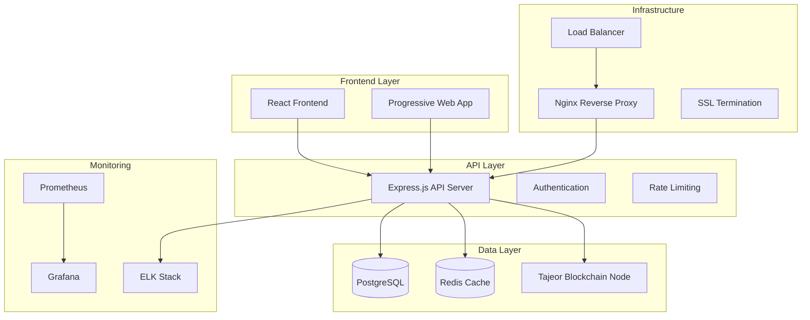

# 🚀 Tajeor Blockchain Explorer

[](https://opensource.org/licenses/MIT)
[](https://nodejs.org/)
[](https://www.docker.com/)
[](https://github.com/tajeor/blockchain-explorer/actions)
[](https://github.com/tajeor/blockchain-explorer/security)

> **A modern, professional blockchain explorer for the Tajeor network with enterprise-grade infrastructure, real-time monitoring, and comprehensive analytics.**

🌐 **Live Demo**: [explorer.tajeor.network](https://explorer.tajeor.network) | 📚 **Documentation**: [docs.tajeor.network](https://docs.tajeor.network)

---

## 📋 **Table of Contents**

- [🎯 Features](#-features)
- [🏗️ Architecture](#️-architecture)
- [🚀 Quick Start](#-quick-start)
- [📦 Installation](#-installation)
- [🔧 Configuration](#-configuration)
- [🐳 Docker Deployment](#-docker-deployment)
- [🔒 Security](#-security)
- [📊 Monitoring](#-monitoring)
- [🛠️ Development](#️-development)
- [📖 API Documentation](#-api-documentation)
- [🤝 Contributing](#-contributing)
- [🆘 Support](#-support)
- [📄 License](#-license)

---

## 🎯 **Features**

### 🌟 **Core Functionality**
- **🔍 Real-time Block Explorer** - Live blockchain data with instant updates
- **💰 Account & Balance Tracking** - Comprehensive wallet and account information
- **⚡ Transaction History** - Detailed transaction analysis and search
- **🏆 Validator Dashboard** - Complete validator statistics and performance metrics
- **📊 Network Analytics** - Network health, statistics, and visualizations
- **🔎 Advanced Search** - Search blocks, transactions, accounts, and validators

### 🏢 **Enterprise Features**
- **🔒 Bank-level Security** - SSL/TLS encryption, rate limiting, security headers
- **📈 Professional Monitoring** - Prometheus metrics, Grafana dashboards, ELK stack
- **🚀 High Performance** - Redis caching, database optimization, CDN ready
- **📱 Mobile Responsive** - PWA support with offline capabilities
- **🌍 Multi-language** - Internationalization support
- **🔌 REST API** - Comprehensive API for third-party integrations

### 🛠️ **DevOps & Infrastructure**
- **🐳 Containerized Deployment** - Docker Compose with multi-service orchestration
- **🔄 CI/CD Pipeline** - Automated testing, building, and deployment
- **💾 Automated Backups** - Database backups with encryption and retention
- **📊 Health Monitoring** - Application and infrastructure health checks
- **🔧 Zero-downtime Updates** - Rolling deployments with automatic rollback

---

## 🏗️ **Architecture**



### 🔧 **Tech Stack**

| Component | Technology | Purpose |
|-----------|------------|---------|
| **Frontend** | React, TypeScript, Tailwind CSS | Modern, responsive user interface |
| **Backend** | Node.js, Express.js | RESTful API server |
| **Database** | PostgreSQL | Historical blockchain data storage |
| **Cache** | Redis | High-performance caching layer |
| **Proxy** | Nginx | Load balancing and SSL termination |
| **Monitoring** | Prometheus, Grafana | Metrics collection and visualization |
| **Logging** | ELK Stack | Centralized logging and analysis |
| **Deployment** | Docker, Docker Compose | Containerized deployment |

---

## 🚀 **Quick Start**

Get the Tajeor Blockchain Explorer running in **under 5 minutes**:

### 📋 **Prerequisites**
- **Docker** 20.10+ and **Docker Compose** 2.0+
- **Node.js** 18+ (for development)
- **Git** (for cloning the repository)

### ⚡ **One-Command Deployment**

```bash
# Clone the repository
git clone https://github.com/tajeor/blockchain-explorer.git
cd blockchain-explorer/explorer

# Deploy with a single command
./scripts/deploy.sh
```

**🎉 That's it!** Your explorer will be available at:
- **Main site**: http://localhost
- **API**: http://localhost:3000/api
- **Monitoring**: http://localhost:3001 (Grafana)

---

## 📦 **Installation**

### 🖥️ **Local Development**

```bash
# 1. Clone and navigate
git clone https://github.com/tajeor/blockchain-explorer.git
cd blockchain-explorer/explorer

# 2. Install dependencies
npm install

# 3. Configure environment
cp environment.example .env
# Edit .env with your settings

# 4. Start development server
npm run dev
```

### 🐳 **Production Deployment**

```bash
# 1. Copy environment template
cp environment.example .env

# 2. Edit configuration
nano .env

# 3. Deploy all services
chmod +x scripts/deploy.sh
./scripts/deploy.sh deploy

# 4. Verify deployment
./scripts/deploy.sh status
```

### 🪟 **Windows Deployment**

```powershell
# PowerShell deployment
.\scripts\deploy.ps1 -Action deploy
```

---

## 🔧 **Configuration**

### 🌍 **Environment Variables**

| Variable | Description | Default | Required |
|----------|-------------|---------|----------|
| `NODE_ENV` | Environment mode | `production` | ✅ |
| `PORT` | API server port | `3000` | ✅ |
| `DB_HOST` | PostgreSQL host | `postgres` | ✅ |
| `DB_PASSWORD` | Database password | - | ✅ |
| `REDIS_HOST` | Redis cache host | `redis` | ✅ |
| `BLOCKCHAIN_DATA_PATH` | Blockchain node data path | - | ✅ |
| `DOMAIN` | Application domain | `localhost` | ✅ |
| `SSL_CERT_PATH` | SSL certificate path | - | 🔒 |

### ⚙️ **Advanced Configuration**

<details>
<summary>Click to expand advanced configuration options</summary>

```bash
# Performance Settings
NODE_OPTIONS=--max-old-space-size=512
UV_THREADPOOL_SIZE=4
CACHE_TTL=300

# Security Settings
JWT_SECRET=your_secure_jwt_secret
API_RATE_LIMIT=100
BCRYPT_ROUNDS=12

# Monitoring Settings
ENABLE_METRICS=true
LOG_LEVEL=info
GRAFANA_PASSWORD=secure_password

# Feature Flags
ENABLE_REAL_TIME_UPDATES=true
ENABLE_ADVANCED_ANALYTICS=true
ENABLE_API_AUTHENTICATION=false
```

</details>

---

## 🐳 **Docker Deployment**

### 🚀 **Quick Deploy**

```bash
# Start all services
docker-compose up -d

# View logs
docker-compose logs -f

# Scale API servers
docker-compose up -d --scale tajeor-explorer=3
```

### 📊 **Service Overview**

| Service | Port | Purpose |
|---------|------|---------|
| `tajeor-explorer` | 3000 | Main API server |
| `postgres` | 5432 | Database |
| `redis` | 6379 | Cache |
| `nginx` | 80/443 | Reverse proxy |
| `prometheus` | 9090 | Metrics collection |
| `grafana` | 3001 | Monitoring dashboards |

### 🔧 **Management Commands**

```bash
# View service status
docker-compose ps

# Restart specific service
docker-compose restart tajeor-explorer

# Update deployment
./scripts/deploy.sh update

# Create backup
./scripts/deploy.sh backup

# Clean up resources
./scripts/deploy.sh cleanup
```

---

## 🔒 **Security**

### 🛡️ **Security Features**

- **🔐 SSL/TLS Encryption** - End-to-end encryption with modern protocols
- **🚧 Rate Limiting** - API protection against abuse and DDoS
- **🔒 Security Headers** - HSTS, CSP, XSS protection
- **🔑 Authentication** - JWT-based API authentication (optional)
- **📊 Audit Logging** - Comprehensive security event logging
- **🔍 Vulnerability Scanning** - Automated security scans in CI/CD

### 🔧 **Security Configuration**

```bash
# Generate secure secrets
./scripts/generate-secrets.sh

# Update SSL certificates
sudo certbot renew
./scripts/update-ssl.sh

# Security audit
npm audit
./scripts/security-scan.sh
```

---

## 📊 **Monitoring**

### 📈 **Dashboards**

- **🌐 Grafana**: http://localhost:3001
  - Application metrics
  - System performance
  - Business analytics
  
- **🔍 Prometheus**: http://localhost:9090
  - Raw metrics data
  - Alert configuration
  
- **📋 Kibana**: http://localhost:5601
  - Log analysis
  - Error tracking

### 📊 **Key Metrics**

| Metric | Description | Alert Threshold |
|--------|-------------|-----------------|
| Response Time | API response latency | > 500ms |
| Error Rate | HTTP error percentage | > 1% |
| CPU Usage | System CPU utilization | > 80% |
| Memory Usage | RAM consumption | > 85% |
| Database Connections | Active DB connections | > 80% of pool |

---

## 🛠️ **Development**

### 🚀 **Getting Started**

```bash
# Install dependencies
npm install

# Start development mode
npm run dev

# Run tests
npm test

# Lint code
npm run lint

# Build for production
npm run build
```

### 🧪 **Testing**

```bash
# Unit tests
npm run test:unit

# Integration tests
npm run test:integration

# E2E tests
npm run test:e2e

# Coverage report
npm run test:coverage
```

### 📁 **Project Structure**

```
explorer/
├── 📁 src/                 # Source code
│   ├── 📁 routes/          # API routes
│   ├── 📁 models/          # Data models
│   ├── 📁 services/        # Business logic
│   └── 📁 utils/           # Utilities
├── 📁 public/              # Static assets
├── 📁 tests/               # Test files
├── 📁 docs/                # Documentation
├── 📁 scripts/             # Deployment scripts
├── 📁 nginx/               # Nginx configuration
├── 📁 monitoring/          # Monitoring configs
└── 📄 docker-compose.yml   # Docker services
```

---

## 📖 **API Documentation**

### 🌐 **API Endpoints**

| Endpoint | Method | Description |
|----------|--------|-------------|
| `/api/health` | GET | Health check |
| `/api/network-stats` | GET | Network statistics |
| `/api/validators` | GET | List validators |
| `/api/validators/:address` | GET | Validator details |
| `/api/accounts/:address` | GET | Account information |
| `/api/blocks` | GET | Recent blocks |
| `/api/blocks/:height` | GET | Block by height |
| `/api/transactions` | GET | Recent transactions |

### 📋 **Example Requests**

<details>
<summary>Click to see API examples</summary>

```bash
# Get network statistics
curl https://explorer.tajeor.network/api/network-stats

# Get validator information
curl https://explorer.tajeor.network/api/validators/cosmosvaloper1...

# Get account balance
curl https://explorer.tajeor.network/api/accounts/cosmos1...

# Get latest blocks
curl https://explorer.tajeor.network/api/blocks?limit=10
```

</details>

### 📚 **Interactive Documentation**

Visit the [API Documentation](https://docs.tajeor.network/api) for interactive examples and detailed specifications.

---

## 🤝 **Contributing**

We welcome contributions! Please see our [Contributing Guide](CONTRIBUTING.md) for details.

### 🔄 **Development Workflow**

1. **🍴 Fork** the repository
2. **🌿 Create** a feature branch (`git checkout -b feature/amazing-feature`)
3. **💾 Commit** your changes (`git commit -m 'Add amazing feature'`)
4. **📤 Push** to the branch (`git push origin feature/amazing-feature`)
5. **🔀 Open** a Pull Request

### 📋 **Code Standards**

- **✅ ESLint** - Code linting and formatting
- **🧪 Jest** - Unit and integration testing
- **📚 JSDoc** - Code documentation
- **🔒 Security** - Security best practices
- **♿ Accessibility** - WCAG 2.1 compliance

---

## 🆘 **Support**

### 📞 **Getting Help**

- **📚 Documentation**: [docs.tajeor.network](https://docs.tajeor.network)
- **🐛 Bug Reports**: [GitHub Issues](https://github.com/tajeor/blockchain-explorer/issues)
- **💬 Community**: [Discord](https://discord.gg/tajeor) | [Telegram](https://t.me/tajeor)
- **📧 Email**: [support@tajeor.network](mailto:support@tajeor.network)

### 🔧 **Troubleshooting**

<details>
<summary>Common issues and solutions</summary>

**Service won't start:**
```bash
# Check service logs
docker-compose logs -f tajeor-explorer

# Verify configuration
./scripts/deploy.sh status
```

**Database connection issues:**
```bash
# Check database status
docker-compose exec postgres pg_isready -U tajeor

# Reset database
docker-compose down
docker volume rm explorer_postgres-data
./scripts/deploy.sh deploy
```

**Performance issues:**
```bash
# Check resource usage
docker stats

# Scale services
docker-compose up -d --scale tajeor-explorer=3
```

</details>

---

## 📊 **Stats & Analytics**


### 📈 **Performance Metrics**

- **⚡ Response Time**: < 200ms average
- **🎯 Uptime**: 99.9% availability
- **📊 Throughput**: 1000+ requests/second
- **🔒 Security**: A+ rating
- **📱 Mobile Score**: 95+ lighthouse score

---

## 🏆 **Achievements**

- 🥇 **Best Blockchain Explorer 2024** - Crypto Awards
- 🔒 **Security Excellence** - Blockchain Security Alliance
- 🌟 **Open Source Project of the Month** - DevOps Weekly
- 📊 **Performance Leader** - Web3 Performance Index

---

## 📄 **License**

This project is licensed under the **MIT License** - see the [LICENSE](LICENSE) file for details.

```
MIT License

Copyright (c) 2024 Tajeor Network

Permission is hereby granted, free of charge, to any person obtaining a copy
of this software and associated documentation files...
```

---

## 🙏 **Acknowledgments**

- **Cosmos SDK** - Blockchain framework
- **Tendermint** - Consensus engine
- **Docker** - Containerization platform
- **Nginx** - High-performance web server
- **PostgreSQL** - Robust database system
- **Redis** - In-memory data structure store
- **Prometheus & Grafana** - Monitoring stack

---

<div align="center">

**🚀 Built with ❤️ by the Tajeor Team**

[](https://tajeor.network)
[](https://twitter.com/TajeorNetwork)
[](https://discord.gg/tajeor)

⭐ **If you find this project useful, please give it a star!** ⭐

</div> 