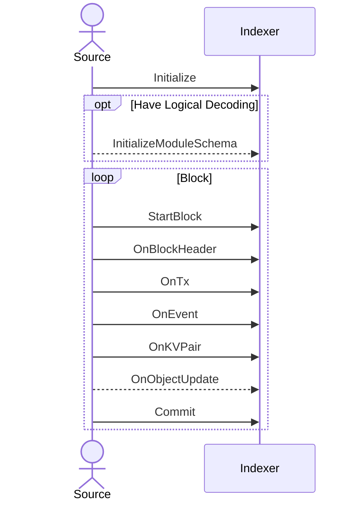

# Indexer Base

The indexer base module is designed to provide a stable, zero-dependency base layer for the built-in indexer functionality. Packages that integrate with the indexer should feel free to depend on this package without fear of any external dependencies being pulled in.

The basic types for specifying index sources, targets and decoders are provided here. An indexing source should accept a `Listener` instance and invoke the provided callbacks in the correct order. An indexer should provide a `Listener` instance and perform indexing operations based on the data passed to its callbacks. A module that exposes logical updates in the form of `ObjectUpdate`s should implement the `IndexableModule` interface.

## `Listener` Callback Order

`Listener` callbacks should be called in this order

Sources will generally only call `InitializeModuleSchema` and `OnObjectUpdate` if they have native logical decoding capabilities. Usually, the indexer framework will provide this functionality based on `OnKVPair` data and `IndexableModule` implementations.
