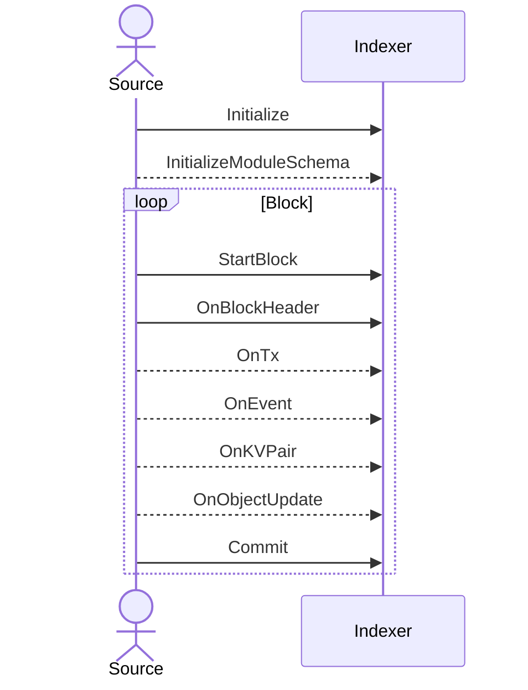

# Indexer Base

The indexer base module is designed to provide a stable, zero-dependency base layer for the built-in indexer functionality. Packages that integrate with the indexer should feel free to depend on this package without fear of any external dependencies being pulled in.

The basic types for specifying index sources, targets and decoders are provided here. An indexing source should accept a `Listener` instance and invoke the provided callbacks in the correct order. An indexer should provide a `Listener` instance and perform indexing operations based on the data passed to its callbacks. A module that exposes logical updates in the form of `ObjectUpdate`s should implement the `IndexableModule` interface.

## `Listener` Callback Order

`Listener` callbacks should be called in this order

`Initialize` must be called before any other method and should only be invoked once. `InitializeModuleSchema` should be called at most once for every module with logical data.

Sources will generally only call `InitializeModuleSchema` and `OnObjectUpdate` if they have native logical decoding capabilities. Usually, the indexer framework will provide this functionality based on `OnKVPair` data and `IndexableModule` implementations.

`StartBlock` and `OnBlockHeader` should be called only once at the beginning of a block, and `Commit` should be called only once at the end of a block. The `OnTx`, `OnEvent`, `OnKVPair` and `OnObjectUpdate` must be called after `OnBlockHeader`, may be called multiple times within a block and indexers should not assume that the order is logical unless `InitializationData.HasEventAlignedWrites` is true. 
