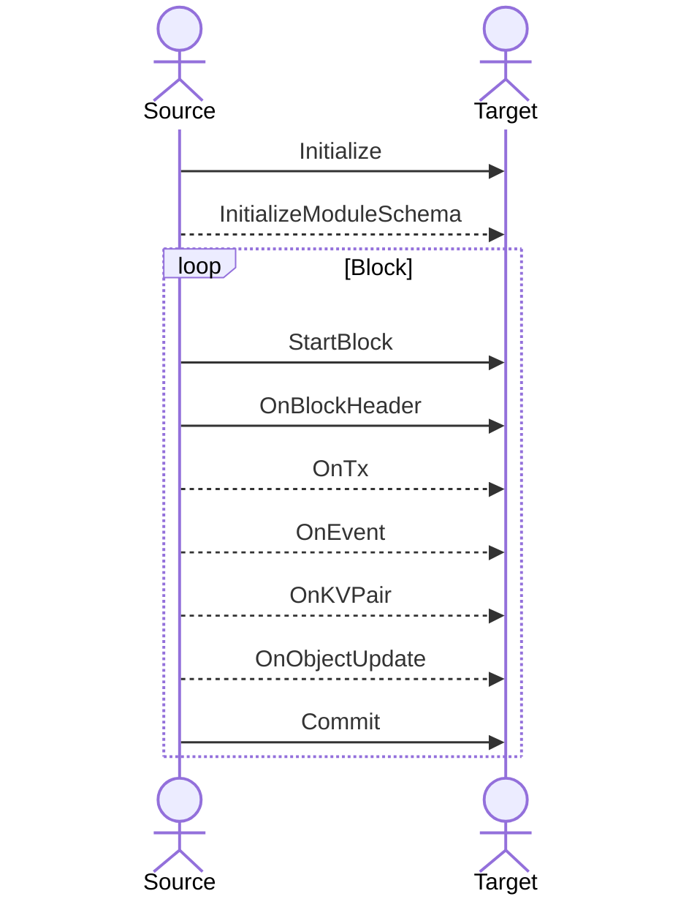

# App Data

The `appdata` package defines the basic types for streaming blockchain event and state data to external listeners, with a specific focus on supporting logical decoding and indexing of state.

A blockchain data source should accept a `Listener` instance and invoke the provided callbacks in the correct order. A downstream listener should provide a `Listener` instance and perform  operations based on the data passed to its callbacks.

## `Listener` Callback Order

`Listener` callbacks should be called in this order

`Initialize` must be called before any other method and should only be invoked once. `InitializeModuleSchema` should be called at most once for every module with logical data.

Sources will generally only call `InitializeModuleSchema` and `OnObjectUpdate` if they have native logical decoding capabilities. Usually, the indexer framework will provide this functionality based on `OnKVPair` data and `schema.HasModuleCodec` implementations.

`StartBlock` and `OnBlockHeader` should be called only once at the beginning of a block, and `Commit` should be called only once at the end of a block. The `OnTx`, `OnEvent`, `OnKVPair` and `OnObjectUpdate` must be called after `OnBlockHeader`, may be called multiple times within a block and indexers should not assume that the order is logical unless `InitializationData.HasEventAlignedWrites` is true.
