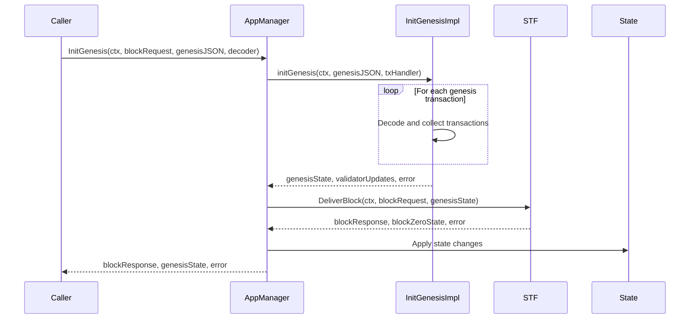
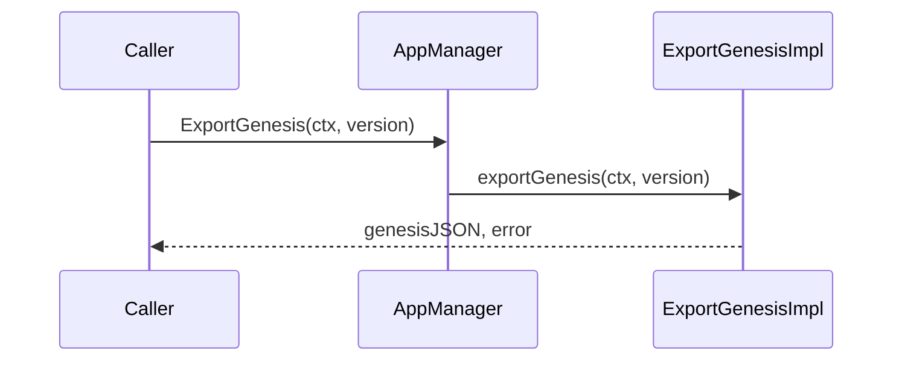
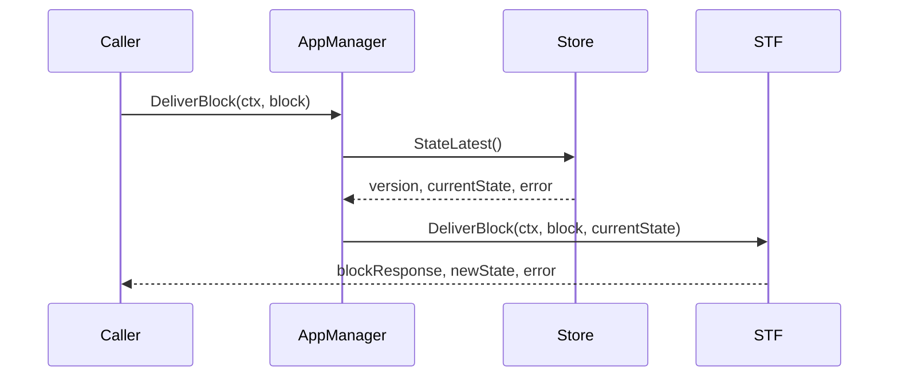
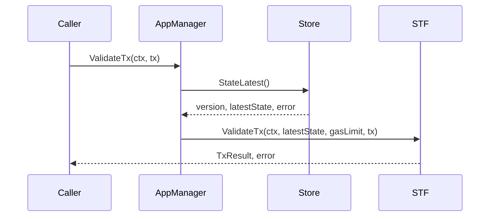
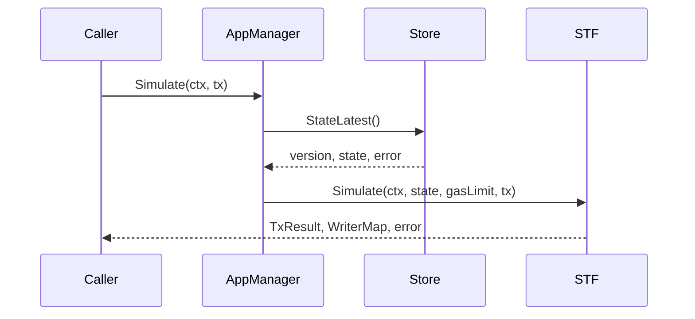
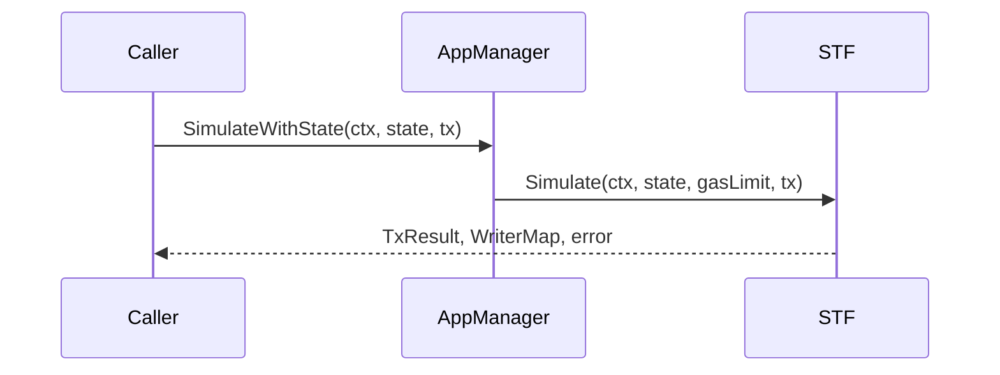
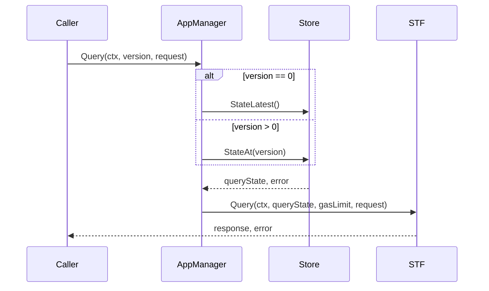
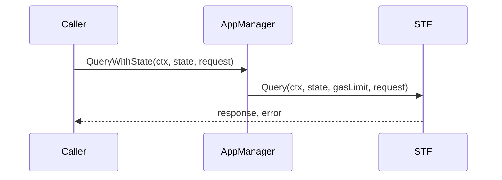

# AppManager Documentation

The AppManager serves as a high-level coordinator, delegating most operations to the STF while managing state access through the Store interface.

This document outlines the main external calls in the AppManager package, their execution flows, and dependencies.

## Table of Contents
- [InitGenesis](#initgenesis)
- [ExportGenesis](#exportgenesis)
- [DeliverBlock](#deliverblock)
- [ValidateTx](#validatetx)
- [Simulate](#simulate)
- [SimulateWithState](#simulatewithstate)
- [Query](#query)
- [QueryWithState](#querywithstate)

## InitGenesis

InitGenesis initializes the genesis state of the application.

### Dependencies
- Required Input:
  - Context
  - BlockRequest
  - Genesis JSON
  - Transaction decoder
- Required Components:
  - InitGenesis implementation
  - STF
  - Store interface

## ExportGenesis

ExportGenesis exports the current application state as genesis state.

### Dependencies
- Required Input:
  - Context
  - Version
- Required Components:
  - ExportGenesis implementation
  - Store interface

## DeliverBlock

DeliverBlock processes a block of transactions.

### Dependencies
- Required Input:
  - Context
  - BlockRequest
- Required Components:
  - Store interface
  - STF

## ValidateTx

ValidateTx validates a transaction against the latest state.

### Dependencies
- Required Input:
  - Context
  - Transaction
- Required Components:
  - Store interface
  - STF
  - Configuration (for gas limits)

## Simulate

Simulate executes a transaction simulation using the latest state.

### Dependencies
- Required Input:
  - Context
  - Transaction
- Required Components:
  - Store interface
  - STF
  - Configuration (for gas limits)  

## SimulateWithState

SimulateWithState executes a transaction simulation using provided state.

### Dependencies
- Required Input:
  - Context
  - Transaction
  - State

  ## Query

Query executes a query at a specific version.

### Dependencies
- Required Input:
  - Context
  - Version (or 0 for latest)
  - Query request
- Required Components:
  - Store interface
  - STF
  - Configuration (for gas limits)

  ## QueryWithState

QueryWithState executes a query using provided state.

### Dependencies
- Required Input:
  - Context
  - ReaderMap state
  - Query request
- Required Components:
  - STF
  - Configuration (for gas limits)

## Common Dependencies

All operations depend on:
- Context management
- Error handling
- Gas metering
- State management (Store interface)
- STF interface