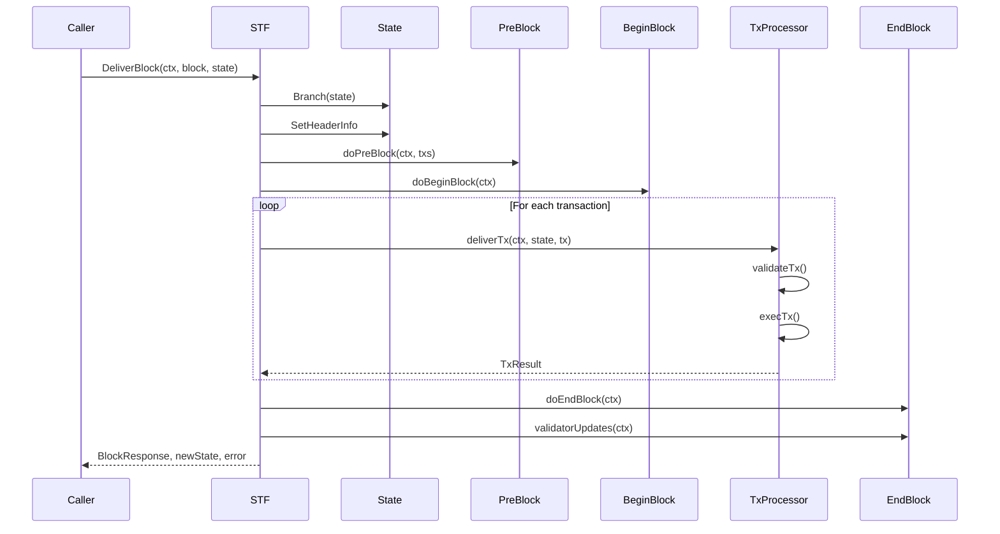
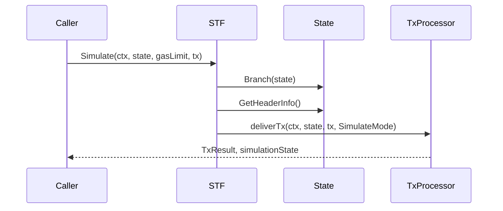
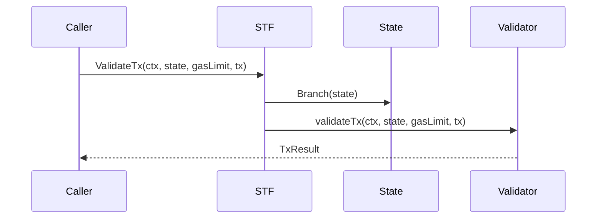
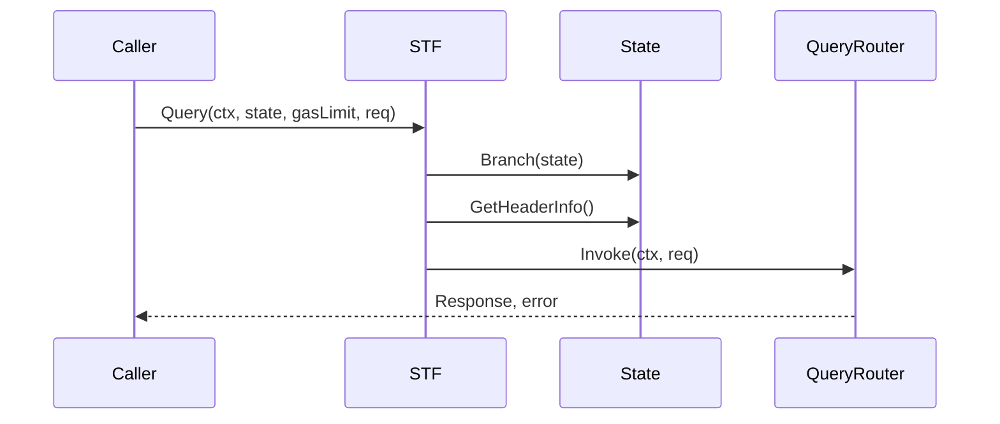

# STF (State Transition Function) Documentation

This document outlines the main external calls in the STF package, their execution flows, and dependencies.

## Table of Contents
- [DeliverBlock](#deliverblock)
- [Simulate](#simulate)
- [ValidateTx](#validatetx)
- [Query](#query)

## DeliverBlock

DeliverBlock is the main state transition function that processes an entire block of transactions.

### Dependencies
- Required Input:
  - Context
  - BlockRequest containing transactions
  - ReadOnly state
- Required Components:
  - PreBlock handler
  - BeginBlock handler
  - EndBlock handler
  - Transaction validator
  - Message router
  - Gas meter

## Simulate

Simulate executes a transaction without committing changes to the actual state.

### Dependencies
- Required Input:
  - Context
  - ReadOnly state
  - Gas limit
  - Transaction
- Required Components:
  - Transaction processor
  - Gas meter
  - Message router

## ValidateTx

ValidateTx performs transaction validation without execution.

### Dependencies
- Required Input:
  - Context
  - ReadOnly state
  - Gas limit
  - Transaction
- Required Components:
  - Transaction validator
  - Gas meter

## Query

Query executes a read-only query against the application state.

### Dependencies
- Required Input:
  - Context
  - ReadOnly state
  - Gas limit
  - Query request message
- Required Components:
  - Query router
  - Gas meter
  - Message handlers

## Error Handling

All operations include error handling for:
- Context cancellation
- Gas limit exceeded
- Invalid transactions
- State operation failures
- Panic recovery (in transaction execution)

## Gas Management

Gas is tracked and limited for:
- Transaction validation
- Message execution
- State operations
- Query execution

Each operation that consumes gas uses a gas meter to track usage and ensure limits are not exceeded.