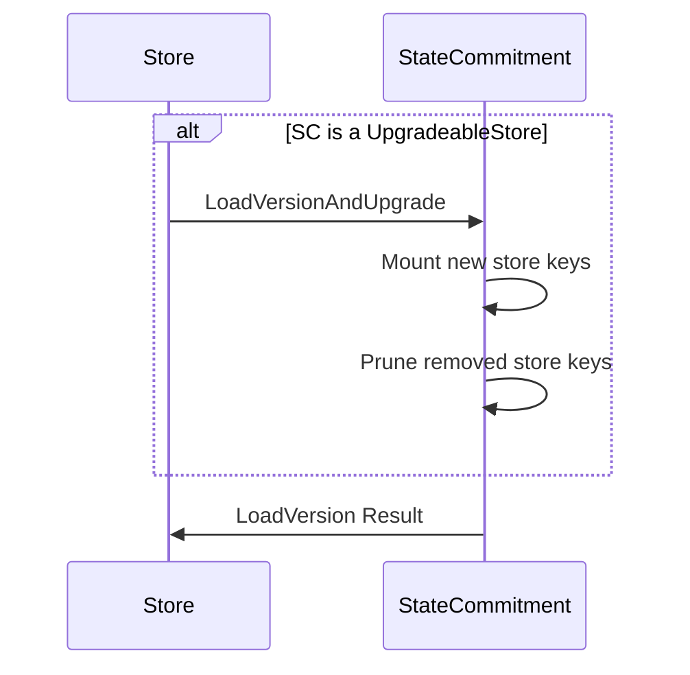

# Store

The `store` package contains the implementation of store/v2, which is the SDK's
abstraction around managing historical and committed state. See [ADR-065](../../docs/architecture/adr-065-store-v2.md)
and [Store v2 Design](https://docs.google.com/document/d/1l6uXIjTPHOOWM5N4sUUmUfCZvePoa5SNfIEtmgvgQSU/edit#heading=h.nz8dqy6wa4g1) for a high-level overview of the design and rationale.

## Usage

The `store` package contains a `root.Store` type which is intended to act as an
abstraction layer around it's primary constituent components - state commitment (SC). It acts as the main entry point into storage for an
application to use in server/v2. Through `root.Store`, an application can query
and iterate over both current and historical data, commit new state, perform state
sync, and fetch commitment proofs.

A `root.Store` is intended to be initialized with already constructed SS and SC
backends (see relevant package documentation for instantiation details). Note,
from the perspective of `root.Store`, there is no notion of multi or single tree/store,
rather these are implementation details of SC. For SC, we utilize an abstraction, `commitment.CommitStore`,
to map store keys to a commitment trees.

## Upgrades

The `LoadVersionAndUpgrade` API of the `root.store` allows for adding or removing
store keys. This is useful for upgrading the chain with new modules or removing
old ones. The `Rename` feature is not supported in store/v2.

`PruneStoreKeys` does not remove the data from the SC instantly. It only
marks the store keys as pruned. The actual data removal is done by the pruning
process of the underlying SC.

## Migration

The migration from store/v1 to store/v2 is supported by the `MigrationManager` in
the `migration` package. See [Migration Manager](./migration/README.md) for more details.

## Pruning

The `root.Store` is NOT responsible for pruning. Rather, pruning is the responsibility
of the underlying commitment layer. This means pruning can be implementation specific,
such as being synchronous or asynchronous. See [Pruning Manager](./pruning/README.md) for more details.

## State Sync

The `root.Store` is NOT responsible for state sync. See [Snapshots Manager](./snapshots/README.md)
for more details.

## Test Coverage

The test coverage of the following logical components should be over 60%:
