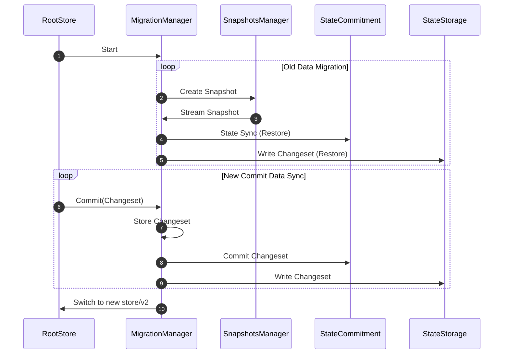

# Migration Manager

The `migration` package contains the `migration.Manager`, which is responsible 
for migrating data from `store/v1` to `store/v2`. To ensure a smooth transition, 
the process is designed to **lazily** migrate data in the background without blocking 
`root.Store` operations.

## Overview

The migration process involves several steps:

1. **Create a snapshot** of the current state while `Commit` operations continue to 
    function with `store/v1`.
2. **Restore the snapshot** into the new StateStorage (SS) and StateCommitment (SC).
3. **Sync recent state changes** from `store/v1` to the new SS and SC.
4. After syncing, the `Commit` operation will be switched to the new `store/v2`.

Taking a snapshot is a lightweight operation. The snapshot is not stored on disk but
consumed by the `Restore` process, which replays state changes to the new SS and SC.

> **Note:** After migration, `store/v2` does **not** support historical queries. 
If historical data access is required, a full state migration to `store/v2` is necessary.

## Usage

You can create a new `migration.Manager` by calling the following function:

```go
func NewManager(
    db corestore.KVStoreWithBatch, 
    sm *snapshots.Manager, 
    ss *storage.StorageStore, 
    sc *commitment.CommitStore, 
    logger log.Logger
) *Manager
```

* `sc` (Commitment Store) can be `nil`. In that case, the Manager will migrate only 
    the state storage.
* The migration process is lazy, meaning data is migrated in the background while 
    `root.Store` remains fully operational.

To initiate the migration process, call the `Start` method:

```go
func (m *Manager) Start(ctx context.Context) error
```

> **Note:** It should be called by the RootStore, running in the background.

## Migration Flow



## Key Considerations

### Laziness and Background Operation

The migration is performed lazily, meaning it occurs in the background without 
interrupting the current operations on root.Store. This allows the chain to continue 
running while data is gradually migrated to `store/v2`. State synchronization ensures 
that any new state changes during the migration are also applied to `store/v2`.

However, note that there may be a performance impact depending on the size of the data
being migrated, and it’s essential to monitor the migration process in production 
environments.

### Handling Failures and Rollbacks

It is important to consider how the migration manager handles errors or system failures 
during the migration process:

* If the migration fails, there is no impact on the existing `store/v1` operations, 
    but need to restart the migration process from the scratch.
* In the event of a critical failure after migration, a rollback may not be possible, 
    and it is needed to keep the `store/v1` backup for a certain period.

### Impact on Historical Queries

After the migration, the new `store/v2` does not support historical queries. 
This limitation should be clearly understood before starting the migration process, 
especially if the node relies on historical data for any operations.

If historical queries are required, users must fully migrate all historical data to `store/v2`.
Alternatively, keeping store/v1 accessible for historical queries could be an option.